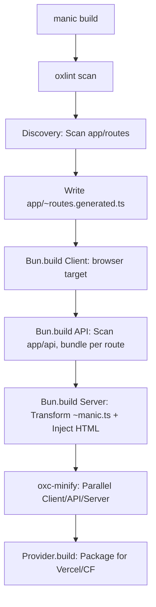

# Manic Framework: The Comprehensive Engineering Manual

Manic is a high-performance, production-grade React framework built from the ground up on Bun and Hono. It features a custom, ultra-fast bundler and builder system leveraging OXC for transformation and minification. We prioritize reliability, speed, and zero-config DX, intentionally replacing existing solutions like Vite, Webpack, or Turbopack with our own optimized stack.

---

## 📂 Repository Structure

### Core Workspace
| Path | Purpose |
| :--- | :--- |
| `packages/manic/` | The core framework engine (CLI, runtime, router, server). |
| `packages/create-manic/` | CLI scaffolding tool (`bun create manic`) and project templates. |
| `packages/providers/` | Deployment adapters for Vercel, Netlify, Cloudflare, and more. |
| `demo/` | The primary development testbench for local feature verification. |
| `examples/` | Curated reference applications and integration patterns. |

### Framework Internals (`packages/manic/src/`)
| Directory | Responsibility | Key Files |
| :--- | :--- | :--- |
| `cli/` | Command orchestrator & toolchain. | `index.ts`, `commands/build.ts`, `commands/dev.ts`, `plugins/oxc.ts` |
| `server/` | Production Hono server & SSR engine. | `index.ts`, `lib/discovery.ts` (route scanning) |
| `router/` | Type-safe React router & View Transitions. | `Router.tsx`, `lib/matcher.ts`, `lib/Link.tsx`, `lib/context.ts` |
| `plugins/` | Core framework extensions & middleware. | `lib/api.ts` (API loader), `lib/static.ts` |
| `config/` | Schema-driven configuration engine. | `index.ts` (loadConfig/defineConfig), `client.ts` |
| `env/` | Environment variable management. | `client.ts` |
| `theme/` | Built-in styling & theme utilities. | `index.ts` |
| `transitions/` | View Transitions API React components. | `index.ts` |

---

## 🛠 The Manic Build Engine (Custom Toolchain)

Manic does NOT use Vite or Rollup. It implements a proprietary build pipeline built with Bun and OXC:

### 🏗 Build Pipeline Flow

1. **Auto-Linting**: Mandatory `oxlint` pass ensures production-grade reliability before bundling.
2. **Client Bundling**: `Bun.build` + `oxcPlugin` + `bun-plugin-tailwind`. Target: `browser`. Implements code-splitting via dynamic imports in the route manifest.
3. **API Bundling**: Each folder in `app/api/` (with an `index.ts`) is bundled into a standalone JS file in `dist/api/`.
4. **Server Entry Transformation**: 
   - Reads `~manic.ts`.
   - Replaces `import app from './app/index.html'` with a `Bun.file()` read of the built HTML.
   - Bundles the entire server for the `bun` target.
5. **OXC Minification**: `oxc-minify` runs in parallel over all output directories. es2022 target, mangling enabled.

---

## 🛣 Routing & Client Lifecycle

### The `~` (Tilde) Convention
- `~manic.ts`: Mandatory server entry point.
- `app/~routes.generated.ts`: Auto-generated manifest. Contains dynamic `import()` for all pages.
- `app/routes/~*.tsx`: Files prefixed with `~` are ignored by the router (useful for components/layouts/utils).

### 🛣 Client Navigation Flow

- **Matching Strategy**: Routes are compiled into regex and scored (Static > Dynamic > Catch-all). `RouteRegistry` ensures O(n) matching with pre-sorted priorities.
- **Lazy Loading**: Pages are only loaded when navigated to. Components are cached in memory after first load.
- **Prefetching**: `<Link>` preloads the target route's JS chunk on `onMouseEnter` or `onFocus`.

---

## 🔌 Plugin & Provider Architecture

### Build-Time Plugins (`ManicPlugin`)
Defined in `manic.config.ts`.
- `build(ctx)`: Access to `pageRoutes`, `apiRoutes`, `dist`, and `emitClientFile(path, content)`.

### Runtime/Server Plugins (`ManicPlugin`)
- `configureServer(ctx)`: Hooks into `Bun.serve`. Can add routes via `addRoute(path, handler)` which maps directly to Bun's native router.

### Deployment Providers (`ManicProvider`)
Transforms `.manic/` output into platform-specific formats.
- **Vercel**: Creates `.vercel/output`, maps static files, and generates `config.json` + `.vc-config.json` for serverless functions.
- **Cloudflare**: Generates `dist/`, `_redirects` for SPA routing, and `wrangler.toml`.

---

## 🚀 Technical Standards & Requirements

### The Stack
- **Runtime**: Bun (Mandatory - uses `Bun.serve`, `Bun.build`, `Bun.Glob`, `Bun.spawn`, `Bun.file`).
- **Server**: Hono (High-performance middleware & routing).
- **Transform**: `oxc-transform` (Ultra-fast JSX/TS compilation).
- **Minify**: `oxc-minify` (Production-grade code compression).
- **Resolve**: `oxc-resolver` (Node/Bun compatible module resolution).
- **Lint**: `oxlint` (Blazing fast diagnostics).

### Engineering Principles
- **Reliability First**: Production builds in `demo/` are the ultimate source of truth.
- **Speed & Lightness**: Avoid non-essential dependencies. Prefer Bun built-ins.
- **Zero-Config**: Framework should "just work" by scanning `app/` structure.
- **Type Safety**: Maintain strict TypeScript contracts across router, config, and plugins.
- **Workspace Integrity**: Always use `bun install` at the root.

---

## 📝 Development Workflow

1. **Feature Work**: Modify `packages/manic/src/`.
2. **Local Validation**: Run `bun dev` or `bun build && bun start` in `demo/`.
3. **Internal CLI Testing**: `bun run packages/manic/src/cli/index.ts <cmd>`.
4. **Format/Lint**: Use `manic fmt` and `manic lint`.
