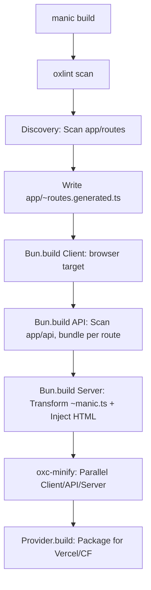

# Manic Framework: The Comprehensive Engineering Manual

Manic is a high-performance, production-grade React framework built from the ground up on Bun and Hono. It features a custom, ultra-fast bundler and builder system leveraging OXC for transformation and minification. We prioritize reliability, speed, and zero-config DX, intentionally replacing existing solutions like Vite, Webpack, or Turbopack with our own optimized stack.

**Documentation:** [manic-docs.vercel.app](https://manic-docs.vercel.app/)

**LLM / agent context (plain text):** [llms.txt](https://manic-docs.vercel.app/llms.txt) (index of doc URLs) · [llms-full.txt](https://manic-docs.vercel.app/llms-full.txt) (full docs in one file)

---

## 📂 Repository Structure

### Core Workspace

| Path                     | Purpose                                                           |
| :----------------------- | :---------------------------------------------------------------- |
| `packages/manic/`        | The core framework engine (CLI, runtime, router, server).         |
| `packages/create-manic/` | CLI scaffolding tool (`bun create manic`) and project templates.  |
| `packages/providers/`    | Deployment adapters for Vercel, Netlify, Cloudflare, and more.    |
| `demo/`                  | The primary development testbench for local feature verification. |
| `examples/`              | Curated reference applications and integration patterns.          |

### Framework Internals (`packages/manic/src/`)

| Directory      | Responsibility                             | Key Files                                                            |
| :------------- | :----------------------------------------- | :------------------------------------------------------------------- |
| `cli/`         | Command orchestrator & toolchain.          | `index.ts`, `commands/build.ts`, `commands/dev.ts`, `plugins/oxc.ts` |
| `server/`      | Production Hono server & SSR engine.       | `index.ts`, `lib/discovery.ts` (route scanning)                      |
| `router/`      | Type-safe React router & View Transitions. | `Router.tsx`, `lib/matcher.ts`, `lib/Link.tsx`, `lib/context.ts`     |
| `plugins/`     | Core framework extensions & middleware.    | `lib/api.ts` (API loader), `lib/static.ts`                           |
| `config/`      | Schema-driven configuration engine.        | `index.ts` (loadConfig/defineConfig), `client.ts`                    |
| `env/`         | Environment variable management.           | `client.ts`                                                          |
| `theme/`       | Built-in styling & theme utilities.        | `index.ts`                                                           |
| `transitions/` | View Transitions API React components.     | `index.ts`                                                           |

---

## 🛠 The Manic Build Engine (Custom Toolchain)

Manic does NOT use Vite or Rollup. It implements a proprietary build pipeline built with Bun and OXC:

### 🏗 Build Pipeline Flow



1. **Auto-Linting**: Mandatory `oxlint` pass ensures production-grade reliability before bundling.
2. **Client Bundling**: `Bun.build` + `oxcPlugin` + `bun-plugin-tailwind`. Target: `browser`. Implements code-splitting via dynamic imports in the route manifest.
3. **API Bundling**: Each folder in `app/api/` (with an `index.ts`) is bundled into a standalone JS file in `dist/api/`.
4. **Server Entry Transformation**:
   - Reads `~manic.ts`.
   - Replaces `import app from './app/index.html'` with a `Bun.file()` read of the built HTML.
   - Bundles the entire server for the `bun` target.
5. **OXC Minification**: `oxc-minify` runs in parallel over all output directories. es2022 target, mangling enabled.

---

## 🛣 Routing & Client Lifecycle

### The `~` (Tilde) Convention

- `~manic.ts`: Mandatory server entry point.
- `app/~routes.generated.ts`: Auto-generated manifest. Contains dynamic `import()` for all pages.
- `app/routes/~*.tsx`: Files prefixed with `~` are ignored by the router (useful for components/layouts/utils).

### 🛣 Client Navigation Flow


- **Matching Strategy**: Routes are compiled into regex and scored (Static > Dynamic > Catch-all). `RouteRegistry` ensures O(n) matching with pre-sorted priorities.
- **Lazy Loading**: Pages are only loaded when navigated to. Components are cached in memory after first load.
- **Prefetching**: `<Link>` preloads the target route's JS chunk on `onMouseEnter` or `onFocus`.

---

## 🔌 Plugin & Provider Architecture

### `ManicPlugin` Interface

```ts
interface ManicPlugin {
  name: string;
  /** Absolute path to a Bun plugin script — auto-injected as --preload in dev, Bun.plugin() in build */
  preload?: string;
  /** TOML snippet for bunfig.toml — manic dev merges all [serve.static] entries automatically */
  bunfig?: string;
  configureServer?(ctx: ManicServerPluginContext): void | Promise<void>;
  build?(ctx: ManicBuildPluginContext): void | Promise<void>;
}
```

### First-Party Plugins

| Package | Purpose |
| :--- | :--- |
| `@manicjs/tailwind` | Tailwind CSS v4 via `bun-plugin-tailwind` |
| `@manicjs/unocss` | UnoCSS via `bun-plugin-unocss` |
| `@manicjs/mdx` | MDX with GFM, frontmatter, TOC extraction |
| `@manicjs/seo` | Meta tags, Open Graph, canonical URLs |
| `@manicjs/sitemap` | Auto-generates `sitemap.xml` |
| `@manicjs/mcp` | Model Context Protocol endpoint |
| `@manicjs/api-docs` | Scalar API reference UI |

### How `bunfig.toml` Works

`manic dev` auto-generates `bunfig.toml` by collecting `bunfig` snippets from all plugins and merging `[serve.static]` entries into one section. Apps never touch `bunfig.toml` — it's gitignored.

```toml
# Auto-generated by manic dev — do not edit

[serve.static]
plugins = ["bun-plugin-tailwind", "@manicjs/mdx/bun-plugin"]
```

### Build-Time Plugins (`ManicPlugin`)

Defined in `manic.config.ts`.

- `build(ctx)`: Access to `pageRoutes`, `apiRoutes`, `dist`, `emitClientFile(path, content)`, and `injectHtml(tags)`.
- Use `emitClientFile(relativePath, content)` to write static files into `dist/client/`. These are automatically picked up by **all providers** (Vercel, Cloudflare, Netlify) since every provider copies `dist/client` to its static output directory.
- Use `injectHtml(tags)` to inject HTML tags (e.g. `<meta>`, `<script>`) into `<head>` of the built `index.html`.
- **Do not write provider-specific code inside a plugin.** Plugins must be provider-agnostic. If a feature needs to work in production, emit it as a static file via `emitClientFile` or handle it in `configureServer` for the dev server.

### Runtime/Server Plugins (`ManicPlugin`)

- `configureServer(ctx)`: Hooks into `Bun.serve`. Can add routes via `addRoute(path, handler)`, inject `Link` headers via `addLinkHeader(value)`, and inject HTML tags via `injectHtml(tags)`.
- Routes registered here are **dev-only** unless the same content is also emitted as a static file in the `build` hook.
- **Every plugin that registers a route in `configureServer` should also emit the equivalent static file in `build`** so production deployments work identically.

### `createPlugin` Helper

Use `createPlugin` from `manicjs/config` instead of returning a plain object. It eliminates the dev/prod parity boilerplate for static files via the `staticFiles` shorthand:

```ts
import { createPlugin } from 'manicjs/config';

export function myPlugin(options = {}) {
  return createPlugin({
    name: 'my-plugin',

    // Automatically served as a route in dev AND emitted via emitClientFile in prod
    staticFiles: [
      {
        path: '/my-file.txt',
        content: ctx => generateContent(ctx.pageRoutes), // or a plain string
        contentType: 'text/plain; charset=utf-8',
      },
    ],

    configureServer(ctx) {
      // Additional dev-only setup (link headers, html injection, dynamic routes)
      ctx.addLinkHeader('</my-file.txt>; rel="my-relation"');
      ctx.injectHtml('<meta name="my-plugin" content="true">');
    },

    build(ctx) {
      // Additional build-only setup (html injection, extra emits)
      ctx.injectHtml('<meta name="my-plugin" content="true">');
    },
  });
}
```

- `staticFiles[].content` can be a plain string or a function `(ctx: ManicPluginContext) => string | Promise<string>` for context-aware generation.
- `configureServer` and `build` hooks are optional and run **after** `staticFiles` are processed.
- **Never hardcode `<script src="/webmcp.js">` or similar plugin-owned tags in `index.html`** — plugins inject them via `injectHtml`.

### Plugin Checklist

When creating or modifying a plugin, ensure:

- [ ] Use `createPlugin` from `manicjs/config`
- [ ] Static files use the `staticFiles` shorthand (not manual `addRoute` + `emitClientFile`)
- [ ] `injectHtml` is called (not a hardcoded script tag in `index.html`) for any injected scripts/meta
- [ ] No provider-specific imports or logic inside the plugin
- [ ] `addLinkHeader` is called for any discovery endpoint (RFC 8288)

### Deployment Providers (`ManicProvider`)

Transforms `.manic/` output into platform-specific formats. Providers **consume** what plugins emit — they do not duplicate plugin logic.

- **Vercel**: Creates `.vercel/output`, maps static files, generates `config.json` + `.vc-config.json` for serverless functions.
- **Cloudflare**: Generates `dist/`, `_worker.js` for edge routing, and `wrangler.toml`.
- Providers may inject shared middleware (Link headers, markdown negotiation) into the generated worker/function code, but this is infrastructure-level — not plugin logic.

---

## 🚀 Technical Standards & Requirements

### The Stack

- **Runtime**: Bun (Mandatory - uses `Bun.serve`, `Bun.build`, `Bun.Glob`, `Bun.spawn`, `Bun.file`).
- **Server**: Hono (High-performance middleware & routing).
- **Transform**: `oxc-transform` (Ultra-fast JSX/TS compilation).
- **Minify**: `oxc-minify` (Production-grade code compression).
- **Resolve**: `oxc-resolver` (Node/Bun compatible module resolution).
- **Lint**: `oxlint` (Blazing fast diagnostics).

### Engineering Principles

- **Reliability First**: Production builds in `demo/` are the ultimate source of truth.
- **Speed & Lightness**: Avoid non-essential dependencies. Prefer Bun built-ins.
- **Zero-Config**: Framework should "just work" by scanning `app/` structure.
- **Type Safety**: Maintain strict TypeScript contracts across router, config, and plugins.
- **Workspace Integrity**: Always use `bun install` at the root.

---

## 📝 Development Workflow

1. **Feature Work**: Modify `packages/manic/src/`.
2. **Local Validation**: Run `bun dev` or `bun build && bun start` in `demo/`.
3. **Internal CLI Testing**: `bun run packages/manic/src/cli/index.ts <cmd>`.
4. **Format/Lint**: Use `manic fmt` and `manic lint`.
