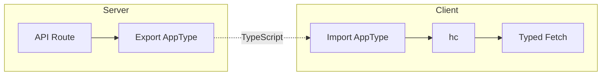

# RPC Client

The recommended pattern for calling API routes from client-side code is using standard fetch or Hono RPC for type-safety.

## Fetch Pattern

### Basic Fetch

```ts
const res = await fetch('/api/users');
const data = await res.json();
```

### With Type Safety

Share types between your API and client code:

```ts title="app/api/users/index.ts"
import { Hono } from 'hono';

const app = new Hono();
app.get('/', (c) => c.json({ users: [] }));
export type AppType = typeof app;
```

```ts title="lib/client.ts"
import type { AppType } from '../api/users';
import { hc } from 'hono/client';

export const client = hc<AppType>('/api');
```

## Helper Function Pattern

Create a reusable API client helper:

```ts title="lib/api.ts"
export async function apiFetch<T>(
  endpoint: string, 
  options?: RequestInit
): Promise<T> {
  const res = await fetch(`/api${endpoint}`, {
    ...options,
    headers: {
      'Content-Type': 'application/json',
      ...options?.headers,
    },
  });
  
  if (!res.ok) {
    const error = await res.json().catch(() => ({ message: 'Request failed' }));
    throw new Error(error.message);
  }
  
  return res.json();
}
```

### Usage Examples

```ts
interface User {
  id: string;
  name: string;
}

// Get all users
const users = await apiFetch<User[]>('/users');

// Get single user
const user = await apiFetch<User>('/users/123');

// Create user
const newUser = await apiFetch<User>('/users', {
  method: 'POST',
  body: JSON.stringify({ name: 'Alice' }),
});
```

## Error Handling

```ts title="lib/api.ts"
async function safeApiFetch<T>(endpoint: string): Promise<T | null> {
  try {
    const res = await fetch(`/api${endpoint}`);
    
    if (res.status === 404) {
      return null;
    }
    
    if (!res.ok) {
      const error = await res.json().catch(() => ({ message: 'Unknown error' }));
      throw new Error(error.message);
    }
    
    return res.json();
  } catch (error) {
    console.error('API call failed:', error);
    return null;
  }
}
```

## Type Sharing Flow



## See Also

- [API Routes](/docs/framework/server) - Creating API endpoints
- [Data Fetching](/docs/framework/server/data-fetching) - Client data patterns
- [Hono RPC](https://hono.dev/docs/rpc) - Full RPC documentation
