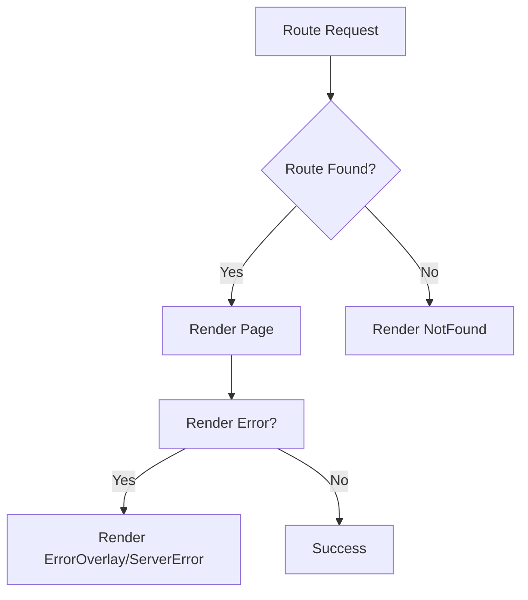

# Error Handling Components

Manic provides built-in components for handling various error states in your application.

## NotFound

The 404 page component displayed when no route matches the current URL.

### Default Render

```ts
// Built-in default renders:
<div className="manic-not-found">
  <h1>404</h1>
  <p>Page not found</p>
  <a href="/">Go Home</a>
</div>
```

### Creating a Custom NotFound Page

Create a file at `app/routes/~404.tsx`:

```tsx twoslash
// @errors: 2322
// app/routes/~404.tsx
import React from 'react';
import { Link } from 'manicjs';

export default function NotFound() {
  return (
    <div className="min-h-screen flex items-center justify-center">
      <div className="text-center">
        <h1 className="text-6xl font-bold">404</h1>
        <p className="text-xl mt-4">Page not found</p>
        <Link to="/" className="mt-4 inline-block">
          Go Home
        </Link>
      </div>
    </div>
  );
}
```

---

## ErrorOverlay

React error boundary overlay for client-side errors.

### Usage

```tsx twoslash
// @errors: 2322
import React from 'react';
import { ErrorOverlay } from 'manicjs';

export function ErrorPage({ error }: { error: Error }) {
  return <ErrorOverlay error={error} />;
}
```

### Props

<TypeTable
  type={{
    error: {
      type: 'Error | undefined',
      description: 'Error object to display in the overlay',
    },
  }}
/>

### Example With Local Error State

```tsx twoslash
// @errors: 2322
import React, { useState } from 'react';
import { ErrorOverlay } from 'manicjs';

function App() {
  const [error, setError] = useState<Error | null>(null);

  return error ? (
    <ErrorOverlay error={error} />
  ) : (
    <button onClick={() => setError(new Error('Something went wrong'))}>
      Trigger error overlay
    </button>
  );
}
```

---

## ServerError

Server-side error component for 500 errors.

### Usage

Create `app/routes/~500.tsx`:

```tsx
// app/routes/~500.tsx
import React from 'react';

export default function ServerError({ error }: { error?: Error }) {
  const isDev = Bun.env.NODE_ENV === 'development';
  
  return (
    <div className="error-500">
      <h1>500 - Server Error</h1>
      {isDev && error && (
        <pre className="bg-red-100 p-4">{error.stack}</pre>
      )}
    </div>
  );
}
```

### Props

<TypeTable
  type={{
    error: {
      type: 'Error | undefined',
      description: 'Error object (available in development)',
    },
  }}
/>

---

## Error Flow



---

## Error Pages Summary

| File | Route | Purpose |
|------|-------|---------|
| `app/routes/~404.tsx` | All unmatched | 404 Not Found |
| `app/routes/~500.tsx` | All | Server errors |
| `app/routes/~ErrorOverlay.tsx` | Client | React error boundary |

## See Also

- [Error Handling Guide](/docs/framework/advanced/error-handling) - Full error handling patterns
- [Routes Guide](/docs/framework/routing) - Route structure