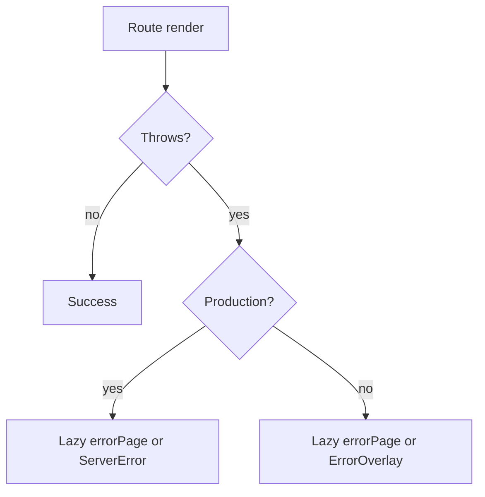

# Errors & boundaries

Manic exposes three React primitives from **`manicjs`** for unmatched routes and thrown errors. Custom **`app/routes/~404.tsx`** / **`~500.tsx`** files override the lazy loaders emitted inside **`app/~routes.generated.ts`**.

---

## API reference

<Cards>
  <Card title="NotFound" description="Router no-match shell optional routes hints" href="/docs/api/errors/not-found" />
  <Card title="ErrorOverlay" description="Development overlay with stack diagnostics" href="/docs/api/errors/error-overlay" />
  <Card title="ServerError" description="Minimal fatal-error shell — no props" href="/docs/api/errors/server-error" />
</Cards>

---

## Manifest wiring (`main.tsx`)

```ts
import { routes, notFoundPage, errorPage } from './~routes.generated';

window.__MANIC_ROUTES__ = routes;
window.__MANIC_ERROR_PAGES__ = {};
if (notFoundPage) window.__MANIC_ERROR_PAGES__.notFound = notFoundPage;
if (errorPage) window.__MANIC_ERROR_PAGES__.error = errorPage;
```

---

## Error flow



---

## Route-level pages

| File | Purpose |
| :--- | :--- |
| **`app/routes/~404.tsx`** | Custom not-found UI (`export default`) |
| **`app/routes/~500.tsx`** | Custom error UI — receives framework-provided **`error`** props when routed via manifest |

---

## See also

- [Framework · Error handling](/docs/framework/advanced/error-handling)
- [Router](/docs/api/router/router)
