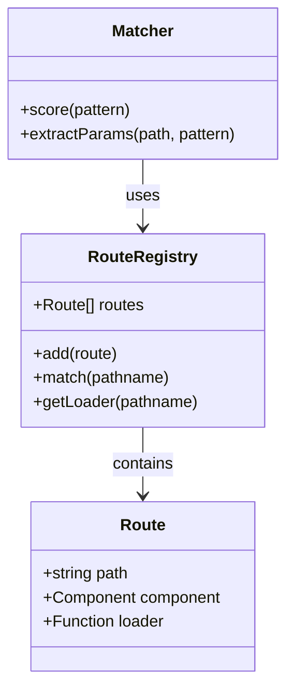
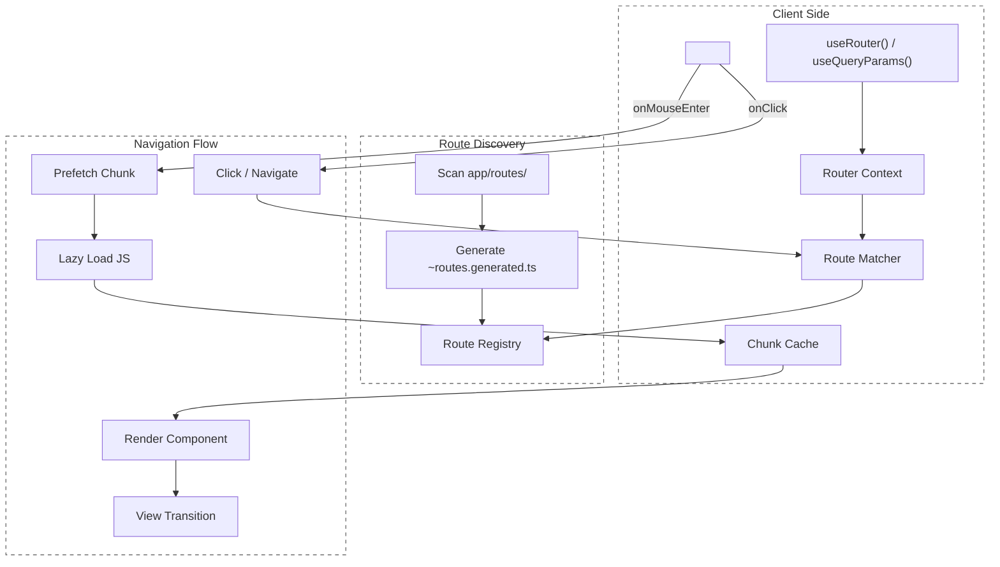

# Router API

The Manic Router provides a **type-safe, zero-config routing system** for client-side navigation with built-in code-splitting and View Transitions support.

<Cards>
  <Card title="Router" description="Root component __MANIC_ROUTES__ wiring" href="/docs/api/router/router" />
  <Card title="RouterContext" description="Advanced context consumer integrations" href="/docs/api/router/router-context" />
  <Card title="Link" description="Declarative navigation prefetch" href="/docs/api/router/link" />
  <Card title="navigate" description="Programmatic navigation" href="/docs/api/router/navigate" />
  <Card title="useRouter" description="Matched route params context" href="/docs/api/router/use-router" />
  <Card title="useQueryParams" description="Reactive URLSearchParams" href="/docs/api/router/use-query-params" />
  <Card title="preloadRoute" description="Warm lazy chunks manually" href="/docs/api/router/preload-route" />
</Cards>

## Components

### `<Link />`

Primary component for client-side navigation. Automatically prefetches code chunks on hover.

```tsx
// @errors: 2322
import React from 'react';
import { Link } from 'manicjs';

export default function Nav() {
  return (
    <Link to="/posts/123" prefetch={true}>
      View Post
    </Link>
  );
}
```

#### Props

<TypeTable
  type={{
    to: {
      type: 'string',
      description: 'Destination URL path',
    },
    children: {
      type: 'ReactNode',
      description: 'Link content',
    },
    className: {
      type: 'string',
      description: 'CSS class name',
    },
    style: {
      type: 'CSSProperties',
      description: 'Inline styles',
    },
    viewTransitionName: {
      type: 'string',
      description: 'CSS view-transition-name for animating across navigations',
    },
    prefetch: {
      type: 'boolean',
      default: 'true',
      description: 'Preload code chunk on hover/focus',
    },
    replace: {
      type: 'boolean',
      default: 'false',
      description: 'Replace history entry instead of pushing',
    },
  }}
/>

#### Example: Conditional Navigation

```tsx twoslash
// @errors: 2322
import React from 'react';
import { Link } from 'manicjs';

export function BlogLink({ slug, featured }: { slug: string; featured?: boolean }) {
  return (
    <Link
      to={`/blog/${slug}`}
      replace={featured}
      className={featured ? 'font-bold' : ''}
    >
      {slug}
    </Link>
  );
}
```

---

## Hooks

### `useRouter()`

Access the router instance for programmatic navigation.

```tsx
// @errors: 2322
import React from 'react';
import { useRouter } from 'manicjs';

export function LoginButton() {
  const router = useRouter();

  const handleLogin = async () => {
    // ... login logic
    router.navigate('/dashboard');
  };

  return <button onClick={handleLogin}>Login</button>;
}
```

#### Router API

<TypeTable
  type={{
    path: {
      type: 'string',
      description: 'Current URL pathname',
    },
    navigate: {
      type: '(to: string, options?: { replace?: boolean }) => void',
      description: 'Navigate to a new path',
    },
    params: {
      type: 'Record<string, string>',
      description: 'Dynamic route parameters',
    },
  }}
/>

#### Examples

```tsx
// @errors: 2322
const router = useRouter();

// Push a new entry to history
router.navigate('/posts/456');

// Replace current history entry
router.navigate('/login', { replace: true });

// Check current path
if (router.path === '/') {
  // Home page
}

// Access route params
const postId = router.params.id;
```

### Route Parameters

Access dynamic route parameters via `useRouter().params`:

```tsx
// @errors: 2322
import React from 'react';
import { useRouter, useQueryParams } from 'manicjs';

export default function PostPage() {
  const { params } = useRouter();
  const slug = params.slug;
  
  return <div>Post: {slug}</div>;
}
```

#### Usage

```tsx twoslash
// @errors: 2322
import { useRouter } from 'manicjs';

// Route: app/routes/blog/[slug].tsx
const { params } = useRouter();
const { slug } = params;  // From URL: /blog/my-post

// Route: app/routes/posts/[id]/comments/[commentId].tsx
const { id, commentId } = params;

// Route: app/routes/docs/[...path].tsx (catch-all)
const { path } = params;  // path = "guides/setup/installation"
```

### `useQueryParams()`

Access and update URL search parameters:

```tsx twoslash
// @errors: 2322 2304
import React from 'react';
import { useQueryParams } from 'manicjs';
declare const window: any;
declare const replaceUrl: (_url: string) => void;

export function SearchPage() {
  const searchParams = useQueryParams();

  return (
    <>
      <input
        value={searchParams.get('q') || ''}
        onChange={(e: any) => {
          const params = new URLSearchParams(searchParams);
          params.set('q', e.target.value);
          replaceUrl(`?${params.toString()}`);
        }}
      />
      <p>Searching for: {searchParams.get('q')}</p>
    </>
  );
}
```

#### API

`useQueryParams()` returns a standard `URLSearchParams` object:

```ts
class URLSearchParams {
  get(key: string): string | null;
  getAll(key: string): string[];
  has(key: string): boolean;
  set(key: string, value: string): void;
  delete(key: string): void;
  toString(): string;
}
```

#### Examples

```tsx twoslash
// @errors: 2322
import { useQueryParams } from 'manicjs';

declare function replaceUrl(url: string): void;

const searchParams = useQueryParams();

// Read
const searchTerm = searchParams.get('q');           // "react"
const page = searchParams.get('page');             // "2"
const tags = searchParams.getAll('tag');           // ["javascript", "react"]

// Check existence
if (searchParams.has('sort')) {
  // Sort param exists
}

// Update URL manually
const params = new URLSearchParams(searchParams);
params.set('q', 'typescript');
params.delete('page');
replaceUrl(`?${params.toString()}`);
```

---

## Route Manifest

The router relies on an **auto-generated manifest** at `app/~routes.generated.ts`. This file is updated automatically by `manic dev` and `manic build`.

<Callout type="warn">

**Never edit `app/~routes.generated.ts` manually.** It is regenerated on every build.

</Callout>

### Example Generated Manifest

```ts
// app/~routes.generated.ts (auto-generated)
export const routes = [
  {
    path: '/',
    component: null,
    loader: () => import('./routes/index.tsx'),
  },
  {
    path: '/blog/:slug',
    component: null,
    loader: () => import('./routes/blog/[slug].tsx'),
  },
  {
    path: '/docs/:...path',
    component: null,
    loader: () => import('./routes/docs/[...path].tsx'),
  },
];
```

### Route Registry Structure



### Architecture



---

## Advanced Patterns

### Protected Routes

```tsx
// @errors: 2322
import React from 'react';
import { useRouter, useQueryParams } from 'manicjs';
import { useAuth } from './~hooks/useAuth';

export default function AdminPage() {
  const router = useRouter();
  const { user } = useAuth();

  React.useEffect(() => {
    if (!user?.isAdmin) {
      router.navigate('/', { replace: true });
    }
  }, [user, router]);

  if (!user?.isAdmin) return null;  // Prevent flash
  
  return <div>Admin Panel</div>;
}
```

### Search with Query Params

```tsx twoslash
// @errors: 2322
import React from 'react';
import { useRouter, useQueryParams } from 'manicjs';

declare function replaceUrl(url: string): void;

export default function SearchResults() {
  const query = useQueryParams();
  const router = useRouter();
  const searchTerm = query.get('q') || '';

  const handleSearch = (term: string) => {
    const params = new URLSearchParams(query);
    params.set('q', term);
    params.set('page', '1');
    replaceUrl(`?${params.toString()}`);
  };

  return (
    <div>
      <input value={searchTerm} onChange={(e: any) => handleSearch(e.target.value)} />
      {/* Results for {searchTerm} */}
    </div>
  );
}
```

### Nested Dynamic Routes

```tsx twoslash
// @errors: 2322
// Route: app/routes/posts/[id]/comments/[commentId].tsx
import React from 'react';
import { useRouter } from 'manicjs';

export default function CommentPage() {
  const { params } = useRouter();
  
  return (
    <div>
      <h1>Post {params.id}</h1>
      <p>Comment {params.commentId}</p>
    </div>
  );
}
```

---

## View Transitions

Manic automatically wraps navigation in `document.startViewTransition()` for smooth page transitions.

```tsx twoslash
// @errors: 2322
import React from 'react';
import { Link } from 'manicjs';

export default function Navigation() {
  return (
    <Link to="/about">
      About
    </Link>
  );
}
```

**Disable transitions globally:**

```ts twoslash
// @errors: 2322
import { setViewTransitions } from 'manicjs';

setViewTransitions(false);
```

**Custom transition CSS:**

```css
::view-transition-old(root) {
  animation: fadeOut 0.3s ease-out;
}

::view-transition-new(root) {
  animation: fadeIn 0.3s ease-in;
}
```

---

<Callout type="info">

Router hooks must be called inside components rendered by the router. Calling them outside a routed component will error.

</Callout>
See [routing guide](/docs/framework/routing) for more patterns and best practices.
