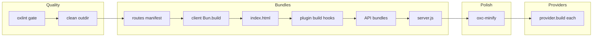

# manic build

**`manic build`** produces the **`build.outdir`** bundle (default **`.manic/`**): browser client, optional API bundles, **`server.js`**, minification, then **`provider.build`** adapters.

Implementation: [`packages/manic/src/cli/commands/build.ts`](https://github.com/Rahuletto/manic/blob/main/packages/manic/src/cli/commands/build.ts).

---

## Pipeline map

Stages Group roughly into **quality**, **bundles**, **polish**, and **providers**:

### Stage checklist

| Stage | Artifact / effect |
| :--- | :--- |
| oxlint | Aborts build on failures |
| Clean | Fresh **`outdir/client`** tree |
| Bun plugins | **`plugins[].preload`** registered before **`Bun.build`** |
| Manifest | **`app/~routes.generated.ts`** |
| Client | Hashed chunks under **`outdir/client`** |
| HTML | **`outdir/client/index.html`** (+ plugin **`injectHtml`**) |
| Plugin **`build`** | **`emitClientFile`**, HTML mutations |
| API | **`outdir/api/*.js`** or skipped in **`frontend`** mode |
| Server | **`outdir/server.js`** |
| Minify | **`client/`**, **`api/`**, **`server.js`** |
| Providers | Vercel / Cloudflare / Netlify adapters |

---

## Pipeline (ordered)

1. **Oxlint gate** — Runs **`oxlint .`** (prefers **`node_modules/.bin/oxlint`**). **Build aborts** on failure.

2. **Clean & scaffold** — **`rm -rf <outdir>`**, **`mkdir -p <outdir>/client`**.

3. **Register Bun plugins** — Imports each **`plugins[].preload`** and registers **`default`** / **`plugin`** via **`Bun.plugin()`** before bundling.

4. **Route manifest** — Writes **`app/~routes.generated.ts`** via **`writeRoutesManifest`**.

5. **Client bundle** — Resolves **`./app/main`** (**`app/main.tsx`** / **`.jsx`** required). **`Bun.build`** with **`target: 'browser'`**, **`oxcPlugin()`**, **`bun-plugin-tailwind`**, hashed **`entry` / `chunk` / `asset`** names under **`<outdir>/client`**.

6. **HTML** — Reads **`app/index.html`** when present; injects built JS (and Tailwind CSS link); otherwise emits a minimal shell with **`#root`**. Writes **`<outdir>/client/index.html`**.

7. **Optional `assets/` copy** — If a root **`assets/`** folder exists, copies it to **`<outdir>/client/assets`**.

8. **`plugins[].build`** — Runs Manic **`build`** hooks with **`emitClientFile`**, **`injectHtml`**, discovered **`pageRoutes`**, **`dist`**, etc.; **`apiRoutes`** passed here is **`[]`** during this stage.

9. **API bundles** — Skipped when **`mode === 'frontend'`**. Otherwise globs **`app/api/**/index.ts`**, **`Bun.build`** each entry (**`target: 'bun'`**, **`dependencies` externalized from `package.json`**), outputs **`<outdir>/api/<route-path>.js`**. Writes **`/.well-known/api-catalog`** under **`client`** when any API route exists.

10. **Server bundle** — Rewrites **`~manic.ts`** HTML import to **`Bun.file("<outdir>/client/index.html").text()`**, emits **`server.js`** (**`target: 'bun'`**, **`oxcPlugin()`**).

11. **Minify** — Parallel **oxc-minify** (**es2022**, mangle) over **`client/`**, **`api/`** (if present), and **`server.js`**.

12. **Providers** — Invokes **`provider.build({ dist, config, apiEntries, clientDir, serverFile })`** for each configured **`ManicProvider`**.

Console ends with artifact sizes and **`Start: bun start`** hint.

---

## Output layout

Default **`<outdir>`** is **`.manic`** — configurable via **`build.outdir`** in **`manic.config.ts`** ([Configuration](/docs/api/config)).

---

## CLI notes

- **`manic build`** does **not** expose **`--out-dir`** as a CLI flag; change **`build.outdir`** in config.
- Parsed **`--port`** / **`--network`** from the root CLI are **not read** inside **`build()`** today.

---

## See also

- [CLI Overview](/docs/cli)
- [manic dev](/docs/cli/dev)
- [manic start](/docs/cli/start)
- [Core build pipeline](/docs/core/build-pipeline)
- [Discovery engine](/docs/core/discovery-engine)
