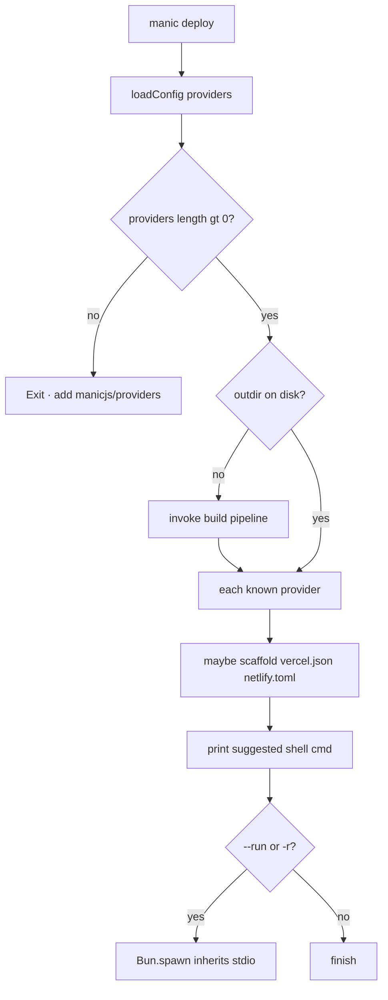

# manic deploy

**`manic deploy`** prepares or prints commands to publish your app using **`providers`** from **`manic.config.ts`**. It does **not** replace each vendor’s CLI—you still use **Vercel**, **Wrangler**, **Netlify**, etc.; Manic stitches **`manic build`** output to those workflows.

---

## Flow



---

## Prerequisites

- At least one **`providers`** entry from **`@manicjs/providers`** (for example **`vercel()`**, **`cloudflare()`**, **`netlify()`**).
- Without providers the CLI exits with an error and a short **`import`** hint.

## Behavior

Source: [`packages/manic/src/cli/commands/deploy.ts`](https://github.com/Rahuletto/manic/blob/main/packages/manic/src/cli/commands/deploy.ts)

1. **`loadConfig()`** and read **`providers`** (must be non-empty).
2. **`dist`** = **`config.build.outdir ?? '.manic'`**. If that directory does **not** exist, **`deploy`** runs **`build()`** once (full production pipeline).
3. **`projectName`** defaults from **`config.app.name`** (slugified, else **`manic-app`**).
4. For each provider whose **`name`** is **`vercel`**, **`cloudflare`**, or **`netlify`**:

   - Optionally **generate** a starter **`vercel.json`** or **`netlify.toml`** at the repo root if missing.
   - **Print** the suggested shell command.

5. If **`--run`** or **`-r`** is present on **`argv`**, **`Bun.spawn`** runs that command with **stdio inherited**. Commands are split on spaces—avoid paths with spaces or edit locally.

### Built-in command map

| Provider `name` | Config file touched | Printed / run command |
| :--- | :--- | :--- |
| **`vercel`** | **`vercel.json`** (install/build hints if missing) | **`bunx vercel deploy`** |
| **`cloudflare`** | *(none — Wrangler config expected from provider build)* | **`bunx wrangler pages deploy dist --project-name <slug>`** |
| **`netlify`** | **`netlify.toml`** if missing | **`bunx netlify deploy --prod`** |

Unknown **`provider.name`** values log a warning and skip execution—adjust manually.

---

## Flags

| Flag | Effect |
| :--- | :--- |
| **`--run`**, **`-r`** | Executes suggested commands via **`Bun.spawn`** (stdio inherited). Arguments are split on spaces—avoid paths with spaces or wrap edits manually. |
| **`--port`**, **`--network`** | Parsed by the root **`manic`** binary only; **`deploy()`** ignores them. |

---

## Examples

```bash
# Print suggested deploy commands only
manic deploy

# Build (if needed) and run provider CLIs
manic deploy --run
```

## See also

- [CLI Overview](/docs/cli)
- [manic build](/docs/cli/build)
- [Deployments](/docs/framework/deployment)
- [Vercel](/docs/framework/deployment/vercel)
- [Cloudflare](/docs/framework/deployment/cloudflare)
