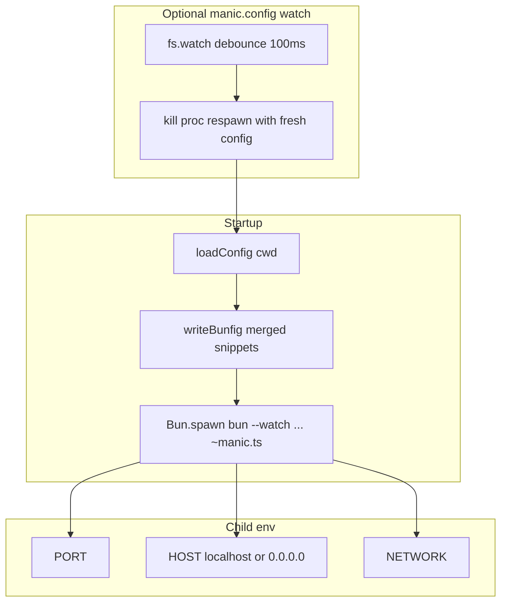

# manic dev

**`manic dev`** is the local development entry point. It does **not** embed the whole server in the CLI process—it **spawns Bun** with **`--watch`** on your **`~manic.ts`** file so filesystem changes reload the server.

Implementation: [`packages/manic/src/cli/commands/dev.ts`](https://github.com/Rahuletto/manic/blob/main/packages/manic/src/cli/commands/dev.ts).

---

## Lifecycle



---

## What runs

After **`loadConfig()`**:

1. **`bunfig.toml`** — Aggregates **`plugin.bunfig`** strings from **`manic.config.ts`**. **`[serve.static].plugins`** arrays from multiple plugins are merged into **one** section; everything else is appended. File starts with **`# Auto-generated by manic dev — do not edit`**. Skip writing if there is nothing to emit besides the header.

2. **Child process:**

   ```txt
   bun --watch [--preload <absolute-plugin-preload.ts> ...] ~manic.ts
   ```

   Each **`plugins[].preload`** becomes **two** argv tokens: **`--preload`** and the plugin script path.

| Piece | Resolved path | Purpose |
| :--- | :--- | :--- |
| Entry file | **`~manic.ts`** at repo root | Your **`createManicServer`** bootstrap |
| Preloads | **`plugins[].preload`** absolute paths | Bun executes **`--preload`** before **`~manic.ts`** |

3. **Environment** passed to the child:

   | Variable | Meaning |
   | :--- | :--- |
   | **`PORT`** | **`--port`** / **`-p`**, else **`config.server.port`**, else **6070** |
   | **`HOST`** | **`0.0.0.0`** if **`--network`**, else **`localhost`** |
   | **`NETWORK`** | **`true`** or **`false`** |

4. **Config watch** — If **`manic.config.ts`** or **`manic.config.js`** exists at the repo root, **`fs.watch`** debounces (**160ms**) **kill + respawn** after re-importing the config module so plugins and bunfig stay in sync.
5. **App graph watch** — `app/**` is watched for structural changes (`rename` on `tsx/jsx/css/mdx`) and schedules a restart so newly created components/routes are picked up without manual restarts.

---

## Fast Refresh & HMR

React Fast Refresh is driven by the **OXC** transform pipeline injected during dev transforms (see **`oxc`** plugin). Behavior matches standard Fast Refresh expectations (preserve state where possible).

Toggle **`server.hmr`** in **`manic.config.ts`** if you disable HMR at the framework level (**not** a **`manic dev --no-hmr`** flag—the CLI does not define one).

## Shutdown safety

`manic dev` only attempts to stop the spawned Manic server process and release the occupied listener port. Cleanup intentionally avoids process-group kills so quitting dev does not terminate unrelated apps (for example, browsers connected to localhost).

---

## View transitions

Controlled by **`router.viewTransitions`** in **`manic.config.ts`** (and runtime **`setViewTransitions`**). There is **no** **`manic dev --no-view-transitions`** switch.

---

## CLI flags (supported today)

| Flag | Role |
| :--- | :--- |
| **`-p`**, **`--port`** | Sets **`PORT`** for the spawned **`bun`** process (see [CLI Overview](/docs/cli) for **`server.port`** vs **`PORT`**). |
| **`--network`** | **`NETWORK=true`**, **`HOST=0.0.0.0`**. |

Global **`manic --help`** documents all commands.

---

## Plugin preloads

Plugins may declare **`preload`** so Bun executes them **before** **`~manic.ts`**:

```ts
// manic.config.ts
import { defineConfig } from 'manicjs/config';

export default defineConfig({
  plugins: [
    {
      name: 'my-plugin',
      preload: `${process.cwd()}/plugins/my-plugin-preload.ts`,
    },
  ],
});
```

The dev command expands each preload into **`--preload`** flags automatically.

---

## See also

- [CLI Overview](/docs/cli)
- [manic build](/docs/cli/build)
- [Configuration](/docs/api/config)
- [Plugins](/docs/framework/plugins)
