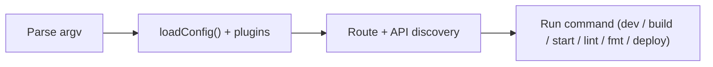

# CLI Overview

The `manic` binary is the single entry point for everything the framework does locally and in CI: starting the dev server, producing a production build, running the production server, and code-quality tasks. It is installed automatically when you add `manicjs` to your project.

```bash
bunx manic <command> [options]
```

When the package is installed globally (`bun add -g manicjs`), the `manic` command works without `bunx`.

---

## Commands

| Command | Purpose | Page |
| :--- | :--- | :--- |
| `manic dev` | Start the development server with HMR and route discovery. | [Reference](/docs/cli/dev) |
| `manic build` | Produce an optimized production bundle in `.manic/`. | [Reference](/docs/cli/build) |
| `manic start` | Serve the production build locally with the Bun runtime. | — |
| `manic deploy` | Hand the build artifacts to the configured provider. | — |
| `manic lint` | Run `oxlint` across the project. | [Reference](/docs/cli/lint-fmt) |
| `manic fmt` | Format the codebase with the OXC formatter. | [Reference](/docs/cli/lint-fmt) |

Every command supports `--help` for inline usage information.

---

## Global Options

| Flag | Default | Description |
| :--- | :--- | :--- |
| `-h`, `--help` | — | Show usage information. |
| `-v`, `--version` | — | Print the framework version. |
| `-p`, `--port <port>` | `6070` | Override the dev/start port. |
| `--network` | `false` | Bind the dev server to `0.0.0.0` so it is reachable on the LAN. |

---

## Typical Workflows

```bash
# Local development
bunx manic dev
bunx manic dev --port 3000
bunx manic dev --network          # share with phones / other devices

# Production
bunx manic build
bunx manic start                  # validate the build locally
bunx manic deploy                 # provider-specific packaging

# Code quality
bunx manic lint
bunx manic fmt
```

---

## How the CLI Boots



1. **Argument parsing** — A simple lookup against the `commands` registry in [packages/manic/src/cli/index.ts](https://github.com/Rahuletto/manic/blob/main/packages/manic/src/cli/index.ts).
2. **Configuration** — `loadConfig()` reads `manic.config.ts`, merges defaults, and exposes the resolved object to plugins.
3. **Discovery** — Pages and API routes are scanned and the manifest at `app/~routes.generated.ts` is written. See [Discovery Engine](/docs/core/discovery-engine).
4. **Command execution** — The selected command runs with the prepared context (Bun watcher, `Bun.build`, OXC plugins, providers).

---

## See Also

- [manic dev](/docs/cli/dev) — development server internals
- [manic build](/docs/cli/build) — production pipeline
- [manic lint & fmt](/docs/cli/lint-fmt) — linting and formatting
- [Configuration](/docs/api/config) — `defineConfig` reference
