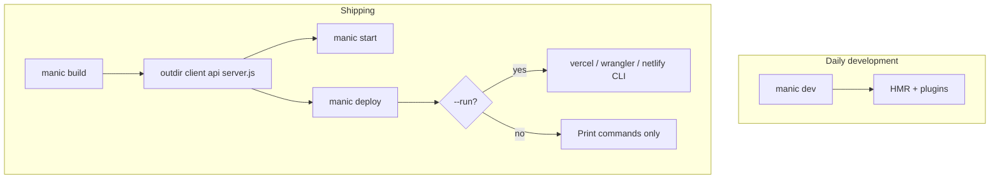
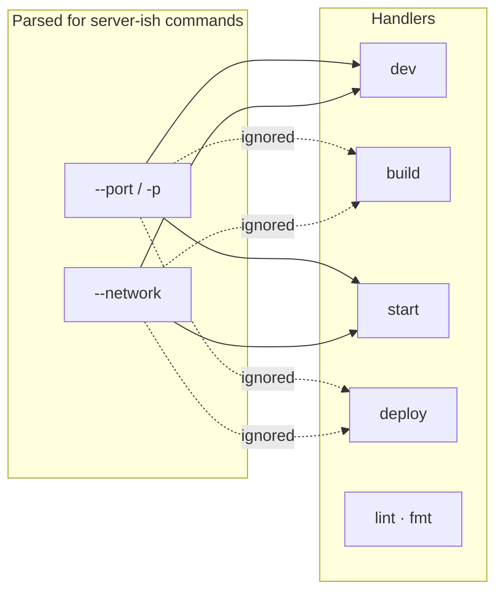

# CLI Overview

The **`manic`** binary ships with **`manicjs`** and is the entry point for dev, production builds, local production serves, deploy helpers, lint, and format.

```bash
bunx manic <command> [options]
```

With a global install (`bun add -g manicjs`), you can run **`manic`** without **`bunx`**.

---

## Commands at a glance

<Cards>
  <Card title="manic dev" description="Spawn Bun --watch on ~manic.ts, merged bunfig, config hot reload" href="/docs/cli/dev" />
  <Card title="manic build" description="Lint gate, bundles, minify, provider adapters" href="/docs/cli/build" />
  <Card title="manic start" description="Run production server.js from outdir" href="/docs/cli/start" />
  <Card title="manic deploy" description="Print or run provider deploy commands" href="/docs/cli/deploy" />
  <Card title="manic lint / fmt" description="oxlint and oxfmt via bun x" href="/docs/cli/lint-fmt" />
  <Card title="manic plugin" description="Add and remove plugins with config auto-updates" href="/docs/cli/plugin" />
</Cards>

### Typical workflows



### Command comparison

| Command | Primary output | Honors `-p` / `--port` | Honors `--network` | Spawns a child Bun process |
| :--- | :--- | :---: | :---: | :---: |
| **`dev`** | Running dev server + writes **`bunfig.toml`** | Yes → **`PORT`** | Yes → **`HOST`** + **`NETWORK`** | Yes (**`bun --watch ~manic.ts`**) |
| **`build`** | **`<outdir>/`** bundles | Parsed globally; **ignored** inside **`build()`** | Parsed; **ignored** | No |
| **`start`** | Foreground **`server.js`** logs | Yes → **`PORT`** env on child | Yes → **`NETWORK`** | Yes (**`bun server.js`**) |
| **`deploy`** | stdout hints or vendor CLI runs | Ignored | Ignored | Sometimes (**`--run`** → **`Bun.spawn`**) |
| **`lint`** | oxlint diagnostics | — | — | Yes (**`bun x oxlint`** subprocess) |
| **`fmt`** | Rewrites sources via oxfmt | — | — | Yes (**`bun x oxfmt`** subprocess) |
| **`plugin`** | Plugin package + config management | — | — | Yes (**`bun add/remove`**) |

---

## Global behavior

| Flag | When it applies | What it does |
| :--- | :--- | :--- |
| `-h`, `--help` | Always (no command or as an arg) | Prints full usage text and exits. |
| `-v`, `--version` | Anywhere in argv | Prints a version string and exits (today: the literal `latest` from the CLI; for the precise package version use `bun pm ls manicjs` or `package.json`). |
| `-p`, `--port <n>` | Parsed for **`dev`**, **`build`**, **`start`**, **`deploy`** | Currently only **dev** and **start** consumers use it: they set **`process.env.PORT`** on the spawned **`bun`** process. **`build`** accepts the parsed object today but **does not** change output or bind ports. **`deploy`** does not spawn your app server. **`createManicServer`** reads **`server.port`** from **`manic.config.ts`** (via **`loadConfig()`**, default **6070**), not **`PORT`**—set **`server.port`** to match CLI expectations, or read **`process.env.PORT`** in custom **`~manic.ts`** if you rely on the CLI flag. |
| `--network` | Parsed for **`dev`**, **`build`**, **`start`**, **`deploy`** | Only **dev** / **start** set **`NETWORK`** on the child process (**dev** also toggles **`HOST`**). Other commands ignore it. |

Commands that do not spawn your **`~manic`** server (**`build`**, **`lint`**, **`fmt`**, **`deploy`**) receive parsed **`port`**/**`network`** from argv but **do not use them** in their implementations today.

---

## Command summary

| Command | Purpose |
| :--- | :--- |
| [`manic dev`](/docs/cli/dev) | Development: generate **`bunfig.toml`**, spawn **`bun --watch`** on **`~manic.ts`** with plugin preloads, watch **`manic.config.*`**. |
| [`manic build`](/docs/cli/build) | Production: lint, clean output dir, client + API + server bundles, minify, run **provider.build** hooks. |
| [`manic start`](/docs/cli/start) | Run **`${outdir}/server.js`** with **`NODE_ENV=production`**. |
| [`manic deploy`](/docs/cli/deploy) | Ensure build output exists, print (or run) provider deploy commands. |
| [`manic lint`](/docs/cli/lint-fmt) | Run **oxlint** with **`.oxlintrc.json`**. |
| [`manic fmt`](/docs/cli/lint-fmt) | Run **oxfmt** with **`.oxfmt.json`**. |
| [`manic plugin`](/docs/cli/plugin) | Add/remove plugin packages and update **`manic.config.*`** automatically. |

### argv routing (same binary, different handlers)



---

## `manic dev` (in depth)

**Handler:** [`packages/manic/src/cli/commands/dev.ts`](https://github.com/Rahuletto/manic/blob/main/packages/manic/src/cli/commands/dev.ts)

1. **`loadConfig()`** reads **`manic.config.ts`** / **`.js`** from the project root.
2. **`writeBunfig()`** merges each plugin’s **`bunfig`** string: collects **`[serve.static].plugins`** entries from every plugin and writes a root **`bunfig.toml`** prefixed with `# Auto-generated by manic dev — do not edit`. Other non-static snippets are appended.
3. Spawns:

   ```txt
   bun --watch [--preload <plugin.preload> ...] ~manic.ts
   ```

   with **`env`** including **`PORT`**, **`HOST`** (**`localhost`** vs **`0.0.0.0`**), and **`NETWORK`**.

4. If **`manic.config.ts`** or **`manic.config.js`** exists, **`fs.watch`** debounces (~100ms) and **kills + respawns** the child after re-importing config so plugin list and bunfig stay fresh.

**Does not parse:** `--no-hmr`, `--no-view-transitions` (those are not CLI flags today—use **`manic.config.ts`** **`server.hmr`** and **`router.viewTransitions`**).

---

## `manic build` (in depth)

**Handler:** [`packages/manic/src/cli/commands/build.ts`](https://github.com/Rahuletto/manic/blob/main/packages/manic/src/cli/commands/build.ts)

Output directory: **`config.build.outdir`** (default **`.manic`**).

1. **Lint:** Runs **oxlint** on `.` (prefers **`node_modules/.bin/oxlint`**, else **`oxlint`**). **Fails the build** on non-zero exit (no separate `--no-lint` flag).
2. **Prepare:** **`rm -rf <outdir>`**, **`mkdir -p <outdir>/client`**.
3. **Plugin Bun plugins:** For each **`plugins[].preload`**, dynamically **`import`** and registers **`default`** or **`plugin`** export via **`Bun.plugin()`** before **`Bun.build`**.
4. **Routes manifest:** **`writeRoutesManifest('app/~routes.generated.ts')`**.
5. **Client bundle:** **`Bun.build`** from resolved **`./app/main`** (**`app/main.tsx`** / **`.jsx`** required). Target **`browser`**, **`oxcPlugin()`**, **`bun-plugin-tailwind`**, hashed entry/chunk/asset names. Copies top-level **`assets/`** → **`<outdir>/client/assets`** if present. Rewrites **`app/index.html`** (or generates minimal HTML) so **`main`** script and Tailwind CSS point at built filenames; writes **`<outdir>/client/index.html`**.
6. **Plugin `build` hooks:** Runs each plugin’s **`build()`** with **`emitClientFile`**, **`injectHtml`**, route lists, **`dist`**, etc.; reapplies HTML injections to **`index.html`**.
7. **API bundles:** Skipped when **`mode === 'frontend'`**. Otherwise globs **`app/api/**/index.ts`**, bundles each with **`Bun.build`** (**`target: 'bun'`**, dependencies **external**), outputs under **`<outdir>/api`**. Writes **RFC 9727** **`/.well-known/api-catalog`** under **`<outdir>/client`** when any API exists.
8. **Server bundle:** Reads **`~manic.ts`**, rewrites **`import … from './app/index.html'`** to **`Bun.file("<outdir>/client/index.html").text()`**, adjusts **`createManicServer({ html`** injection, writes temp **`<outdir>/_entry.ts`**, **`Bun.build`** → **`server.js`**, deletes temp entry.
9. **Minify:** **oxc-minify** over **`<outdir>/client`**, **`<outdir>/api`** (if any), and **`server.js`** (**es2022**, mangle).
10. **Providers:** For each **`config.providers`** with a **`build`** function, calls **`provider.build({ dist, config, apiEntries, clientDir, serverFile })`**.

---

## `manic start` (in depth)

**Handler:** [`packages/manic/src/cli/commands/start.ts`](https://github.com/Rahuletto/manic/blob/main/packages/manic/src/cli/commands/start.ts)

- Requires **`<outdir>/server.js`** (exit **1** with “Run build first” if missing).
- Runs **`bun <outdir>/server.js`** with **`NODE_ENV=production`**, **`PORT`**, **`NETWORK`** set from CLI/config parsing.

See **[manic start](/docs/cli/start)** for workflows.

---

## `manic deploy` (in depth)

**Handler:** [`packages/manic/src/cli/commands/deploy.ts`](https://github.com/Rahuletto/manic/blob/main/packages/manic/src/cli/commands/deploy.ts)

- Requires **`config.providers`** non-empty; otherwise exits with a hint to add **`@manicjs/providers`**.
- If **`<outdir>`** missing, runs **`build()`** first.
- For known providers (**`vercel`**, **`cloudflare`**, **`netlify`**), prints a suggested command and optionally generates **`vercel.json`** / **`netlify.toml`** if missing.
- **`--run`** or **`-r`**: **`Bun.spawn`** the suggested command (split on spaces—keep paths without spaces).

See **[manic deploy](/docs/cli/deploy)** for commands per provider.

---

## `manic lint` / `manic fmt` (in depth)

**Handlers:** [`lint.ts`](https://github.com/Rahuletto/manic/blob/main/packages/manic/src/cli/commands/lint.ts), [`fmt.ts`](https://github.com/Rahuletto/manic/blob/main/packages/manic/src/cli/commands/fmt.ts)

- **`manic lint`:** **`bun x oxlint --config .oxlintrc.json .`**
- **`manic fmt`:** **`bun x oxfmt -c .oxfmt.json .`**

No extra argv is forwarded—you cannot pass **`oxfmt --check`** through **`manic fmt`** today; invoke **`bun x oxfmt …`** directly if needed.

Details: **[Lint & format](/docs/cli/lint-fmt)**.

Routing lives in [`packages/manic/src/cli/index.ts`](https://github.com/Rahuletto/manic/blob/main/packages/manic/src/cli/index.ts): **`lint`** / **`fmt`** ignore **`port`** & **`network`**; **`dev`**, **`build`**, **`start`**, **`deploy`** receive **`{ port, network }`** (see **argv routing** diagram above).

---

## See also

- [manic dev](/docs/cli/dev)
- [manic build](/docs/cli/build)
- [manic start](/docs/cli/start)
- [manic deploy](/docs/cli/deploy)
- [Lint & format](/docs/cli/lint-fmt)
- [Configuration](/docs/api/config)
- [Discovery engine](/docs/core/discovery-engine)
