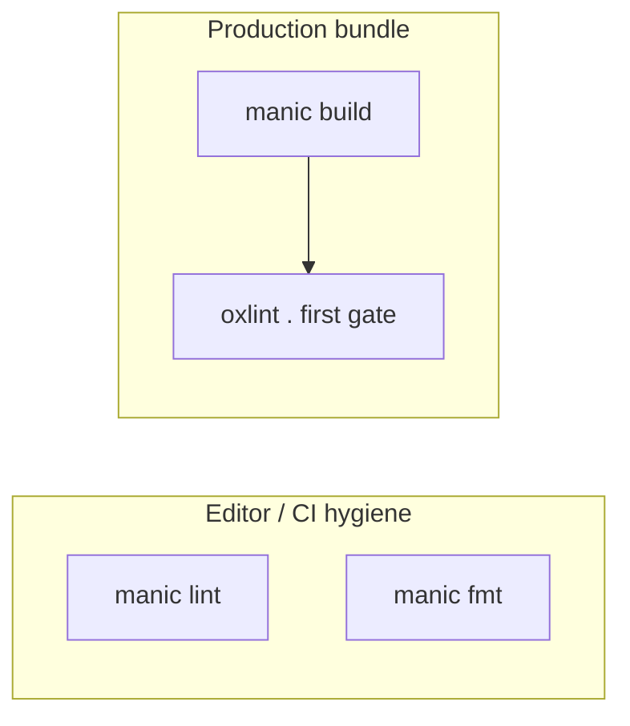

# Linting & formatting (`manic lint`, `manic fmt`)

Manic wraps **OXC**’s **`oxlint`** and **`oxfmt`** binaries via **`bun x`** so you don’t memorize paths.

---

## Tools vs build gate



| Invocation | Config file | Notes |
| :--- | :--- | :--- |
| **`manic lint`** | **`.oxlintrc.json`** (explicit **`--config`**) | Same rules you expect from local dev |
| **`manic build`** (first step) | **oxlint** default discovery | Uses **`node_modules/.bin/oxlint`** or **`PATH`** — align with **`.oxlintrc.json`** location so CI matches **`manic lint`** |
| **`manic fmt`** | **`.oxfmt.json`** via **`-c`** | No argv forwarding; use **`bun x oxfmt`** for **`--check`** |

---

Sources:

- [`packages/manic/src/cli/commands/lint.ts`](https://github.com/Rahuletto/manic/blob/main/packages/manic/src/cli/commands/lint.ts)
- [`packages/manic/src/cli/commands/fmt.ts`](https://github.com/Rahuletto/manic/blob/main/packages/manic/src/cli/commands/fmt.ts)

---

## `manic lint`

Runs exactly:

```bash
bun x oxlint --config .oxlintrc.json .
```

### Requirements

- **`.oxlintrc.json`** at the repo root — the CLI always passes **`--config .oxlintrc.json`**.

### Relation to `manic build`

See **Tools vs build gate** above — **`build`** invokes **`oxlint`** directly without **`manic lint`**’s explicit **`--config`** path.

---

## `manic fmt`

Runs exactly:

```bash
bun x oxfmt -c .oxfmt.json .
```

### Requirements

- **`.oxfmt.json`** at the repository root (**`-c`** points there).

### Passing extra formatter flags

The **`manic`** CLI **does not forward** additional argv tokens to **`oxfmt`**. For **`--check`**, includes/excludes, etc., call **`bun x oxfmt …`** directly.

---

Scaffold templates should ship **`.oxlintrc.json`** and **`.oxfmt.json`** at the repo root so **`manic lint`** / **`manic fmt`** work immediately.

---

## See also

- [CLI Overview](/docs/cli)
- [manic build](/docs/cli/build) — mandatory lint step before bundling
