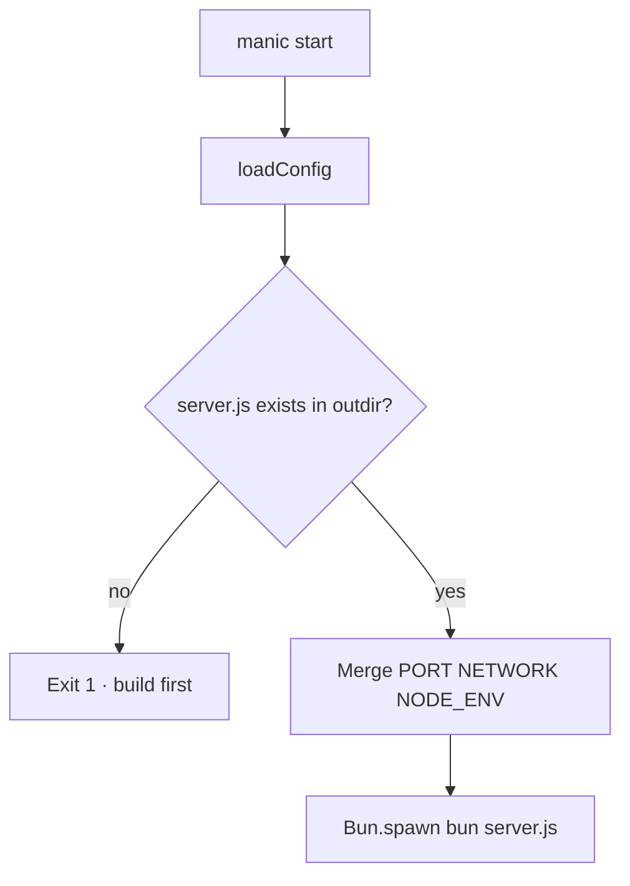

# manic start

**`manic start`** runs the compiled production server produced by **`manic build`**.

---

## Decision flow



---

## Requirements

- **`${build.outdir}/server.js`** must exist (default **`build.outdir`** is **`.manic`** → **`.manic/server.js`**).
- Run **`manic build`** first if you see **“Build not found”**.

## What it runs

Source: [`packages/manic/src/cli/commands/start.ts`](https://github.com/Rahuletto/manic/blob/main/packages/manic/src/cli/commands/start.ts)

```txt
bun ${build.outdir}/server.js
```

with **`cwd`** set to the project root and **`env`** extended with:

| Variable | Value |
| :--- | :--- |
| **`PORT`** | CLI **`--port`** / **`-p`**, else **`config.server.port`**, else **6070** |
| **`NETWORK`** | **`true`** if **`--network`** was passed, else **`false`** |
| **`NODE_ENV`** | **`production`** |

Stdout/stderr are inherited so logs appear in your terminal.

## CLI flags

Same global parsing as **`manic dev`**:

- **`-p`**, **`--port <number>`** — sets **`PORT`** for the subprocess (see [CLI Overview](/docs/cli) for how this interacts with **`server.port`** in **`manic.config.ts`**).
- **`--network`** — sets **`NETWORK=true`** on the subprocess.

There is no **`manic start --help`** subcommand; **`manic --help`** lists global usage.

## Typical use

```bash
manic build
manic start
manic start --port 8080
```

In **`package.json`**, scaffold templates often wire **`"start": "manic start"`** after **`build`**.

## See also

- [CLI Overview](/docs/cli)
- [manic build](/docs/cli/build)
- [Deployment](/docs/framework/deployment)
- [Self-hosting](/docs/framework/deployment/self-hosting)
