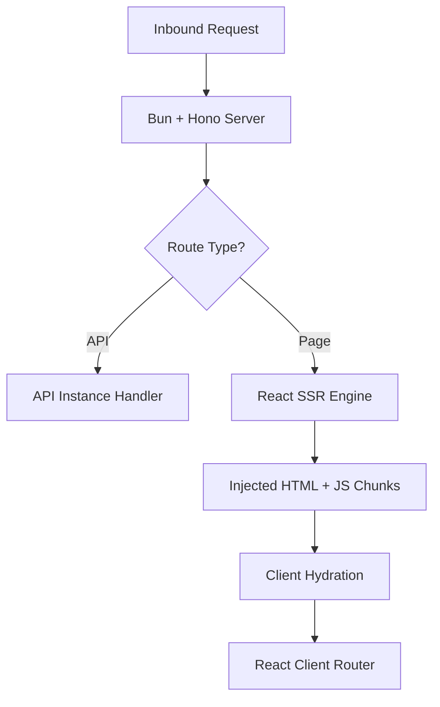

# Architecture Overview

Manic is a fullstack React framework that prioritizes absolute performance and uncompromising developer experience. To achieve this, we vertically integrate the entire toolchain—from the runtime to the minifier.

## The Manic Philosophy

The framework is built on three core pillars:
1.  **Vertical Integration**: By owning the toolchain (Bun + OXC), we eliminate the compatibility and configuration overhead of legacy tools like Babel and Webpack.
2.  **Standards-First**: We avoid proprietary APIs where possible, preferring standard Web APIs like `Request`, `Response`, and `fetch`.
3.  **Zero-Config Discovery**: Simply adding a file to `app/routes/` or `app/api/` should be the only step required to build a feature.

---

## Technical Stack

Manic intentionally replaces standard industry tools with more efficient, modern alternatives:

| Layer | Traditional Choice | Manic Choice |
| :--- | :--- | :--- |
| **Runtime** | Node.js | **Bun** |
| **Bundler** | Webpack / Vite | **Bun.build** |
| **Transformer** | Babel / SWC | **OXC** |
| **Server** | Express / Fastify | **Hono** |
| **Linter** | ESLint | **Oxlint** |

---

## System Layers

### 1. The CLI (Orchestrator)
The CLI is the brain of the framework. It manages:
- **Config Loading**: Parsing and merging `manic.config.ts`.
- **Plugin Registry**: Handling preloads and build hooks.
- **Environment Management**: Injecting `MANIC_PUBLIC_` variables.

### 2. The Build Engine
A proprietary pipeline that processes your `app/` directory. It uses a **Manifest-First** approach: it scans the directory tree exactly once to generate a static route registry before starting the heavy bundling work.

### 3. The Server (Hono)
The production server is a high-performance Hono instance running on `Bun.serve`. It is responsible for:
- **SSR (Server-Side Rendering)**: Injecting React components into a static HTML shell.
- **API Mounting**: Dynamically loading and serving Hono instances from `app/api`.
- **Static Resolution**: High-speed serving of assets via Bun's native file system APIs.

### 4. The Client Router (React)
A custom React routing engine that:
- **Matches**: Uses a pre-scored regex scanner for O(1) matching.
- **Loads**: Lazy-loads route chunks exactly when needed.
- **Transitions**: Provides cinematic navigation via the native View Transitions API.

---

## Data Flow: Request Lifecycle

By maintaining total control over the request lifecycle, Manic can optimize performance bottlenecks that are typically impossible to address in more fragmented framework ecosystems.
