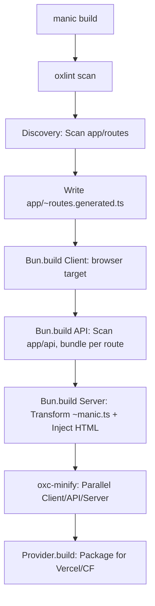

# Build Pipeline

Manic does not use Vite, Webpack, or Turbopack. It implements a proprietary build pipeline built exclusively with **Bun** and **OXC**. This vertical integration allows for optimizations that are physically impossible in multi-tool ecosystems.

## Pipeline Flow



---

## Stage Deep Dives

### 1. Mandatory Linting
Every build begins with an `oxlint` pass. By treating linting as a first-class build step rather than an optional check, Manic ensures that production builds are always compliant with project standards.

### 2. The Route Manifest
Unlike other frameworks that resolve routes at runtime, Manic generates a static manifest during the build.
- **Dynamic Imports**: Each page is wrapped in an `import()` statement.
- **Dependency Tracking**: The manifest tracks which modules are shared between routes to optimize chunking.

### 3. OXC Transformation
We use OXC to handle JSX and TypeScript transformation. 
- **ESNext Target**: We transform source code directly to `ES2022`, the modern standard for all providers.
- **Import Extensions**: We automatically rewrite `.ts` and `.tsx` extensions to `.js` in the output, ensuring native compatibility without a resolver layer.

### 4. API Route Isolation
Manic's API builder treats each endpoint folder as a standalone entry point. This allows the framework to produce extremely small, focused bundles for serverless functions, dramatically reducing cold starts compared to "Monolithic API" approaches.

### 5. Parallel Minification
Minification is one of the most CPU-intensive parts of a build. Manic executes `oxc-minify` in parallel using Bun's worker threads, compressing the Client, API, and Server codebases simultaneously. 

### 6. Provider Transformation
This is the "Final Mile". The framework hands over the `.manic/` artifacts to a specialized **Provider** (Vercel, Cloudflare, etc.).
- **Static Assets**: Providers move `dist/client` to the platform's static edge directory.
- **Serverless Mapping**: Providers generate platform-specific meta files (like `.vercel/output/config.json`) to route traffic to the built chunks.

---

## Debugging the Build

If a build fails, Manic provides detailed diagnostics. You can run the build with the `--debug` flag to see the exact transformation logs and timing for each stage.

```bash
manic build --debug
```
