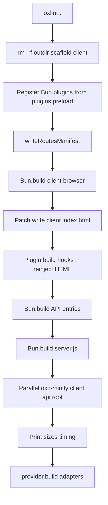

# Build pipeline

Manic does **not** ship Vite, Webpack, or Turbopack. **`manic build`** (`packages/manic/src/cli/commands/build.ts`) orchestrates **`oxlint`**, **`writeRoutesManifest`**, three **`Bun.build`** graphs (client → optional API → server), **`oxc-minify`**, and finally **`provider.build`**.

---

## Ordering (authoritative)

---

## Stage reference

| Step | Source artifact | Notes |
| :--- | :--- | :--- |
| **1 · Lint** | — | **`node_modules/.bin/oxlint`** else **`oxlint`** on **`PATH`**; **`oxlint .`** (no enforced **`--config`** — align CI with **`manic lint`**, see [Caveats](/docs/core/caveats)) |
| **2 · Clean** | **`<outdir>`** | **`rm -rf`**, **`mkdir -p …/client`** |
| **3 · Bun plugin registration** | **`plugins[].preload`** modules | Imports **`default`** or **`plugin`** **`BunPlugin`** → **`Bun.plugin(...)`** |
| **4 · Manifest** | **`app/~routes.generated.ts`** | **`writeRoutesManifest`** without **`touch`** |
| **5 · Client bundle** | **`app/main.*`** → **`<outdir>/client`** | **`oxcPlugin()`**, **`bun-plugin-tailwind`**, hashed naming |
| **6 · HTML** | **`app/index.html`** → **`<outdir>/client/index.html`** | Rewrites Tailwind placeholder / **`main.tsx`** script references |
| **7 · Plugin `build`** | Optional emits under **`client/`** | **`discoverRoutes()`** snapshot → **`pageRoutes`**; **`apiRoutes`** forced **`[]`** |
| **8 · API bundles** | **`app/api/**/index.ts`** | Skipped when **`mode === 'frontend'`** or folder missing |
| **9 · RFC catalog** | **`<outdir>/client/.well-known/api-catalog`** | Written when ≥1 API bundle exists |
| **10 · Server bundle** | **`~manic.ts`** → **`server.js`** | Rewrites HTML import + temp **`_entry.ts`** |
| **11 · Minify** | **JS under client / api / dist root** | **`minifySync`**, **`es2022`**, mangle |
| **12 · Providers** | Adapter-specific dirs | Executes **after** minification completes |

---

## Output layout (default **`build.outdir === '.manic'`**)

| Path | Contents |
| :--- | :--- |
| **`.manic/client/`** | Hashed **`main-*.js`**, **`chunks/`**, **`assets/`**, **`index.html`**, optional **`.well-known/`** |
| **`.manic/api/`** | One **`*.js`** per **`app/api/**/index.ts`** entry |
| **`.manic/server.js`** | **`createManicServer`** bootstrap |

Providers may synthesize extra directories (`.vercel/output`, `_worker.js`, etc.) **beside** this tree.

---

## Failure modes engineers debug first

| Symptom | Likely cause |
| :--- | :--- |
| Lint exits **`1`** before bundles | **`oxlint`** failures across repo |
| **`app/main.tsx not found`** | Resolver cannot find **`./app/main`** entry |
| **`~manic.ts not found`** | Missing server entry at repo root |
| API routes missing in prod | **`mode: 'frontend'`** or files not named **`index.ts`** |
| Plugins diverge dev/prod | **`configureServer`** without **`build`** emits |

---

## Debugging builds today

There is **no** **`manic build --debug`** flag in the CLI — instrumentation means reading **`build.ts`** logs (`● Bundling…`), inspecting **`<outdir>`**, or temporarily flipping **`build.minify`** / commenting stages locally.

---

## See also

- [Bundler transform](/docs/core/bundler-transform) — **`oxcPlugin`**, **`Bun.build`** matrices
- [Discovery engine](/docs/core/discovery-engine) — manifest contents
- [Performance model](/docs/core/performance-model) — why stages cost what they cost
- [manic build CLI](/docs/cli/build) — operator workflows
