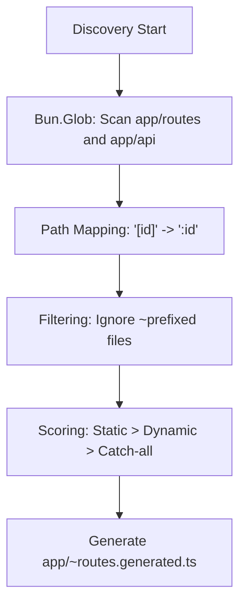

# Discovery Engine

The Discovery Engine is the heart of Manic's zero-config philosophy. It recursively scans your `app/` directory to build a comprehensive map of page routes and API endpoints.

## Scan Process

## Step-by-Step Details

## Scoping

The engine distinguishes between:

- **Page Routes**: Located in `app/routes/`. These are transformed into lazy-loaded React components in the client manifest.
- **API Routes**: Located in `app/api/`. These are bundled into standalone Hono handlers for the server.

## Manifest Generation

Once discovery is complete, the engine generates the `app/~routes.generated.ts` file. This file acts as the single source of truth for the Client Router, ensuring O(1) lookups during navigation.
