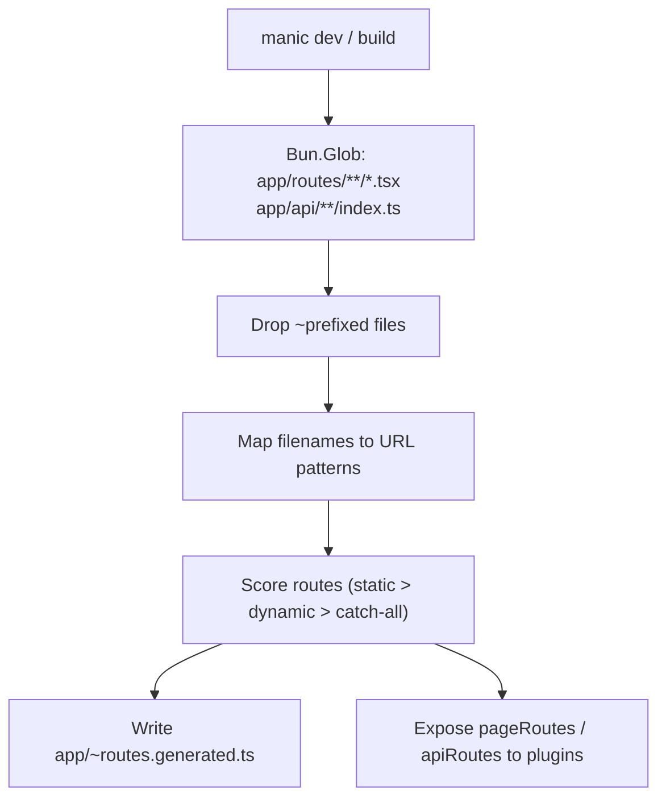

# Discovery Engine

The Discovery Engine is the part of the framework that turns conventions in `app/` into the static information that powers the router, the build pipeline, and every plugin context. It runs once during `manic dev`, on every `manic build`, and again whenever the file watcher detects a structural change.

The implementation lives in [packages/manic/src/server/lib/discovery.ts](https://github.com/Rahuletto/manic/blob/main/packages/manic/src/server/lib/discovery.ts).

---

## What Discovery Produces

| Artifact | Consumer | When |
| :--- | :--- | :--- |
| `pageRoutes: PageRoute[]` | Plugin context, manifest writer | Every run |
| `apiRoutes: ApiRoute[]` | API bundler, Hono mounting | Every run |
| `app/~routes.generated.ts` | Client router (`window.__MANIC_ROUTES__`) | Whenever the page set changes |

The shape of `PageRoute` and `ApiRoute` is exported from `manicjs/config`:

```ts twoslash
import type { PageRoute, ApiRoute } from 'manicjs/config';
```

```ts
interface PageRoute {
  path: string;       // URL pattern, e.g. "/posts/:id"
  filePath: string;   // Source file, e.g. "app/routes/posts/[id].tsx"
  dynamic: boolean;   // True if the path contains a parameter
}

interface ApiRoute {
  mountPath: string;  // Mount point, e.g. "/api/users"
  filePath: string;   // Source file, e.g. "app/api/users/index.ts"
}
```

---

## The Scan Pipeline



### 1. Globbing the App

Manic uses `Bun.Glob` (not Node.js `fs`) for parallel reads:

- Pages — `app/routes/**/*.{tsx,jsx}`
- API — `app/api/**/index.ts` (each leaf folder is one endpoint)

### 2. Filtering the `~` Convention

Any file or folder whose basename starts with `~` is **ignored**. This is the framework's escape hatch for colocating components, hooks, error pages, layouts, and tests inside the route tree without polluting the route table.

```text
✓ app/routes/index.tsx          → /
✓ app/routes/posts/[id].tsx     → /posts/:id
✗ app/routes/~Header.tsx        → ignored (component)
✗ app/routes/~hooks/useAuth.ts  → ignored (folder)
```

### 3. Filename → URL Mapping

| Filename | URL Pattern | Notes |
| :--- | :--- | :--- |
| `index.tsx` | `/` | Bare folder root. |
| `about.tsx` | `/about` | Static segment. |
| `[id].tsx` | `/:id` | Dynamic segment. |
| `[...slug].tsx` | `/:...slug` | Catch-all. |
| `posts/[id]/comments/[cId].tsx` | `/posts/:id/comments/:cId` | Nested dynamic params. |

The router internally accepts both `[param]` (file-system friendly) and `:param` (URL friendly) forms — see [packages/manic/src/router/lib/matcher.ts](https://github.com/Rahuletto/manic/blob/main/packages/manic/src/router/lib/matcher.ts).

### 4. Scoring & Priority

When several patterns could match the same URL, Manic uses a deterministic score to pick the winner:

| Segment | Score |
| :--- | :--- |
| Static (`about`) | `+100` |
| Dynamic (`[id]`, `:id`) | `+10` |
| Catch-all (`[...slug]`, `:...slug`) | `+1` |

```text
URL: /posts/new

posts/new.tsx        → 200 ✓ winner
posts/[id].tsx       → 110
posts/[...slug].tsx  → 101
```

Ties are broken by path length, so longer (more specific) routes win.

### 5. Manifest Generation

After scoring, the engine emits a TypeScript module at `app/~routes.generated.ts`. The file contains lazy `import()` statements so that each page becomes its own chunk during `Bun.build`:

```ts title="app/~routes.generated.ts (auto-generated)"
export const routes = {
  '/':            () => import('./routes/index.tsx'),
  '/about':       () => import('./routes/about.tsx'),
  '/posts/:id':   () => import('./routes/posts/[id].tsx'),
  '/docs/:...slug': () => import('./routes/docs/[...slug].tsx'),
};

export const notFoundPage = () => import('./routes/~404.tsx');
export const errorPage    = () => import('./routes/~500.tsx');
```

<Callout type="warn">

`app/~routes.generated.ts` is regenerated on every dev start and every build. **Never edit it by hand** — your changes will be overwritten.

</Callout>

---

## Error Pages

Two filenames carry special meaning when present anywhere in `app/routes/`:

| File | Role |
| :--- | :--- |
| `~404.tsx` | Rendered when no route matches the current pathname. |
| `~500.tsx` | Rendered when a route throws or a `loader()` rejects. |

These pages are wired into the manifest as `notFoundPage` and `errorPage`, which the client `<Router>` reads from `window.__MANIC_ERROR_PAGES__`.

---

## API Discovery

Discovery for `app/api/` is similar but produces Hono mount points instead of lazy components:

```text
app/api/users/index.ts                → POST/GET /api/users
app/api/users/[id]/index.ts           → /api/users/:id
app/api/posts/[id]/comments/index.ts  → /api/posts/:id/comments
```

Each endpoint is bundled into its own JavaScript file inside **`build.outdir`/api** so serverless deployments ship minimal graphs.

<Callout type="info">

**`manic build`** currently globs **`app/api/**/index.ts`** only. **`tsx`** handlers load during **`apiLoaderPlugin`** dev scans (`*.ts`, `*.tsx`, `*.js`) but **won’t** receive a production **`Bun.build`** entry unless they use **`index.ts`** or the pipeline changes ([Bundler integration](/docs/core/bundler-transform)).

</Callout>

---

## Plugin Access

The same scan results are exposed to every plugin via the context:

```ts twoslash
import { createPlugin } from 'manicjs/config';

export default createPlugin({
  name: 'route-counter',
  build(ctx) {
    console.log(`Pages: ${ctx.pageRoutes.length}`);
    console.log(`APIs:  ${ctx.apiRoutes.length}`);
  },
});
```

This is exactly how the [sitemap plugin](/docs/framework/plugins/sitemap) and the [SEO plugin](/docs/framework/plugins/seo) discover URLs without scanning the file system themselves.

---

## See Also

- [Build Pipeline](/docs/core/build-pipeline) — how the manifest feeds `Bun.build`.
- [Routing Guide](/docs/framework/routing) — user-facing routing semantics.
- [Plugins](/docs/framework/plugins) — consuming `pageRoutes` and `apiRoutes`.
