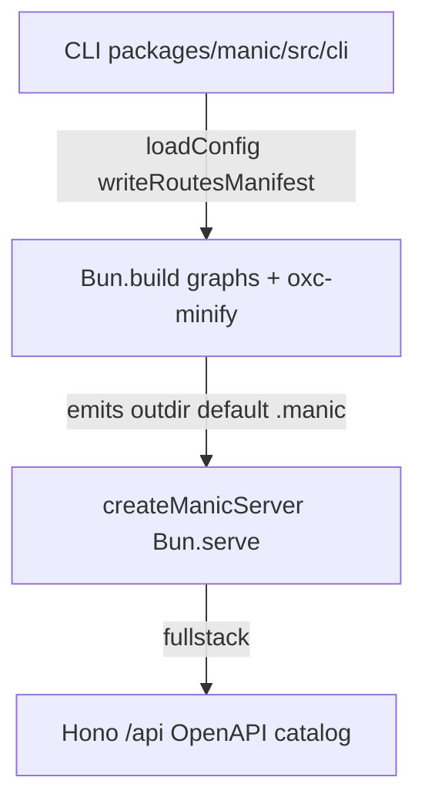

# Core Internals

This section is for **framework contributors** and engineers who want a precise mental model of how Manic turns `app/` conventions into a Bun-hosted SPA (and optional Hono API). Every article maps to [`packages/manic/src`](https://github.com/Rahuletto/manic/tree/main/packages/manic/src).

---

## Stack overview

---

## Speed & perceived performance

<Cards>
  <Card title="Understanding speed" description="On-ramp — why Manic feels fast + reading order" href="/docs/core/understanding-speed" />
  <Card title="Performance model" description="Architecture vs typical stacks tradeoffs" href="/docs/core/performance-model" />
  <Card title="Production client bundle" description="Hashed Bun.build HTML Tailwind NODE_ENV" href="/docs/core/production-client-bundle" />
  <Card title="HMR & Fast Refresh" description="Dev oxc refresh Router cache clear" href="/docs/core/hmr-fast-refresh" />
  <Card title="Lazy chunks & cache" description="componentCache prefetch bandwidth memory" href="/docs/core/lazy-chunks-cache" />
  <Card title="Fullstack API runtime" description="/api OpenAPI prod vs dev loader roots" href="/docs/core/fullstack-api-runtime" />
</Cards>

---

## Topics

<Cards>
  <Card title="Source layout" description="packages/manic/src directory map" href="/docs/core/source-layout" />
  <Card title="Architecture" description="Client router, server, plugins — system diagram" href="/docs/core/architecture" />
  <Card title="Build pipeline" description="Ordered manic build stages tied to build.ts" href="/docs/core/build-pipeline" />
  <Card title="Bundler & transform" description="oxcPlugin matrices per Bun.build target" href="/docs/core/bundler-transform" />
  <Card title="Discovery engine" description="Glob scoring manifest generation watchRoutes" href="/docs/core/discovery-engine" />
  <Card title="OXC toolchain" description="Transform minify lint fmt resolver roles" href="/docs/core/oxc-toolchain" />
  <Card title="Dev internals" description="manic dev bunfig spawn config reload" href="/docs/core/dev-internals" />
  <Card title="Router runtime" description="matcher globals navigate prefetch VT" href="/docs/core/router-runtime" />
  <Card title="Plugin hooks" description="preload configureServer build ordering" href="/docs/core/plugin-hooks" />
  <Card title="Providers contract" description="ManicProvider.build BuildContext" href="/docs/core/providers-contract" />
  <Card title="Server runtime" description="createManicServer modes HTML negotiation plugins" href="/docs/core/server-runtime" />
  <Card title="Caveats" description="CLI quirks caching globs provider ordering" href="/docs/core/caveats" />
  <Card title="Manic internals advanced" description="Config manifest companion narrative" href="/docs/framework/advanced/manic-internals" />
  <Card title="Plugin architecture" description="createPlugin providers user-facing guide" href="/docs/framework/plugins" />
</Cards>

---

## Architectural principles

| Principle | What it means in practice |
| :--- | :--- |
| **Bun-native I/O** | **`Bun.serve`**, **`Bun.build`**, **`Bun.Glob`**, **`Bun.spawn`**, **`Bun.file`** — no dual Node compatibility shim layer inside the framework core |
| **OXC vertical slice** | **`oxc-transform`**, **`oxc-minify`**, **`oxlint`**, **`oxfmt`** share toolchain assumptions ([OXC](/docs/core/oxc-toolchain)) |
| **Filesystem conventions** | Routes + APIs discovered by scanning **`app/`**, not manual registration lists ([Discovery](/docs/core/discovery-engine)) |
| **Explicit tradeoffs** | Type stripping without **`tsc`**, lint parity quirks, plugin **`apiRoutes: []`** during **`build()`** — documented under [Caveats](/docs/core/caveats) |

---

## Repository layout

| Path | Responsibility |
| :--- | :--- |
| [`packages/manic/src/cli`](https://github.com/Rahuletto/manic/tree/main/packages/manic/src/cli) | **`manic`** commands · **`build.ts`** orchestrates production graphs |
| [`packages/manic/src/server`](https://github.com/Rahuletto/manic/tree/main/packages/manic/src/server) | **`createManicServer`** · **`discovery.ts`** manifest helpers |
| [`packages/manic/src/router`](https://github.com/Rahuletto/manic/tree/main/packages/manic/src/router) | Client SPA router **`Link`** **`navigate`** matcher scoring |
| [`packages/manic/src/config`](https://github.com/Rahuletto/manic/tree/main/packages/manic/src/config) | **`defineConfig`** **`loadConfig`** **`createPlugin`** |
| [`packages/manic/src/plugins`](https://github.com/Rahuletto/manic/tree/main/packages/manic/src/plugins) | **`apiLoaderPlugin`** **`fileImporterPlugin`** |
| [`packages/providers`](https://github.com/Rahuletto/manic/tree/main/packages/providers) | Deployment adapters consumed after **`provider.build`** |

---

## Where to start reading

| Goal | Page |
| :--- | :--- |
| Understand speed end-to-end | [Understanding speed](/docs/core/understanding-speed) · [Performance model](/docs/core/performance-model) · [Benchmarks](/docs/framework/benchmarks) |
| Understand **`manic build`** ordering | [Build pipeline](/docs/core/build-pipeline) |
| Understand **`createManicServer`** branches | [Server runtime](/docs/core/server-runtime) |
| Ship reliable plugins | [Framework plugins](/docs/framework/plugins) + [Caveats](/docs/core/caveats) |
