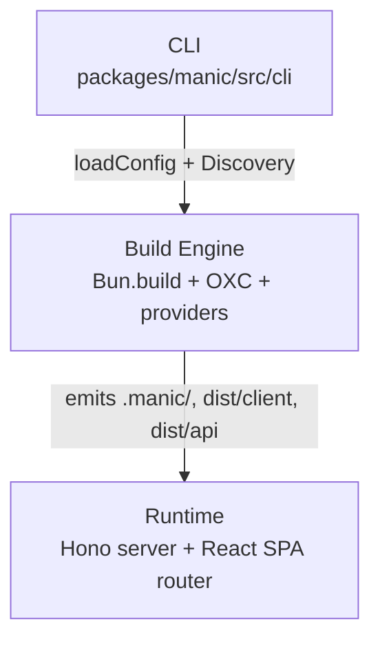

# Core Internals

This section is for framework contributors and for engineers who want a precise mental model of how Manic turns a directory of `.tsx` files into a high-performance application. Every page here maps directly to source under [packages/manic/src](https://github.com/Rahuletto/manic/tree/main/packages/manic/src).

---

## The Three Layers

---

## Topics

<Cards>
  <Card
    title="Architecture"
    description="High-level system design — server, router, plugins."
    href="/docs/core/architecture"
  />
  <Card
    title="Build Pipeline"
    description="The seven stages of manic build, from lint to provider output."
    href="/docs/core/build-pipeline"
  />
  <Card
    title="Discovery Engine"
    description="How app/routes and app/api are scanned into a manifest."
    href="/docs/core/discovery-engine"
  />
  <Card
    title="OXC Toolchain"
    description="Why Manic uses oxc-transform, oxc-minify, and oxlint."
    href="/docs/core/oxc-toolchain"
  />
  <Card
    title="Manic Internals"
    description="Config loading, manifest generation, and runtime wiring."
    href="/docs/framework/advanced/manic-internals"
  />
  <Card
    title="Plugin Architecture"
    description="Extend the framework with createPlugin and providers."
    href="/docs/framework/plugins"
  />
</Cards>

---

## Architectural Principles

- **Speed above all** — every default is benchmarked. Tools are evaluated in milliseconds, not seconds.
- **Bun-only** — Manic embraces `Bun.serve`, `Bun.build`, `Bun.Glob`, `Bun.spawn`, and `Bun.file` rather than abstracting around Node compatibility shims.
- **Zero configuration** — discovery happens by scanning conventions in `app/`, not by reading lists from configuration.
- **Vertical integration** — bundler, transformer, minifier, and linter all come from the same Rust toolchain (OXC) so there is no JS/AST round trip between stages.
- **Type safety by default** — router params, plugin contexts, configuration, and providers are fully typed end-to-end.

---

## Repository Layout

| Path | Purpose |
| :--- | :--- |
| [`packages/manic/src/cli`](https://github.com/Rahuletto/manic/tree/main/packages/manic/src/cli) | Command dispatcher and per-command implementations. |
| [`packages/manic/src/server`](https://github.com/Rahuletto/manic/tree/main/packages/manic/src/server) | Hono server, route discovery, link header injection. |
| [`packages/manic/src/router`](https://github.com/Rahuletto/manic/tree/main/packages/manic/src/router) | Client-side router, `<Link>`, view transitions. |
| [`packages/manic/src/config`](https://github.com/Rahuletto/manic/tree/main/packages/manic/src/config) | `defineConfig`, `loadConfig`, `createPlugin`. |
| [`packages/manic/src/plugins`](https://github.com/Rahuletto/manic/tree/main/packages/manic/src/plugins) | Built-in middleware (API loader, static handler). |
| [`packages/manic/src/transitions`](https://github.com/Rahuletto/manic/tree/main/packages/manic/src/transitions) | `ViewTransitions` element factory. |
| [`packages/providers`](https://github.com/Rahuletto/manic/tree/main/packages/providers) | Vercel, Cloudflare, Netlify deployment adapters. |
| [`packages/create-manic`](https://github.com/Rahuletto/manic/tree/main/packages/create-manic) | Scaffolder used by `bun create manic`. |

---

## Where to Go Next

- Want to **understand a build**? Start with the [build pipeline](/docs/core/build-pipeline).
- Want to **add a feature** to the framework? Read the [plugin architecture](/docs/framework/plugins).
- Want to **ship to a new platform**? Look at [providers](/docs/framework/deployment).
