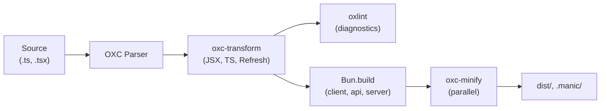

# OXC Toolchain

Manic's build engine is built on top of the **OXC** (Oxidation Compiler) toolchain, a suite of Rust-based JavaScript tools authored for raw speed. Adopting OXC end-to-end means there is no AST round-tripping between unrelated tools — every step of the pipeline shares the same parser and AST representation.

| Tool | Replaces | Used By |
| :--- | :--- | :--- |
| `oxc-transform` | Babel, SWC | Dev server, `manic build` (transform stage) |
| `oxc-minify` | Terser, esbuild | `manic build` (minify stage) |
| `oxc-resolver` | enhanced-resolve | Plugin lookup, custom imports |
| `oxlint` | ESLint | `manic lint`, mandatory build guard |
| OXC formatter | Prettier | `manic fmt` |

All of these are bundled with `manicjs`, so projects do not need to install them separately.

---

## `oxc-transform` — JSX & TypeScript

`oxc-transform` is the workhorse of the dev server. Manic registers it as a Bun plugin so every `.ts`, `.tsx`, `.js`, and `.jsx` file is transformed on demand.

What it provides:

- **JSX compilation** — `react-jsx` runtime by default, no React imports required.
- **TypeScript stripping** — type annotations are removed without performing type-checking, the same trade-off Bun makes natively.
- **Import rewriting** — extension hints like `./utils.ts` are rewritten to `./utils.js` for output compatibility (`oxc.rewriteImportExtensions: true`).
- **React Fast Refresh** — when `oxc.refresh: true` (default in dev), components are wrapped with the Fast Refresh runtime so HMR preserves state.

```ts title="manic.config.ts"
import { defineConfig } from 'manicjs/config';

export default defineConfig({
  oxc: {
    target: 'esnext',              // 'es2022' is used by default in production
    rewriteImportExtensions: true,
    refresh: true,                 // React Fast Refresh
  },
});
```

---

## `oxc-minify` — Production Compression

Minification is the most CPU-heavy stage of any production build. Manic runs `oxc-minify` against `dist/client/`, `dist/api/`, and the server bundle **in parallel** using Bun's worker model.

Capabilities:

- **Symbol mangling** — local identifiers shrunk for byte savings.
- **Dead code elimination** — unreachable branches removed.
- **Constant folding** — pure expressions reduced at compile time.
- **Property mangling** — opt-in for advanced setups.

You can disable minification for debugging by setting `build.minify: false` in your config.

---

## `oxc-resolver` — Module Resolution

`oxc-resolver` is used inside the framework to look up plugin scripts, providers, and any module that the build engine needs to import outside of the `Bun.build` graph (e.g. preload scripts during `manic dev`).

It mirrors the resolution algorithm Node.js uses and respects `package.json` `exports` and `imports` maps.

---

## `oxlint` — Mandatory Build Guard

`oxlint` is invoked in two places:

1. **Manually** — `manic lint` runs it across the whole repository.
2. **Automatically** — `manic build` runs it before any bundling. If the linter reports critical errors, the build aborts.

```bash
bunx manic lint
```

Configure rules in `.oxlintrc.json`:

```json title=".oxlintrc.json"
{
  "rules": {
    "no-console": "off",
    "react/jsx-key": "error"
  }
}
```

`oxlint` ships with sensible React, TypeScript, and import rules out of the box, so most projects never need to author a config.

---

## OXC Formatter — `manic fmt`

`manic fmt` writes formatted output using OXC's formatter. It targets parity with Prettier's defaults and is fast enough to be safe inside pre-commit hooks.

```bash
bunx manic fmt           # write formatted output (default)
bunx manic fmt --check   # CI mode: non-zero exit if anything is unformatted
```

A `.oxfmt.json` file at the project root tunes formatter options (line width, indentation, semicolons, etc.).

---

## Why a Single Toolchain?



Because every box in the pipeline above understands the same AST, Manic avoids:

- Repeated parsing — the parser runs once per file, not once per tool.
- Inconsistent semantics — the same JSX or TS edge case behaves identically across stages.
- Slow IPC — there is no node-to-rust shell-out per file.

The practical result is build times measured in **hundreds of milliseconds** for typical applications and sub-second cold starts for serverless deploys.

---

## See Also

- [Build Pipeline](/docs/core/build-pipeline) — where each OXC tool is invoked.
- [manic build](/docs/cli/build) — the command that orchestrates them.
- [manic lint & fmt](/docs/cli/lint-fmt) — code-quality CLI surface.
