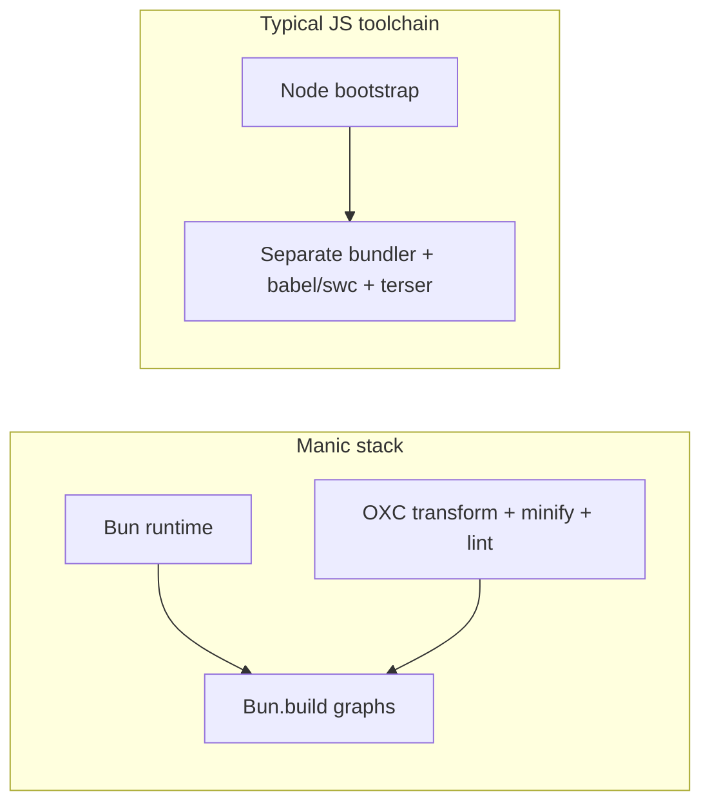

# Performance model

Manic optimizes for **time-to-first-byte in dev**, **wall-clock production builds**, and **small serverless/API graphs**. Concrete numbers live in **[Framework benchmarks](/docs/framework/benchmarks)** (fixture descriptions, hardware, and methodology are listed there — treat them as **representative**, not universal).

---

## Architectural advantages

| Layer | Manic choice | Typical effect |
| :--- | :--- | :--- |
| **Runtime** | **`Bun.serve`**, **`Bun.spawn`**, **`Bun.build`**, **`Bun.Glob`** | Fewer processes, lower startup overhead than Node-based CLI stacks |
| **Transform / lint / minify** | **OXC** (Rust) across stages | Shared semantics; avoids shipping AST across unrelated tools |
| **Dev server** | **`bun --watch ~manic.ts`** + on-demand transform | No separate dev-bundler process wrapping webpack/vite |
| **Route loading** | Build-time manifest + **lazy `import()`** per route | Browser downloads only visited route graphs |
| **API packaging** | **One `Bun.build` entry per `app/api/**/index.ts`** | Smaller deploy units vs monolithic API bundles |

---

## Compared conceptually

| Dimension | Manic | Vite / Rollup ecosystems | Next.js-class stacks |
| :--- | :--- | :--- | :--- |
| **Bundler ownership** | **`Bun.build`** only | Own bundler graph + plugins | Multiple compilers + caching layers |
| **JS transform** | **`oxc-transform`** via **`BunPlugin`** | Usually esbuild/swc + plugins | SWC/Turbopack/webpack mixes |
| **Lint gate** | **`oxlint`** before **`manic build`** | Separate tooling | Mixed (eslint-next, etc.) |
| **SSR model** | SPA + optional fullstack Hono API | Varies | Deep framework runtime |

---

## Why benchmarks show large gaps (usually)

When **[benchmarks](/docs/framework/benchmarks)** show Manic finishing dev startup or production builds faster, the dominant factors tend to be:

1. **Less process nesting** — `manic dev` ultimately runs **one watched Bun server**, not a Node parent supervising a Rust/Webpack child graph.
2. **OXC throughput** — transform + minify + lint share one toolchain tuned for batch speed.
3. **Fewer intermediate artifacts** — production pipeline writes directly to **`<outdir>`** without framework-owned incremental caches (trade-off: fewer incremental shortcuts vs giant repos).

---

## What “fast” does **not** guarantee

| Topic | Reality |
| :--- | :--- |
| **`tsc --noEmit`** | Manic transforms strip types — **typechecking is separate work** your CI should still run |
| **Cold caches** | First build after deleting **`node_modules`** or **`/.manic`** pays full discovery + bundle cost everywhere |
| **Massive apps** | Thousands of routes still mean thousands of lazy chunks — browser concurrency limits apply |
| **Plugin cost** | Heavy **`build()`** plugins can dominate wall time regardless of bundler |

---

## Operational knobs

| Knob | Effect |
| :--- | :--- |
| **`build.minify: false`** | Skip **`oxc-minify`** rewrite pass — faster iteration when debugging output |
| **`mode: 'frontend'`** | Skips API **`Bun.build`** subtree entirely |
| **`server.hmr`** | Toggle Fast Refresh injection path (`oxc.refresh`) |

---

## See also

- [Understanding speed](/docs/core/understanding-speed) — guided tour + links
- [Benchmarks](/docs/framework/benchmarks) — numbers & scenarios
- [OXC toolchain](/docs/core/oxc-toolchain) — tool mapping
- [Caveats](/docs/core/caveats) — sharp edges that bite performance assumptions
