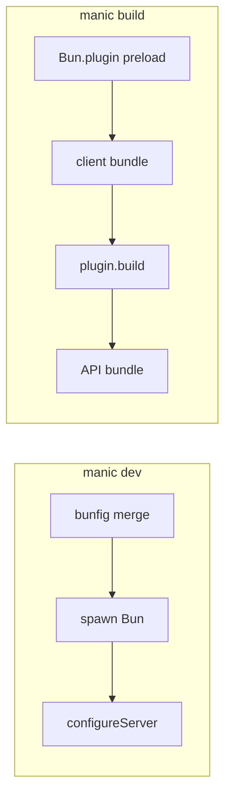

# Plugin hooks internals

Plugins implement **`ManicPlugin`** (`packages/manic/src/config/index.ts`) — optional **`preload`**, **`bunfig`**, **`configureServer`**, **`build`**.

---

## Hook timeline

| Hook | Runs when | Typical use |
| :--- | :--- | :--- |
| **`preload`** | Before **`Bun.build`** graphs · **`--preload`** in dev | Register **`BunPlugin`** (Tailwind, MDX, …) |
| **`bunfig`** | **`manic dev` startup** | Merge **`serve.static`** plugins |
| **`configureServer`** | **`createManicServer`** startup | **`addRoute`**, **`injectHtml`**, **`addLinkHeader`** |
| **`build`** | After client bundle + baseline HTML | **`emitClientFile`**, **`injectHtml`** |

---

## **`createPlugin`** shorthand

**`staticFiles`** expands into **`configureServer`** **`addRoute`** + **`build`** **`emitClientFile`** — the canonical dev/prod parity pattern ([Plugins](/docs/framework/plugins)).

---

## Sharp edges

- **`plugin.build`** receives **`apiRoutes: []`** — APIs bundle **after** plugin hooks ([Caveats](/docs/core/caveats)).
- **`configureServer`** routes do **not** exist in production unless mirrored via **`emitClientFile`** or providers.

---

## See also

- [Plugin architecture](/docs/framework/plugins)
- [Server runtime](/docs/core/server-runtime)
