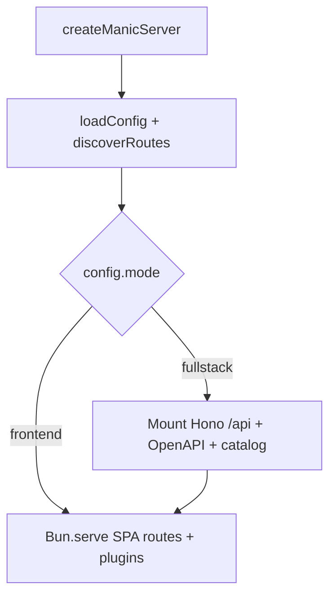

# Server runtime (`createManicServer`)

The compiled **`server.js`** from **`manic build`** wraps **`createManicServer`** (`packages/manic/src/server/index.ts`). Understanding this layer explains why **`manic dev`** (spawned **`bun --watch ~manic.ts`**) and **`manic start`** behave similarly at runtime — both execute **your** server entry that calls **`createManicServer({ html })`**.

---

## High-level branches

| Mode | Extra behavior |
| :--- | :--- |
| **`frontend`** | Page handlers serve processed HTML; **`/sitemap.xml`** is registered **only when `config.sitemap` is set and `NODE_ENV !== 'production'`** |
| **`fullstack`** | Dynamically imports **`apiLoaderPlugin`**, mounts **`/api`**, **`/openapi.json`**, **`/.well-known/api-catalog`** |

---

## HTML pipeline (`serveHtml`)

Every unmatched static asset eventually falls through to **`serveHtml`**:

| Feature | Behavior |
| :--- | :--- |
| **Plugin injections** | **`injectHtml`** strings collected from **`configureServer`** get stitched before **`</head>`** |
| **RFC Link headers** | **`addLinkHeader`** values merged into **`Link`** response header |
| **Markdown negotiation** | If **`prefersMarkdown(request)`**, returns **`text/markdown`** body derived from HTML + token estimate header |
| **Agent probe** | **`?mode=agent`** returns JSON describing MCP/OpenAPI/docs discovery URLs when plugins advertise them |

Dev-only **`HTMLBundle`** mode uses a nonce route so Bun still processes Tailwind/HMR while **`/*`** preserves markdown/agent behavior.

---

## Plugin server hooks

During **`configureServer`**, plugins receive **`ManicServerPluginContext`**:

- **`addRoute(path, handler)`** — merges into **`bunRoutes`** map passed to **`Bun.serve`**
- **`addLinkHeader`** / **`injectHtml`** — feed the behaviors above

<Callout type="warn">

Anything registered **only** in **`configureServer`** without a matching **`build()`** **`emitClientFile`** or provider step may exist in dev but **not** in production static hosting — mirror critical routes in **`staticFiles`** / **`createPlugin`** patterns ([Plugins](/docs/framework/plugins)).

</Callout>

---

## Discovery coupling

At server startup **`discoverRoutes()`** resolves filesystem routes for **`bunRoutes`** keys (non-prod **`HTMLBundle`** layout skips duplicating **`/`** handlers when nonce routing is active — see implementation). Client-side navigation still relies on **`app/~routes.generated.ts`** produced during **`writeRoutesManifest()`**.

---

## See also

- [Discovery engine](/docs/core/discovery-engine) — manifest vs **`discoverRoutes`**
- [Plugin loaders](/docs/api/plugin-loaders) — **`apiLoaderPlugin`** internals
- [Architecture](/docs/core/architecture) — client/server diagram
- [API reference — Server](/docs/api/server) — `createManicServer` options surface
