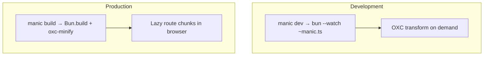

# Understanding speed

Manic optimizes for **fast dev startup**, **short production builds**, and **small runtime graphs**. This page is the **on-ramp**; deeper mechanics live in linked internals below.

---

## The short mental model

| Question | Answer in one line |
| :--- | :--- |
| Why does **`manic dev`** start quickly? | One watched Bun process + native **`Bun.serve`** — no separate Node-powered bundler bootstrap ([Dev internals](/docs/core/dev-internals)). |
| Why are builds fast? | **`Bun.build`** + **OXC** transform/minify share one toolchain; work is batched, not sprayed across many tools ([Performance model](/docs/core/performance-model)). |
| Why does the SPA feel snappy? | Routes load **on demand**; **`Link`** / **`preloadRoute`** warm chunks; matching is **regex + scores**, not giant switches ([Lazy chunks](/docs/core/lazy-chunks-cache)). |
| Where are numbers? | **[Framework benchmarks](/docs/framework/benchmarks)** — fixtures + hardware documented there. |

---

## Reading order

1. **[Performance model](/docs/core/performance-model)** — architectural advantages vs typical stacks + honesty about limits  
2. **[OXC toolchain](/docs/core/oxc-toolchain)** — what replaces Babel/Terser/ESLint in practice  
3. **[Production client bundle](/docs/core/production-client-bundle)** — hashing, HTML rewrite, **`NODE_ENV`** define  
4. **[HMR & Fast Refresh](/docs/core/hmr-fast-refresh)** — how dev differs from prod transforms  
5. **[Lazy chunks & cache](/docs/core/lazy-chunks-cache)** — router **`componentCache`** + prefetch  
6. **[Fullstack API runtime](/docs/core/fullstack-api-runtime)** — `/api`, OpenAPI, catalog — why deploy graphs stay small  

---

## Tradeoffs (still “fast”, not magic)

- **No `tsc` in the transform path** — typecheck CI separately ([Performance model](/docs/core/performance-model)).  
- **Huge apps** — still pay one lazy chunk per route; browser concurrency caps parallelism ([Lazy chunks](/docs/core/lazy-chunks-cache)).  
- **Heavy plugins** — can dominate wall-clock regardless of bundler ([Caveats](/docs/core/caveats)).

---

## See also

- [Benchmarks](/docs/framework/benchmarks)
- [Build pipeline](/docs/core/build-pipeline)
