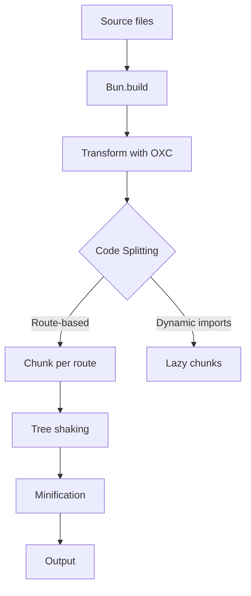

# Build Optimization

<Callout type="info" title="TL;DR">

Learn how to optimize production builds for smaller bundles, faster loading, and better performance using Manic's built-in optimization features.

</Callout>
## What It Is

Build optimization in Manic involves:

| Optimization | Purpose | Impact |
|--------------|---------|--------|
| **Code Splitting** | Split routes into separate chunks | Faster initial load |
| **Tree Shaking** | Remove unused code | Smaller bundles |
| **Minification** | Compress output | Faster downloads |
| **Chunking** | Split large dependencies | Parallel loading |

---

## Prerequisites

- [Build Pipeline](/docs/core/build-pipeline) - Understanding the build process
- [Getting Started](/docs/framework/getting-started) - Basic setup

---

## Quick Start

### Default Optimization

Manic includes optimization by default:

```ts
// manic.config.ts
export default defineConfig({
  build: {
    // Default: true (minify in production)
    minify: true,
    // Default: true (generate sourcemaps)
    sourcemap: false,  // Disable for smaller output
  },
});
```

---

## How It Works

### Build Pipeline with Optimization



---

## Code Splitting

### How Manic Splits Code

By default, each route becomes a separate chunk:

<Files>
  <Folder name="dist/client" defaultOpen>
    <File name="index.js" />
    <Folder name="routes">
      <File name="index.js" />
      <File name="about.js" />
      <File name="posts.js" />
    </Folder>
  </Folder>
</Files>

### Manual Code Splitting

Use dynamic imports for lazy loading:

```tsx
// Lazy load heavy component
const HeavyChart = React.lazy(() => import('./HeavyChart'));

// Usage with Suspense
<React.Suspense fallback={<ChartSkeleton />}>
  <HeavyChart data={data} />
</React.Suspense>
```

---

## Optimization Options

### Configure in manic.config.ts

```ts
// manic.config.ts
export default defineConfig({
  build: {
    // Minify JavaScript (default: true in production)
    minify: true,
    
    // Generate source maps (default: false in production)
    sourcemap: false,
    
    // Target browser versions
    target: 'es2022',
    
    // Split chunks
    splitting: true,
    chunking: true,
  },
});
```

---

## Bundle Analysis

### Analyze Bundle Size

```bash
# Build with analysis
bun build --analyze

# View in browser
# Open dist/client/ and check file sizes
```

### Tools

| Tool | Purpose |
|------|----------|
| Chrome DevTools | Network tab for load times |
| Bundle Analyzer | Visual chunk map |
| Lighthouse | Performance audit |

---

## Examples

### Example 1: Lazy Load Routes

```tsx
// Using Link - automatic lazy loading
import { Link } from 'manicjs';

// This route chunk loads only when user clicks
<a href="/reports/2024">View Report</a>
```

### Example 2: Prefetch Optimization

```tsx
// Prefetch on hover (default behavior)
<a href="/about" prefetch="hover">About</a>

// Don't prefetch for slower connections
<a href="/large-page" prefetch={false}>Large Page</a>
```

### Example 3: Dynamic Imports

```tsx
// Explicit lazy loading
const Modal = React.lazy(() => import('./Modal'));

function App() {
  const [showModal, setShowModal] = useState(false);
  
  return (
    <>
      <button onClick={() => setShowModal(true)}>
        Open Modal
      </button>
      
      {showModal && (
        <React.Suspense fallback={<ModalSkeleton />}>
          <Modal onClose={() => setShowModal(false)} />
        </React.Suspense>
      )}
    </>
  );
}
```

---

## Common Issues

### Issue 1: Large Bundle Size

**Solution:**

1. Check for unused imports
2. Enable tree shaking
3. Lazy load heavy components

```bash
# Analyze bundle
bun build --analyze
```

### Issue 2: Slow Build

**Solution:**

```ts
// Only rebuild changed files in dev
// Ensure watching is enabled
```

### Issue 3: Chunk Loading Issues

**Solution:** Check dynamic import paths:

```tsx
// ✗ BAD
const Heavy = import('./HeavyComponent');  // No await

// ✓ GOOD
const Heavy = import('./HeavyComponent').then(m => m.default);
```

---

## Best Practices

<Callout type="info">

Use route-based splitting for optimal chunks.

</Callout>
<Callout type="warn">
 
Don't manually split too aggressively; let Manic handle the heavy lifting.
 
</Callout>

<Callout type="info">

Monitor bundle size over time.

</Callout>
---

## Performance Checklist

- [ ] Enable minification in production
- [ ] Use route-based splitting
- [ ] Lazy load heavy components
- [ ] Monitor bundle sizes
- [ ] Test with Lighthouse

---

See also:
- [Build Pipeline](/docs/core/build-pipeline)
- [Routing Guide](/docs/framework/routing)
- [Getting Started](/docs/framework/getting-started)