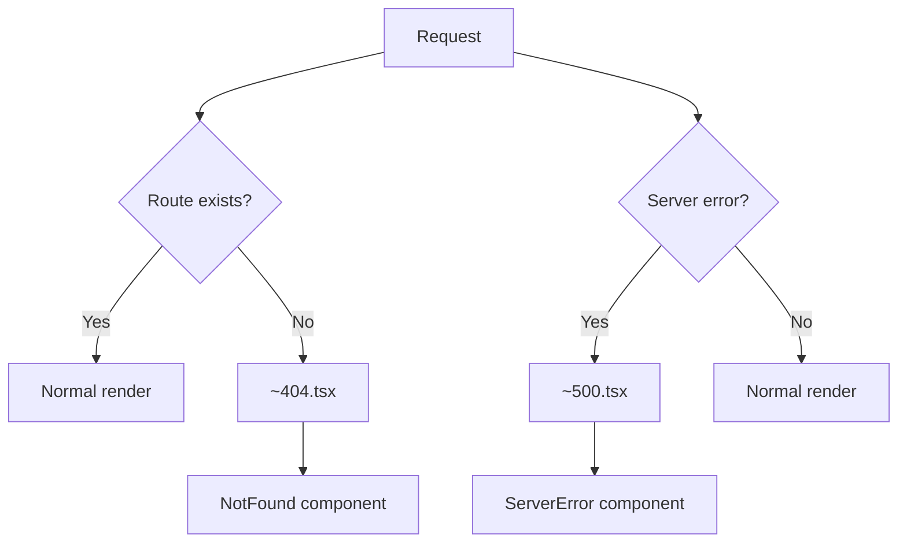

# Error Handling

<Callout type="info" title="TL;DR">

Manic provides error handling through custom error pages (`ErrorOverlay`, `NotFound`, `ServerError`) and React error boundaries. Use these to gracefully display and recover from errors.

</Callout>
## What It Is

Manic supports multiple error handling strategies:

| Error Type | Component | Purpose |
|-----------|----------|----------|
| **404 Not Found** | `NotFound` | Unknown routes |
| **Server Error** | `ServerError` | API/server failures |
| **Error Boundary** | ErrorBoundary | Catch React errors |
| **Error Overlay** | `ErrorOverlay` | Full-page error UI |

---

## Prerequisites

- [Routing Guide](/docs/framework/routing) - Navigation
- [Project Structure](/docs/framework/getting-started/project-structure) - File conventions

---

## Quick Start

### 404 Not Found

```tsx
// app/routes/~404.tsx
import React from 'react';

export default function NotFound() {
  return (
    <div>
      <h1>404 - Page Not Found</h1>
      <p>The page you're looking for doesn't exist.</p>
    </div>
  );
}
```

### Server Error

```tsx
// app/routes/~500.tsx
import React from 'react';

export default function ServerError() {
  return (
    <div>
      <h1>500 - Server Error</h1>
      <p>Something went wrong. Please try again later.</p>
    </div>
  );
}
```

---

## How It Works

### Error Resolution Flow



---

## Type Definitions

```ts
// Error page props (if supported)
interface NotFoundProps {
  error?: Error;
}

interface ServerErrorProps {
  error?: Error;
  reset?: () => void;
}

// Error boundary props
interface ErrorBoundaryProps {
  children: React.ReactNode;
  fallback?: React.ReactNode;
  onError?: (error: Error, errorInfo: React.ErrorInfo) => void;
}
```

---

## Examples

### Example 1: Custom 404 Page with URL

```tsx
// app/routes/~404.tsx
import React from 'react';
import { Link, useRouter } from 'manicjs';

export default function NotFound() {
  const { path } = useRouter();

  return (
    <div className="not-found">
      <h1>404</h1>
      <p>Page not found: {path}</p>

      <nav>
        <a href="/">Go Home</a>
      </nav>
    </div>
  );
}
```

### Example 2: Custom 500 Page

```tsx
// app/routes/~500.tsx
import React from 'react';

export default function ServerError({ error }: { error?: Error }) {
  const isDev = Bun.env.NODE_ENV === 'development';

  return (
    <div className="error-500">
      <h1>Something went wrong</h1>
      {isDev && error && (
        <pre>{error.message}</pre>
      )}
    </div>
  );
}
```

### Example 3: Error Boundary Component

```tsx
// app/routes/~components/ErrorBoundary.tsx
import React, { Component, ErrorInfo, ReactNode } from 'react';

interface Props {
  children: ReactNode;
  fallback?: ReactNode;
}

interface State {
  hasError: boolean;
  error?: Error;
}

export class ErrorBoundary extends Component<Props, State> {
  constructor(props: Props) {
    super(props);
    this.state = { hasError: false };
  }

  static getDerivedStateFromError(error: Error): State {
    return { hasError: true, error };
  }

  componentDidCatch(error: Error, errorInfo: ErrorInfo) {
    console.error('Error caught:', error, errorInfo);
  }

  render() {
    if (this.state.hasError) {
      return this.props.fallback || (
        <div>
          <h1>Something went wrong</h1>
          <button onClick={() => this.setState({ hasError: false })}>
            Try again
          </button>
        </div>
      );
    }

    return this.props.children;
  }
}
```

### Example 4: Using Error Boundary

```tsx
// app/routes/dashboard.tsx
import React from 'react';
import { ErrorBoundary } from './~components/ErrorBoundary';

export default function Dashboard() {
  return (
    <ErrorBoundary
      fallback={<div>Failed to load dashboard</div>}
    >
      <DashboardContent />
    </ErrorBoundary>
  );
}

function DashboardContent() {
  // If this throws, ErrorBoundary catches it
  throw new Error('oops');
}
```

### Example 5: API Error Handling

```tsx
// app/routes/api/users/[id].tsx
// Server-side error handling
export async function GET({ params }: { params: { id: string } }) {
  const user = await db.users.find(params.id);

  if (!user) {
    return Response.json(
      { error: 'User not found' },
      { status: 404 }
    );
  }

  return Response.json(user);
}
```

### Example 6: Client Error Toast

```tsx
// Custom error hook
import { useState } from 'react';

function useError() {
  const [error, setError] = useState<Error | null>(null);

  const clearError = () => setError(null);
  const handleError = (err: Error) => setError(err);

  return { error, clearError, handleError };
}

// Usage
function MyComponent() {
  const { error, clearError } = useError();

  return error ? (
    <div onClick={clearError}>{error.message}</div>
  ) : (
    <div>Content</div>
  );
}
```

---

## Advanced Patterns

### Pattern 1: Logging Errors

```tsx
// Error boundary with logging
class ErrorBoundary extends Component {
  componentDidCatch(error: Error, errorInfo: ErrorInfo) {
    // Send to error tracking service
    fetch('/api/errors', {
      method: 'POST',
      body: JSON.stringify({
        message: error.message,
        stack: error.stack,
        componentStack: errorInfo.componentStack,
        timestamp: Date.now(),
      }),
    });
  }
}
```

### Pattern 2: Retry Logic

```tsx
// Retry button
function ErrorWithRetry({ error, onRetry }) {
  return (
    <div>
      <p>Error: {error.message}</p>
      <button onClick={onRetry}>Retry</button>
    </div>
  );
}
```

### Pattern 3: Error State in URL

```tsx
// Navigate to error page programmatically
import { useRouter } from 'manicjs';

function handleError() {
  const router = useRouter();
  router.navigate('/error?code=500');
}
```

---

## Common Issues

### Issue 1: Error Page Not Showing

**Problem:** Custom error page not rendering.

**Check:**
1. File is named correctly (`~404.tsx`, `~500.tsx`)
2. File is in `app/routes/`
3. No route is matching first

### Issue 2: Error Boundary Not Catching

**Problem:** Errors not caught by boundary.

**Solution:** Ensure boundary wraps the correct children:

```tsx
// ✗ BAD: Boundary doesn't wrap children
<ErrorBoundary>
  <div>Outside</div>
</ErrorBoundary>
<ChildWithError />

// ✓ GOOD: Boundary wraps all potentially failing children
<ErrorBoundary>
  <div>Inside</div>
  <ChildWithError />
</ErrorBoundary>
```

---

## Best Practices

<Callout type="info">

**Use descriptive error messages** that help users understand what happened.

</Callout>
<Callout type="warn">
 
**Don't expose stack traces in production** — only show in development.
 
</Callout>

<Callout type="info">

**Use error boundaries** — they gracefully catch React render errors.

</Callout>
<Callout type="info">

**Log errors** — send to tracking service for debugging.

</Callout>
---

See also:
- [Routing Guide](/docs/framework/routing)
- [API Routes](/docs/framework/server)
- [State Management](/docs/framework/advanced/state-management)
