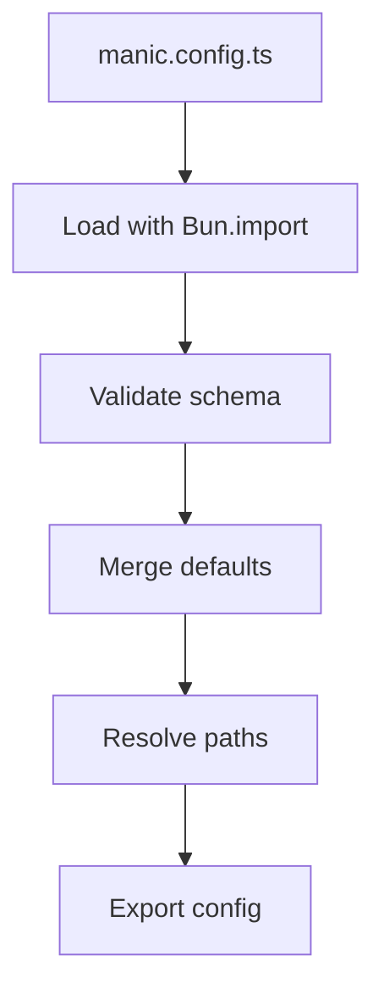
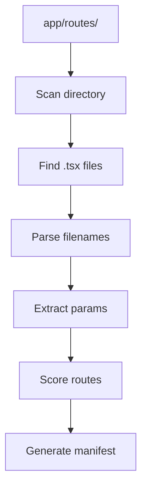
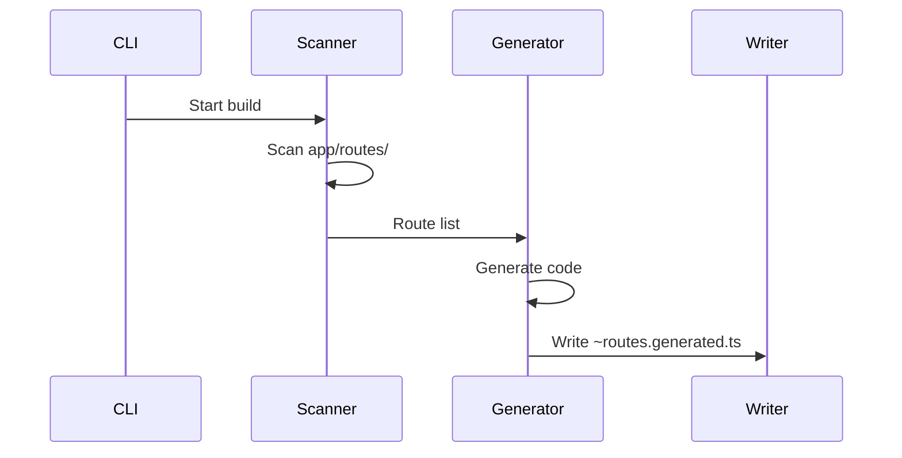

# Manic Internals

<Callout type="info" title="TL;DR">

Understanding how Manic processes configuration, discovers routes, and generates the `~routes.generated.ts` manifest that powers client-side routing.

</Callout>
## What It Is

Manic's internals consist of three main systems:

| System | Purpose | Key File |
|--------|---------|----------|
| **Config Loading** | Load and validate `manic.config.ts` | `packages/manic/src/config/` |
| **Route Discovery** | Scan `app/routes/` for routes | `packages/manic/src/server/lib/discovery.ts` |
| **Manifest Generation** | Create `~routes.generated.ts` | `packages/manic/src/cli/` |

---

## Prerequisites

- [Getting Started](/docs/framework/getting-started) - Basic setup
- [Config Reference](/docs/api/config) - Configuration options
- [Routing Guide](/docs/framework/routing) - Route concepts

---

## How It Works

### Config Loading Flow



### Route Discovery Flow



---

## Config Loading

### How manic.config.ts Loads

```ts
// Simplified config loading
async function loadConfig() {
  // 1. Try manic.config.ts
  const configPath = findFile(['manic.config.ts', 'manic.config.js']);
  
  // 2. Import the file
  const config = await import(configPath);
  
  // 3. Get default export
  const userConfig = config.default;
  
  // 4. Merge with defaults
  return mergeDeep(defaultConfig, userConfig);
}
```

### Schema Validation

Config is validated against a Zod schema:

```ts
const configSchema = z.object({
  mode: z.enum(['fullstack', 'frontend']).default('fullstack'),
  plugins: z.array(z.string()).optional(),
  build: z.object({
    target: z.string().optional(),
    minify: z.boolean().optional(),
  }).optional(),
});
```

---

## Route Discovery

### Process Overview

<Files>
  <Folder name="app/routes" defaultOpen>
    <File name="index.tsx" />
    <File name="about.tsx" />
    <Folder name="posts">
      <File name="index.tsx" />
      <File name="[id].tsx" />
    </Folder>
    <Folder name="docs">
      <File name="[...slug].tsx" />
    </Folder>
  </Folder>
</Files>

### Scoring Algorithm

Routes are scored based on segment type:

| Segment Type | Score | Example |
|--------------|-------|----------|
| Static | +100 | `about.tsx` |
| Dynamic | +10 | `[id].tsx` |
| Catch-all | +1 | `[...slug].tsx` |

**Example:** `/posts/new`
```
posts/new.tsx      [200] ← wins (static)
posts/[id].tsx    [110]
posts/[...slug].tsx [101]
```

---

## Manifest Generation

### ~routes.generated.ts Structure

```ts
// Auto-generated - DO NOT EDIT
import { RouteRegistry } from 'manicjs/router';

export const routes = {
  '/': () => import('./routes/index'),
  '/about': () => import('./routes/about'),
  '/posts': () => import('./routes/posts/index'),
  '/posts/:id': () => import('./routes/posts/[id]'),
  '/docs/*': () => import('./routes/docs/[...slug]'),
};

export const registry = new RouteRegistry(routes);
```

### Generation Process



---

## Type Definitions

### Route Definition

```ts
interface RouteDef {
  path: string;
  score: number;
  file: string;
  params: string[];
  isDynamic: boolean;
  isCatchAll: boolean;
}
```

### Config Type

```ts
interface ManicConfig {
  mode: 'fullstack' | 'frontend';
  plugins: string[];
  build: {
    target?: string;
    minify?: boolean;
    sourcemap?: boolean;
  };
  server: {
    port?: number;
    hostname?: string;
  };
}
```

---

## Debugging

### Enable Debug Logging

```bash
DEBUG=manic:* bun dev
```

### Check Generated Routes

The generated routes file is in your app directory:

```bash
cat app/~routes.generated.ts
```

### Config Validation Errors

```ts
// manic.config.ts must export default
export default defineConfig({ ... });
```

---

## Common Issues

### Issue 1: Config Not Found

<Callout type="error">
manic.config.ts not found at project root.
</Callout>

**Solution:**

```bash
# Ensure manic.config.ts is in project root
ls -la manic.config.ts
```

### Issue 2: Route Not Discovered

**Solution:** Check file location:

```text
✓ app/routes/index.tsx   → discovered
✗ app/pages/index.tsx    → not in routes folder
```

### Issue 3: Manifest Outdated

**Solution:** Restart dev server to regenerate:

```bash
# Stop server and restart
bun dev
```

---

## Best Practices

<Callout type="info">

Don't edit `~routes.generated.ts` - it's auto-generated.

</Callout>
<Callout type="warn">
 
Keep config at project root for discovery.
 
</Callout>

<Callout type="info">

Use debug logging to troubleshoot discovery issues.

</Callout>
---

## Version History

| Version | Changes |
|---------|---------|
| v0.12.0 | Added route scoring |
| v0.11.0 | Improved config loading |
| v0.10.0 | Initial manifest generation |

---

See also:
- [Config Reference](/docs/api/config)
- [Routing Guide](/docs/framework/routing)
- [Build Pipeline](/docs/core/build-pipeline)