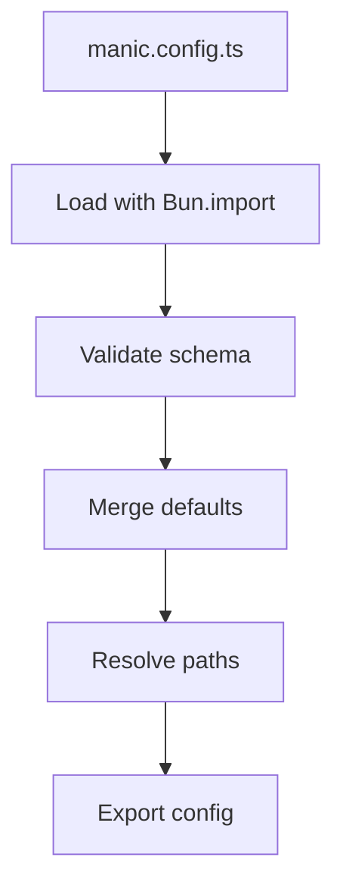
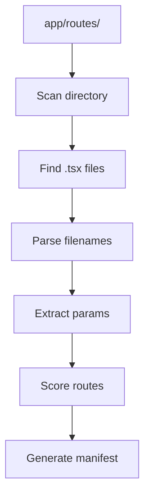
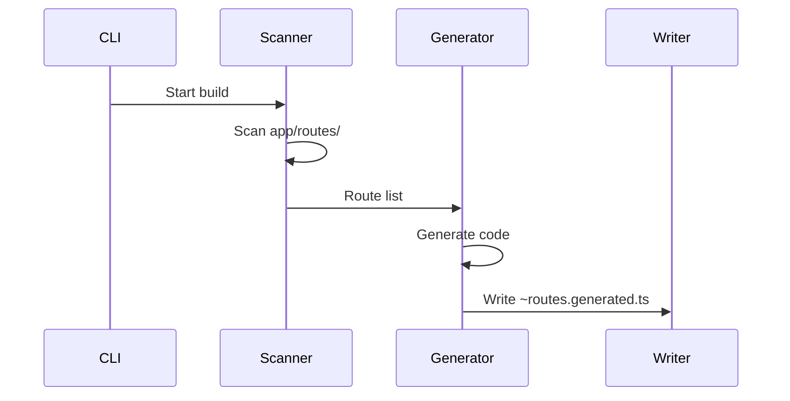

# Manic Internals

<Callout type="info" title="TL;DR">

Understanding how Manic processes configuration, discovers routes, and generates the `~routes.generated.ts` manifest that powers client-side routing.

</Callout>
## What It Is

Manic's internals consist of three main systems:

| System | Purpose | Key File |
|--------|---------|----------|
| **Config Loading** | Load and validate `manic.config.ts` | `packages/manic/src/config/` |
| **Route Discovery** | Scan `app/routes/` for routes | `packages/manic/src/server/lib/discovery.ts` |
| **Manifest Generation** | Create `~routes.generated.ts` | `packages/manic/src/cli/` |

---

## Prerequisites

- [Getting Started](/docs/framework/getting-started) - Basic setup
- [Config Reference](/docs/api/config) - Configuration options
- [Routing Guide](/docs/framework/routing) - Route concepts

---

## How It Works

### Config Loading Flow



### Route Discovery Flow



---

## Config Loading

### How `manic.config.ts` Loads

```ts
// Simplified loadConfig() implementation
// (see packages/manic/src/config/index.ts)
async function loadConfig(cwd = process.cwd()): Promise<ManicConfig> {
  for (const file of ['manic.config.ts', 'manic.config.js']) {
    const path = `${cwd}/${file}`;
    if (await Bun.file(path).exists()) {
      const mod = await import(path);
      const userConfig = mod.default ?? mod;
      return {
        mode:    userConfig.mode    ?? DEFAULT_CONFIG.mode,
        app:     { ...DEFAULT_CONFIG.app,    ...userConfig.app },
        server:  { ...DEFAULT_CONFIG.server, ...userConfig.server },
        router:  { ...DEFAULT_CONFIG.router, ...userConfig.router },
        build:   { ...DEFAULT_CONFIG.build,  ...userConfig.build },
        sitemap: userConfig.sitemap === false ? false : userConfig.sitemap,
        oxc:     { ...DEFAULT_CONFIG.oxc,    ...userConfig.oxc },
        providers: userConfig.providers,
        plugins:   userConfig.plugins,
      };
    }
  }
  return DEFAULT_CONFIG;
}
```

### Defaults & Merging

There is no Zod or runtime schema validator — Manic relies on TypeScript for validation at the call site of `defineConfig`. At load time, the user object is **shallow-merged** field by field with `DEFAULT_CONFIG`. Nested objects (`app`, `server`, `router`, `build`, `oxc`) are spread so user values override defaults without losing siblings.

The loaded config is cached. Subsequent `loadConfig()` calls within the same process return the cached value — important because every plugin context reads from the same instance.

---

## Route Discovery

### Process Overview

<Files>
  <Folder name="app/routes" defaultOpen>
    <File name="index.tsx" />
    <File name="about.tsx" />
    <Folder name="posts">
      <File name="index.tsx" />
      <File name="[id].tsx" />
    </Folder>
    <Folder name="docs">
      <File name="[...slug].tsx" />
    </Folder>
  </Folder>
</Files>

### Scoring Algorithm

Routes are scored based on segment type:

| Segment Type | Score | Example |
|--------------|-------|----------|
| Static | +100 | `about.tsx` |
| Dynamic | +10 | `[id].tsx` |
| Catch-all | +1 | `[...slug].tsx` |

**Example:** `/posts/new`
```
posts/new.tsx      [200] ← wins (static)
posts/[id].tsx    [110]
posts/[...slug].tsx [101]
```

---

## Manifest Generation

### `~routes.generated.ts` Structure

```ts title="app/~routes.generated.ts (auto-generated)"
// DO NOT EDIT — regenerated on every dev start and build.
export const routes = {
  '/':              () => import('./routes/index.tsx'),
  '/about':         () => import('./routes/about.tsx'),
  '/posts':         () => import('./routes/posts/index.tsx'),
  '/posts/:id':     () => import('./routes/posts/[id].tsx'),
  '/docs/:...slug': () => import('./routes/docs/[...slug].tsx'),
};

export const notFoundPage = () => import('./routes/~404.tsx');
export const errorPage    = () => import('./routes/~500.tsx');
```

The client `<Router>` reads these from `window.__MANIC_ROUTES__` and `window.__MANIC_ERROR_PAGES__`, which are populated by the entry script during application boot.

### Generation Process



---

## Type Definitions

### Discovered Route

```ts
import type { PageRoute, ApiRoute } from 'manicjs/config';

interface PageRoute {
  path: string;       // URL pattern, e.g. "/posts/:id"
  filePath: string;   // Source file path
  dynamic: boolean;   // True when the path contains parameters
}

interface ApiRoute {
  mountPath: string;  // Mount point, e.g. "/api/users"
  filePath: string;
}
```

### Config Type (Excerpt)

The full `ManicConfig` shape is exported from `manicjs/config`. The excerpt below covers the fields you most commonly customize — see the [Configuration Reference](/docs/api/config) for everything.

```ts
interface ManicConfig {
  mode?: 'fullstack' | 'frontend';
  app?: { name?: string };
  server?: { port?: number; hmr?: boolean };
  router?: {
    viewTransitions?: boolean;
    preserveScroll?: boolean;
    scrollBehavior?: 'auto' | 'smooth';
  };
  build?: {
    minify?: boolean;
    sourcemap?: boolean | 'inline' | 'external';
    splitting?: boolean;
    outdir?: string;
  };
  oxc?: {
    target?: string;
    rewriteImportExtensions?: boolean;
    refresh?: boolean;
  };
  providers?: ManicProvider[];
  plugins?: ManicPlugin[];
}
```

---

## Debugging

### Enable Debug Logging

```bash
DEBUG=manic:* bun dev
```

### Check Generated Routes

The generated routes file is in your app directory:

```bash
cat app/~routes.generated.ts
```

### Config Validation Errors

```ts
// manic.config.ts must export default
export default defineConfig({ ... });
```

---

## Common Issues

### Issue 1: Config Not Found

<Callout type="error">
manic.config.ts not found at project root.
</Callout>

**Solution:**

```bash
# Ensure manic.config.ts is in project root
ls -la manic.config.ts
```

### Issue 2: Route Not Discovered

**Solution:** Check file location:

```text
✓ app/routes/index.tsx   → discovered
✗ app/pages/index.tsx    → not in routes folder
```

### Issue 3: Manifest Outdated

**Solution:** Restart dev server to regenerate:

```bash
# Stop server and restart
bun dev
```

---

## Best Practices

<Callout type="info">

Don't edit `~routes.generated.ts` - it's auto-generated.

</Callout>
<Callout type="warn">
 
Keep config at project root for discovery.
 
</Callout>

<Callout type="info">

Use debug logging to troubleshoot discovery issues.

</Callout>
---

See also:

- [Core internals overview](/docs/core)
- [Bundler transform](/docs/core/bundler-transform)
- [Server runtime](/docs/core/server-runtime)
- [Caveats](/docs/core/caveats)
- [Config Reference](/docs/api/config)
- [Routing Guide](/docs/framework/routing)
- [Build Pipeline](/docs/core/build-pipeline)