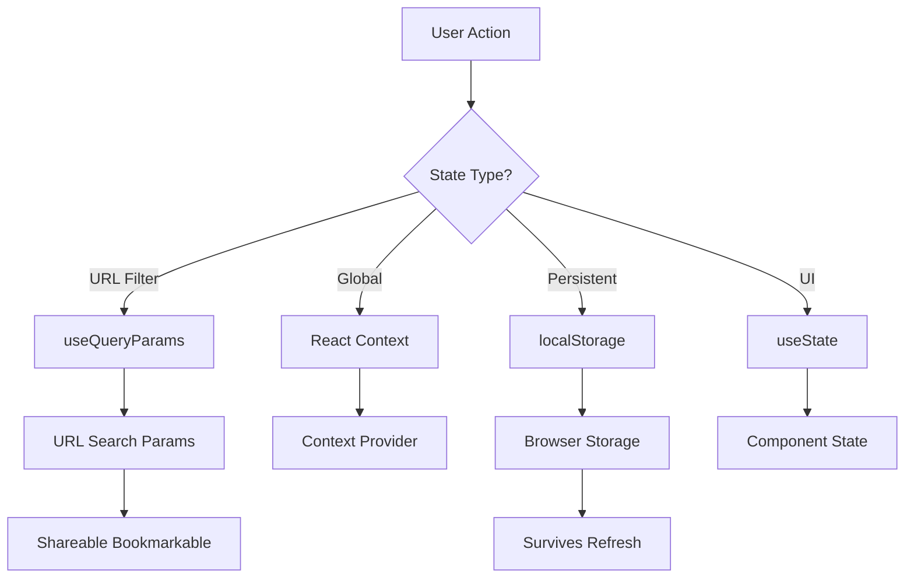
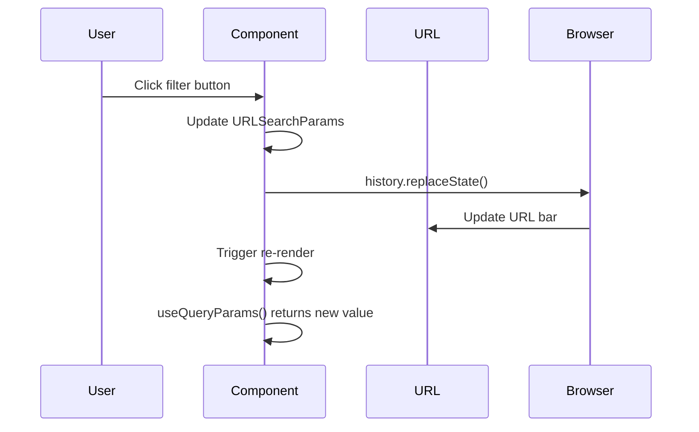

# State Management

<Callout type="info" title="TL;DR">

Manic provides built-in state management through query parameters for shareable URL state, React Context for global app state, and localStorage for persistent client state. Choose the right tool based on your state requirements.

</Callout>
## What It Is

State management in Manic follows a **progressive pattern** — start simple and scale up:

| State Type | Tool | Use Case | Shareable |
|-----------|------|----------|-----------|
| **URL State** | `useQueryParams()` | Filters, search, pagination | ✓ Yes |
| **Global State** | React Context | Theme, auth, user | ✗ No |
| **Persisted State** | localStorage | Preferences, history | Per-session |
| **Component State** | `useState()` | UI state, forms | ✗ No |

## Prerequisites

- [Routing Guide](/docs/framework/routing) - Understanding routes and navigation
- [Environment Variables](/docs/framework/advanced/environment-variables) - For persisted config

## Quick Start

### Install Dependencies

Ensure you have Manic installed:

```bash
bun add manicjs
```

### Use Query Params

Read and manipulate URL query parameters:

```tsx
import { useQueryParams } from 'manicjs';

export default function PostsPage() {
  const [searchParams] = useQueryParams();
  const filter = searchParams.get('filter') || 'all';
  // filter is now reactive with URL changes
}
```

### Update URL

Update the URL without triggering navigation:

```tsx
const handleFilterChange = (newFilter: string) => {
  const params = new URLSearchParams(searchParams);
  if (newFilter === 'all') {
    params.delete('filter');
  } else {
    params.set('filter', newFilter);
  }
  window.history.replaceState({}, '', `?${params.toString()}`);
};
```

<Callout type="info">
This pattern works without navigation, so filters can be applied while maintaining scroll position.
</Callout>

## How It Works

### State Architecture



### Query Parameters Flow



## Type Definitions

```ts
// From manicjs/router
export interface QueryParams {
  get(key: string): string | null;
  getAll(key: string): string[];
  has(key: string): boolean;
  toString(): string;
  entries(): IterableIterator<[string, string]>;
}

// Navigation options
interface NavigateOptions {
  scroll?: boolean;
  replace?: boolean;
  state?: Record<string, unknown>;
}
```

## API Reference

### useQueryParams()

Returns a `URLSearchParams` object for reading and manipulating query parameters.

```tsx
import { useQueryParams } from 'manicjs';

export default function Component() {
  const queryParams = useQueryParams();

  // Reading
  const page = queryParams.get('page');      // "1" or null
  const tags = queryParams.getAll('tag');      // ["react", "typescript"]

  // Check existence
  const hasFilter = queryParams.has('filter');  // boolean

  return <div>Page {page}</div>;
}
```

### useRouter().navigate()

Programmatic navigation with state:

```tsx
import { useRouter } from 'manicjs';

export default function Component() {
  const router = useRouter();

  const handleNav = () => {
    // With query params
    router.navigate('/posts?filter=published&page=2');

    // With options
    router.navigate('/dashboard', {
      replace: true,  // Don't add to history
      state: { from: 'login' }
    });
  };
}
```

## Examples

### Example 1: Pagination

```tsx
import React from 'react';
import { useRouter } from 'manicjs';

export default function PostsPage() {
  const router = useRouter();
  const { params } = router;
  const page = parseInt(params.page || '1', 10);

  return (
    <div>
      <h1>Posts (Page {page})</h1>
      <nav>
        {page > 1 && (
          <a href={`?page=${page - 1}`}>Previous</a>
        )}
        <a href={`?page=${page + 1}`}>Next</a>
      </nav>
    </div>
  );
}
```

### Example 2: Filtering

```tsx
// Products filter example
function ProductsPage() {
  const [searchParams] = useQueryParams();
  const category = searchParams.get('category');
  const sort = searchParams.get('sort') || 'date';

  // ... use filters

  return (
    <select value={category || ''}>
      <option value="">All Categories</option>
      <option value="electronics">Electronics</option>
    </select>
  );
}
```

### Example 3: Global Auth State with Context

```tsx
// Auth context example
import React, { createContext, useContext, useState, useEffect } from 'react';

interface AuthState {
  user: User | null;
  isLoading: boolean;
  login: (email: string, password: string) => Promise<void>;
  logout: () => void;
}

const AuthContext = createContext<AuthState | null>(null);

export function AuthProvider({ children }: { children: React.ReactNode }) {
  const [user, setUser] = useState<User | null>(null);
  const [isLoading, setIsLoading] = useState(true);

  useEffect(() => {
    // Check session on mount
    fetch('/api/auth/me')
      .then(res => res.ok ? res.json() : null)
      .then(data => setUser(data))
      .finally(() => setIsLoading(false));
  }, []);

  const login = async (email: string, password: string) => {
    const res = await fetch('/api/auth/login', {
      method: 'POST',
      headers: { 'Content-Type': 'application/json' },
      body: JSON.stringify({ email, password }),
    });
    if (!res.ok) throw new Error('Login failed');
    const user = await res.json();
    setUser(user);
  };

  const logout = () => {
    fetch('/api/auth/logout', { method: 'POST' });
    setUser(null);
  };

  return (
    <AuthContext.Provider value={{ user, isLoading, login, logout }}>
      {children}
    </AuthContext.Provider>
  );
}

export function useAuth() {
  const ctx = useContext(AuthContext);
  if (!ctx) throw new Error('useAuth must be used within AuthProvider');
  return ctx;
}
```

### Example 4: Persisted Preferences with localStorage

```tsx
// Persistent state hook
import { useState, useEffect } from 'react';

function usePersistedState<T>(key: string, initialValue: T): [T, (value: T) => void] {
  const [storedValue, setStoredValue] = useState<T>(() => {
    if (typeof window === 'undefined') return initialValue;
    const item = localStorage.getItem(key);
    return item ? JSON.parse(item) : initialValue;
  });

  useEffect(() => {
    localStorage.setItem(key, JSON.stringify(storedValue));
  }, [key, storedValue]);

  return [storedValue, setStoredValue];
}

export function useTheme() {
  return usePersistedState('theme', 'light');
}
```

## Common Issues

### Issue 1: State Not Persisting on Refresh

**Problem:** Query params disappear on page refresh.

**Solution:** Use localStorage for persistence:

```tsx
function usePersistedSearch(key: string, defaultValue: string) {
  const [searchParams] = useQueryParams();
  const [local, setLocal] = useState(() => {
    const stored = localStorage.getItem(key);
    return stored || searchParams.get(key) || defaultValue;
  });

  useEffect(() => {
    localStorage.setItem(key, local);
  }, [key, local]);

  return local;
}
```

### Issue 2: Memory Leak in useEffect

**Problem:** Stale closures in timers.

**Solution:** Always cleanup:

```tsx
useEffect(() => {
  const timer = setTimeout(() => { /* ... */ }, 300);
  return () => clearTimeout(timer);  // Cleanup!
}, [value]);
```

### Issue 3: Conflicting State

**Problem:** URL state and component state out of sync.

**Solution:** Single source of truth:

```tsx
// ✓ GOOD: URL is source of truth
const [searchParams] = useQueryParams();
const filter = searchParams.get('filter');

// ✗ BAD: Dual state
const [filter, setFilter] = useState(searchParams.get('filter'));
```

## Best Practices

<Callout type="info">

**Use query params for filters and pagination** — they're shareable and bookmarkable.

</Callout>

<Callout type="warn">
 
**Don't over-use global state** — keep component-specific state local for better performance and maintainability.
 
</Callout>

<Callout type="warn">

**Never store sensitive data in URL** — query params are visible in the address bar and server logs.

</Callout>

<Callout type="info">

**Use React Context for global state** — theme, auth, user preferences that don't need URL sharing.

</Callout>
<Callout type="info">

**Use localStorage for persistence** — user preferences that survive browser sessions.

</Callout>
---

See also:
- [Router API Reference](/docs/api/router)
- [Environment Variables](/docs/framework/advanced/environment-variables)
- [Authentication](/docs/framework/forms/authentication)
