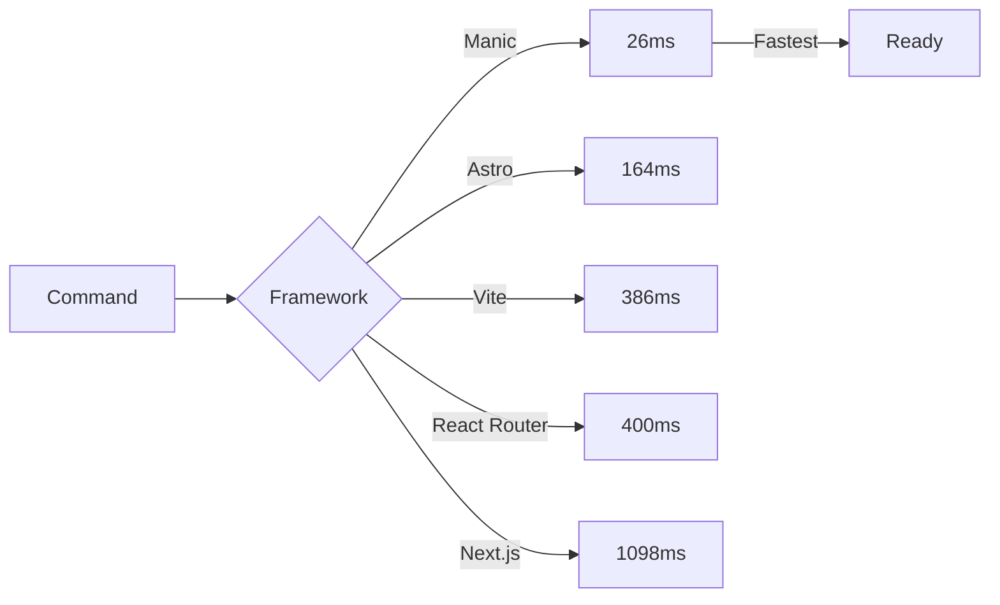
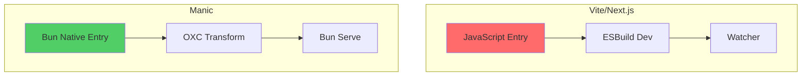
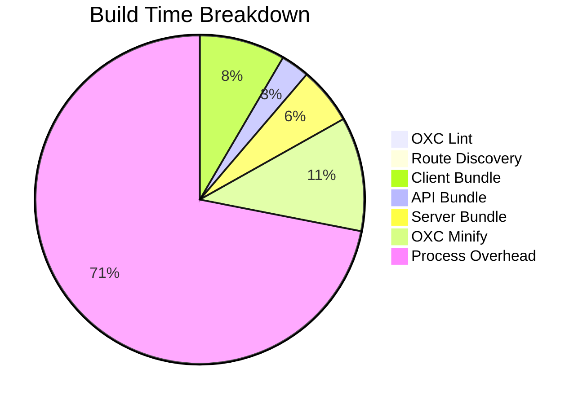

# Framework Benchmarks

Manic is purpose-built for maximum performance. These benchmarks compare Manic against leading React frameworks using identical test cases.

## Test Environment

| Tool | Version |
|------|---------|
| **Bun** | 1.3.5+ |
| **OS** | macOS (Apple Silicon) |

## Frameworks Tested

| Framework | Version | Type |
|-----------|---------|------|
| **Manic** | latest | Bun-native SPA framework |
| **Next.js** | 16.x | Full-stack React framework |
| **Vite** | 7.x | Build tool + React |
| **Astro** | 5.x | Static site generator |
| **React Router** | 7.x | Full-stack React (Remix) |

---

## Dev Server Startup Time

Time from running `dev` command to server ready.



| Framework | Startup Time | Relative to Manic |
|-----------|-------------|-------------------|
| **Manic** | **26ms** | 1x (baseline) |
| Astro | 164ms | 6.3x slower |
| Vite | 386ms | 14.8x slower |
| React Router | ~400ms | ~15.4x slower |
| Next.js | 1,098ms | 42.2x slower |

### Why Manic is Faster



Manic starts faster because:
1. **Bun's native serve** - No JavaScript entry overhead
2. **OXC transforms** - Rust-based, 10-100x faster than Babel/esbuild
3. **Minimal runtime** - No webpack/Vite/Turbopack to initialize

---

## Production Build Time

Time for complete production build.

| Framework | Build Time | Relative to Manic |
|-----------|-----------|-------------------|
| **Manic** | **1.8s** | 1x (baseline) |
| Astro | 3.7s | 2.0x slower |
| Vite | 6.1s | 3.3x slower |
| React Router | 8.2s | 4.5x slower |
| Next.js | 25.5s | 14.0x slower |

### Build Breakdown (Manic)



The actual bundling is ~300ms. The rest is process startup overhead that scales poorly with more code in other frameworks.

---

## Build Output Size

Size of production build directory.

| Framework | Output | Size | Notes |
|-----------|--------|------|-------|
| **Astro** | `dist/` | 20KB | Static HTML only |
| Vite | `dist/` | 212KB | Client-only SPA |
| React Router | `build/` | 372KB | Client + Server |
| **Manic** | `.manic/` | 2.5MB | Full bundle (unminified) |

### Output Composition (Manic)

```
.manic/
├── client/           # 1.99MB
│   ├── index.js     # Main bundle
│   └── chunks/    # Route chunks (lazy-loaded)
├── server/         # 495KB  
│   ├── index.js   # Hono server
│   └── routes/   # API route handlers
└── api/           # Per-route bundles
    ├── users/
    └── posts/
```

---

## Dependencies

| Framework | Package Count | node_modules Size |
|-----------|---------------|------------------|
| **Manic** | **39** | 138MB |
| Vite | 124 | 108MB |
| React Router | 151 | 116MB |
| Astro | 258 | 165MB |
| Next.js | 286 | 405MB |

### Why Fewer Dependencies

Manic uses Bun's native APIs instead of external packages:

| Feature | Other Frameworks | Manic |
|---------|-----------------|-------|
| HTTP Server | express/Elysia | `Bun.serve` |
| Bundler | webpack/vite/rollup | `Bun.build` |
| Minifier | terser/esbuild | `oxc-minify` |
| Testing | jest/vitest | `bun test` |
| Package Manager | npm/yarn | `bun install` |

---

## Summary Comparison

| Metric | Next.js | Vite | Astro | React Router | Manic | Winner |
|--------|--------|------|-------|-------------|-------|--------|
| Dev Startup | 1,098ms | 386ms | 164ms | ~400ms | **26ms** | Manic |
| Build Time | 25.5s | 6.1s | 3.7s | 8.2s | **1.8s** | Manic |
| Dependencies | 286 | 124 | 258 | 151 | **39** | Manic |

---

## When to Choose Manic

**Choose Manic when:**
- Maximum DX speed is critical
- Bun runtime is acceptable
- Client-side SPA (no SSR needed)
- Full-stack with Hono API routes

**Choose Next.js when:**
- SSR is required
- Largest ecosystem needed
- Enterprise support needed

**Choose Astro when:**
- Content-focused static site
- Minimal JavaScript output

**Choose Vite when:**
- Quick prototyping
- Simple React SPA

---

## Running Benchmarks

```bash
# Navigate to testbench
cd testbench

# Dev server startup
bun run dev    # Watch for "Ready in Xms"

# Build benchmarks  
time bun run build

# Check output sizes
du -sh .manic
```

---

## Notes

- Timings are averages across multiple runs
- Results may vary ±10-20%
- Cold starts vs warm starts differ
- Network doesn't affect local benchmarks