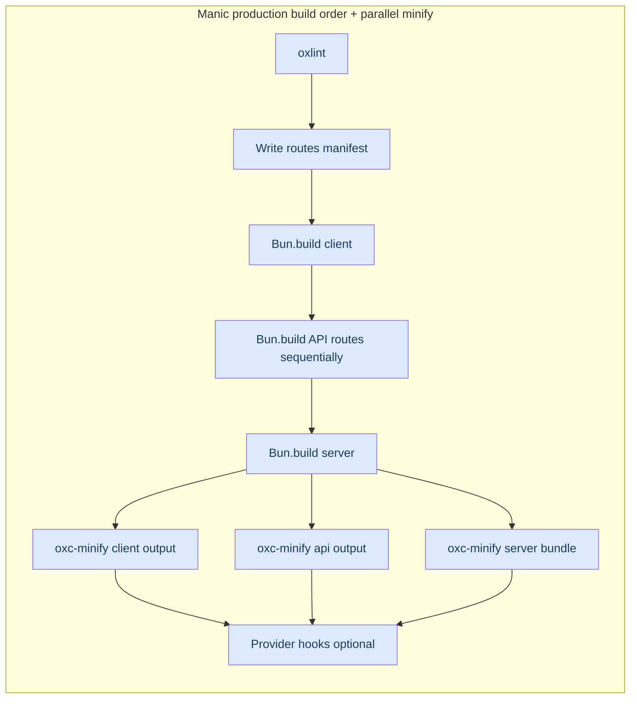

# Framework Benchmarks

Manic is purpose-built for maximum performance. These benchmarks compare Manic against leading React frameworks using identical starter-project test cases — **20 measured runs** each, cold and warm, on Apple Silicon macOS.

## Test Environment

| Tool | Detail |
|------|--------|
| **Scenario** | `starter` (identical starter project per framework) |
| **Runs** | 20 per phase (cold + warm) |
| **OS** | macOS (Apple Silicon) |

## Frameworks Tested

| Framework | Scenario |
|-----------|---------|
| **Manic** | `manic-starter` |
| **Next.js** | `next-starter` |
| **Vite** | `vite-starter` |
| **Astro** | `astro-starter` |
| **Remix (React Router)** | `remix-starter` |
| **TanStack Start** | `tanstack-starter` |
| **Nuxt** | `nuxt-starter` |

---

## Dev Server Startup (readyMeanMs)

Time from running the `dev` command until the framework signals it is ready to serve.

| Framework | Cold Ready Mean | Cold Ready p95 | Warm Ready Mean | Warm Ready p95 |
|-----------|---------------:|---------------:|----------------:|---------------:|
| **Manic** | **145 ms** | 207 ms | **174 ms** | 235 ms |
| Vite | 341 ms | 452 ms | 270 ms | 348 ms |
| Next.js | 494 ms | 787 ms | 344 ms | 546 ms |
| Nuxt | 579 ms | 1,111 ms | 414 ms | 582 ms |
| TanStack | 669 ms | 824 ms | 1,363 ms | 1,806 ms |
| Remix | 737 ms | 1,062 ms | 1,224 ms | 1,784 ms |
| Astro | 1,930 ms | 2,882 ms | 2,539 ms | 3,987 ms |

### Why Manic is Faster

Manic starts faster because:

1. **Bun's native serve** — The dev server is `Bun.serve`, not a Node script bootstrapping a bundler daemon.
2. **OXC end-to-end** — JSX/TS stripping, lint, format, and minify share one Rust parser and AST (`oxc-transform`, `oxlint`, `oxc-minify`). No chain of separate tools round-tripping text between processes.
3. **Minimal runtime** — No webpack, Vite, or Turbopack process to initialize before your app runs.

---

## Production Build Time

| Framework | Cold Build Mean | Cold Build p95 | Warm Build Mean | Warm Build p95 |
|-----------|---------------:|---------------:|----------------:|---------------:|
| **Manic** | **408 ms** | 540 ms | **397 ms** | 505 ms |
| Remix | 1,068 ms | 1,494 ms | 1,716 ms | 2,448 ms |
| TanStack | 1,347 ms | 1,832 ms | 2,218 ms | 3,119 ms |
| Astro | 1,712 ms | 2,432 ms | 2,463 ms | 4,210 ms |
| Vite | 2,351 ms | 3,183 ms | 1,690 ms | 2,147 ms |
| Nuxt | 6,334 ms | 10,455 ms | 4,193 ms | 5,311 ms |
| Next.js | 6,659 ms | 9,274 ms | 8,167 ms | 9,194 ms |

### Build Breakdown (Manic)

**Production parallelism (Manic).** Bundling runs mostly **in order**: oxlint → route manifest → **`Bun.build` client** → **each API route** → **`Bun.build` server**. Then **`Promise.all`** runs **`oxc-minify`** over `dist/client`, `dist/api`, and `server.js` **at the same time**.

---

## Build Output Size

| Framework | Cold Output Mean | Notes |
|-----------|----------------:|-------|
| **Astro** | **16.4 KB** | Static HTML only |
| Vite | 232.8 KB | Client-only SPA |
| Remix | 358.2 KB | Client + Server |
| **Manic** | 371.8 KB | Client + Server + API |
| TanStack | 1.23 MB | Client + Server |
| Nuxt | 2.52 MB | Full-stack |
| Next.js | 5.54 MB | Full-stack |

---

## Summary

| Metric | Manic | Vite | Next.js | Remix | TanStack | Nuxt | Astro |
|--------|------:|-----:|--------:|------:|---------:|-----:|------:|
| Cold Dev Ready | **145 ms** | 341 ms | 494 ms | 737 ms | 669 ms | 579 ms | 1,930 ms |
| Cold Build | **408 ms** | 2,351 ms | 6,659 ms | 1,068 ms | 1,347 ms | 6,334 ms | 1,712 ms |
| Output Size | 371.8 KB | 232.8 KB | 5.54 MB | 358.2 KB | 1.23 MB | 2.52 MB | 16.4 KB |

---

## Notes

- All numbers are **means over 20 runs** on Apple Silicon macOS.
- Cold = fresh cache; Warm = cache present from a prior run.
- Results may vary by machine and project size.
- Raw data and reproduction steps: [github.com/rahuletto/manic-benchmark](https://github.com/rahuletto/manic-benchmark)

## Canary optimization snapshot

Recent canary profiling (same demo workload, stable runtime vs canary runtime) after stricter tree-shaking boundaries:

| Metric | Delta |
|--------|------:|
| Warm build mean | **-3.81%** |
| Output size (`.manic`) | **-21.5%** (`-92 KB`) |

These gains come from conservative pipeline optimizations (client chunk splitting + reduced redundant minify work) rather than risky third-party side-effect pruning.
