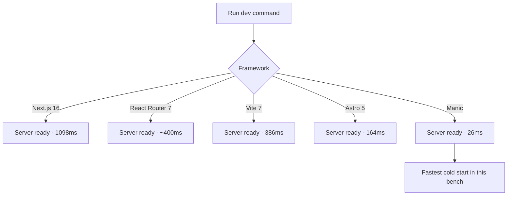
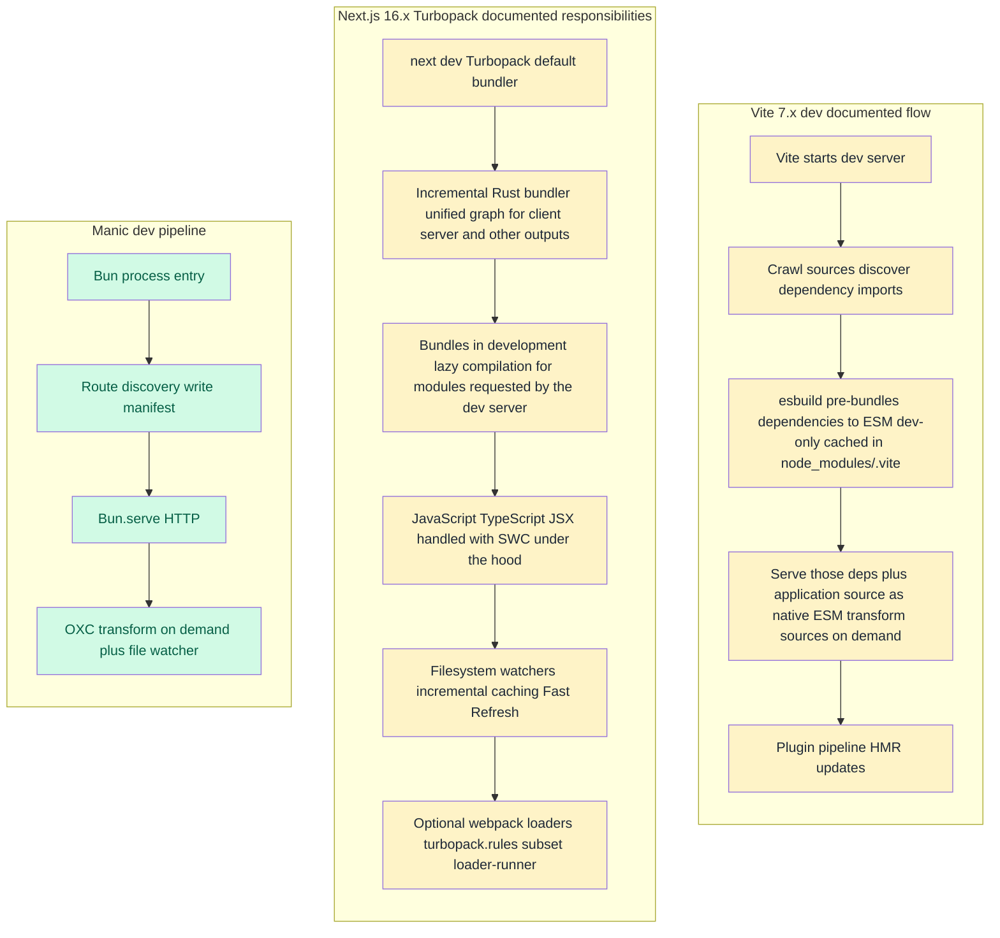
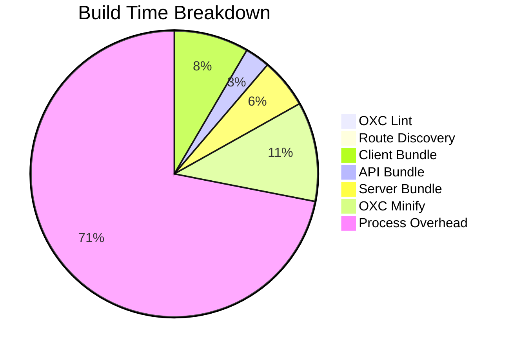
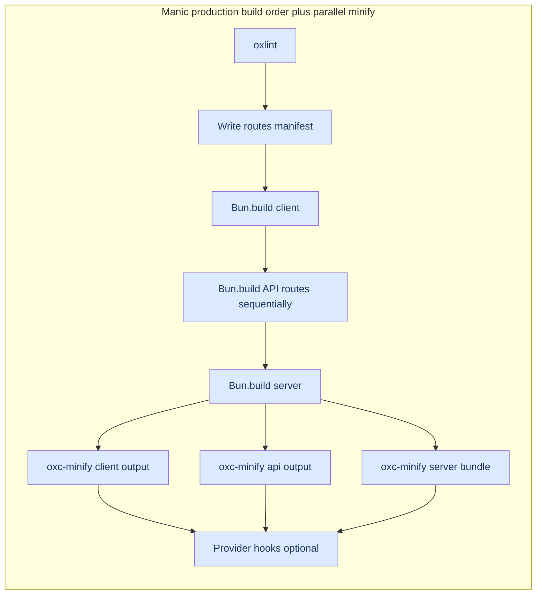

# Framework Benchmarks

Manic is purpose-built for maximum performance. These benchmarks compare Manic against leading React frameworks using identical test cases.

## Test Environment

| Tool | Version |
|------|---------|
| **Bun** | 1.3.5+ |
| **OS** | macOS (Apple Silicon) |

## Frameworks Tested

| Framework | Version | Type |
|-----------|---------|------|
| **Manic** | latest | Bun-native SPA framework |
| **Next.js** | 16.x | Full-stack React framework |
| **Vite** | 7.x | Build tool + React |
| **Astro** | 5.x | Static site generator |
| **React Router** | 7.x | Full-stack React (Remix) |

---

## Dev Server Startup Time

Time from running `dev` command to server ready.



| Framework | Startup Time | Relative to Manic |
|-----------|-------------|-------------------|
| **Manic** | **26ms** | 1x (baseline) |
| Astro | 164ms | 6.3x slower |
| Vite | 386ms | 14.8x slower |
| React Router | ~400ms | ~15.4x slower |
| Next.js | 1,098ms | 42.2x slower |

### Why Manic is Faster

Documented **development** responsibilities for **Vite 7.x** and **Next.js 16.x** below follow the wording on the cited pages. Diagrams show a **conceptual order** where docs imply sequencing (for example Vite’s first-run pre-bundle **before** loading the site locally); they are **not** meant as byte-accurate timelines—internals can overlap or repeat work.



**Sources (fact-check):**

- **Vite (pin to 7.x for this page)** — The frameworks table benchmarks **Vite 7.x**. Dependency pre-bundling for Vite **7** is documented as **`esbuild`** and **development-only**: [Dependency pre-bundling (Vite 7)](https://v7.vite.dev/guide/dep-pre-bundling.html). The same page notes that **after** the server has started, newly discovered dependency imports can trigger another pre-bundle pass. **Current** docs for the latest Vite line describe dependency optimization with **Rolldown** instead ([Dependency pre-bundling](https://vitejs.dev/guide/dep-pre-bundling.html)); do **not** mix those claims when verifying versions. Split dev model (pre-bundle deps vs native ESM for sources): [Why Vite](https://vitejs.dev/guide/why.html).
- **Next.js + Turbopack** — Default bundler, unified graph, bundling **in dev**, lazy compilation driven by dev-server requests, incremental parallelism: [Turbopack API reference — Why Turbopack?](https://nextjs.org/docs/app/api-reference/turbopack#why-turbopack). **SWC** for JS/TS: same page language-features table ([JavaScript & TypeScript — Uses SWC under the hood](https://nextjs.org/docs/app/api-reference/turbopack#language-features)). **Webpack loaders** via **`turbopack.rules`** and **`loader-runner`**: [`next.config` — `turbopack`](https://nextjs.org/docs/app/api-reference/config/next-config-js/turbopack).
- **Webpack fallback** — **`next dev --webpack`** / **`next build --webpack`** when you need webpack ([Turbopack API reference — Supported platforms](https://nextjs.org/docs/app/api-reference/turbopack#supported-platforms)).

Manic starts faster because:

1. **Bun's native serve** — The dev server is `Bun.serve`, not a Node script bootstrapping a bundler daemon.
2. **OXC end-to-end** — JSX/TS stripping, lint, format, and minify share one Rust parser and AST (`oxc-transform`, `oxlint`, `oxc-minify`). There is no chain of separate tools round-tripping text between processes.
3. **Minimal runtime** — No webpack, Vite, or Turbopack process to initialize before your app runs.

**Why Turbopack can still carry webpack-era cost.** Next’s Turbopack documents a **`turbopack.rules`** surface for **webpack loaders** executed through a **subset** of the webpack loader API ([`next.config` `turbopack`](https://nextjs.org/docs/app/api-reference/config/next-config-js/turbopack)). Real apps often depend on loaders, aliases, or fallback to **`next dev --webpack`**, all of which keep the overall dev path heavier than a Bun-and-OXC SPA that never emulates webpack.

**Why Bun + OXC stays fast.** Manic keeps the critical path narrow: **`Bun`** owns HTTP and **`Bun.build`** owns graphs and hashing; **`oxc-transform`** plugs in as the JSX/TS compiler. Production minification runs through **`oxc-minify`** in parallel over outputs. Fewer processes, fewer serialized handoffs, and no emulation layer for webpack loaders—so cold dev startup and builds skew lighter than stacks juggling Node entrypoints plus a compatibility-oriented bundler.

---

## Production Build Time

Time for complete production build.

| Framework | Build Time | Relative to Manic |
|-----------|-----------|-------------------|
| **Manic** | **1.8s** | 1x (baseline) |
| Astro | 3.7s | 2.0x slower |
| Vite | 6.1s | 3.3x slower |
| React Router | 8.2s | 4.5x slower |
| Next.js | 25.5s | 14.0x slower |

### Build Breakdown (Manic)



**Production parallelism (Manic).** Bundling runs mostly **in order**: oxlint → route manifest → **`Bun.build` client** → **each API route** (`Bun.build` per entry, sequentially in the CLI) → **`Bun.build` server**. Then **`Promise.all`** runs **`oxc-minify`** over **`dist/client`**, **`dist/api`** (if present), and **`server.js`** **at the same time** — and inside each folder, `.js` files are minified concurrently (`packages/manic/src/cli/commands/build.ts`).



The actual bundling is ~300ms. The rest is process startup overhead that scales poorly with more code in other frameworks.

---

## Build Output Size

Size of production build directory.

| Framework | Output | Size | Notes |
|-----------|--------|------|-------|
| **Astro** | `dist/` | 20KB | Static HTML only |
| Vite | `dist/` | 212KB | Client-only SPA |
| React Router | `build/` | 372KB | Client + Server |
| **Manic** | `.manic/` | 2.5MB | Full bundle (unminified) |

### Output Composition (Manic)

Approximate layout after `manic build` (exact chunk names are hashed):

<Files>
  <Folder name=".manic" defaultOpen>
    <Folder name="client" defaultOpen>
      <File name="index.html" />
      <File name="main-[hash].js" />
      <Folder name="chunks">
        <File name="[route]-[hash].js" />
      </Folder>
    </Folder>
    <Folder name="api" defaultOpen>
      <Folder name="users">
        <File name="index.js" />
      </Folder>
      <Folder name="posts">
        <File name="index.js" />
      </Folder>
    </Folder>
    <File name="server.js" />
  </Folder>
</Files>

Typical sizes from this benchmark run: client bundle ~1.99MB (before CDN gzip), API + `server.js` add the remainder of the `.manic/` total (~2.5MB unminified in the table above).

---

## Dependencies

| Framework | Package Count | node_modules Size |
|-----------|---------------|------------------|
| **Manic** | **39** | 138MB |
| Vite | 124 | 108MB |
| React Router | 151 | 116MB |
| Astro | 258 | 165MB |
| Next.js | 286 | 405MB |

### Why Fewer Dependencies

Manic uses Bun's native APIs instead of external packages:

| Feature | Other Frameworks | Manic |
|---------|-----------------|-------|
| HTTP Server | express/Elysia | `Bun.serve` |
| Bundler | webpack/vite/rollup | `Bun.build` |
| Minifier | terser/esbuild | `oxc-minify` |
| Testing | jest/vitest | `bun test` |
| Package Manager | npm/yarn | `bun install` |

---

## Summary Comparison

| Metric | Next.js | Vite | Astro | React Router | Manic | Winner |
|--------|--------|------|-------|-------------|-------|--------|
| Dev Startup | 1,098ms | 386ms | 164ms | ~400ms | **26ms** | Manic |
| Build Time | 25.5s | 6.1s | 3.7s | 8.2s | **1.8s** | Manic |
| Dependencies | 286 | 124 | 258 | 151 | **39** | Manic |

---

## When to Choose Manic

**Choose Manic when:**
- Maximum DX speed is critical
- Bun runtime is acceptable
- Client-side SPA (no SSR needed)
- Full-stack with Hono API routes

**Choose Next.js when:**
- SSR is required
- Largest ecosystem needed
- Enterprise support needed

**Choose Astro when:**
- Content-focused static site
- Minimal JavaScript output

**Choose Vite when:**
- Quick prototyping
- Simple React SPA

---

## Running Benchmarks

```bash
# Navigate to testbench
cd testbench

# Dev server startup
bun run dev    # Watch for "Ready in Xms"

# Build benchmarks  
time bun run build

# Check output sizes
du -sh .manic
```

---

## Notes

- Timings are averages across multiple runs
- Results may vary ±10-20%
- Cold starts vs warm starts differ
- Network doesn't affect local benchmarks