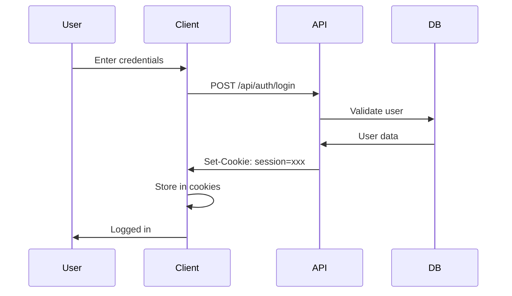
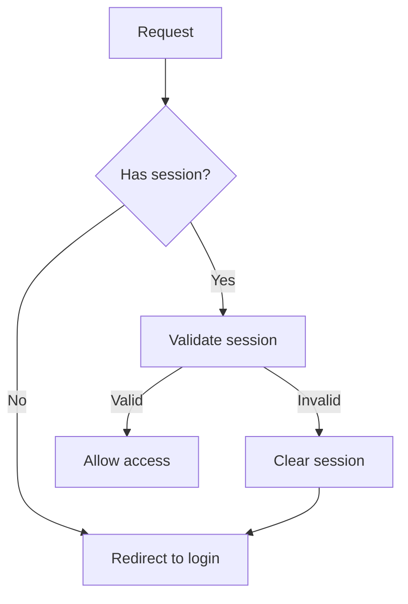

# Authentication

<Callout type="info" title="TL;DR">

Manic **does not** ship a `cookies()` helper. API routes are **Hono apps** (`export default`). Use **`hono/cookie`** (`setCookie`, `getCookie`, `deleteCookie`) for sessions, plus React Context (or similar) on the client.

</Callout>
## What It Is

Authentication patterns in Manic:

| Pattern | Use Case | Security |
|---------|----------|----------|
| **Cookie Sessions** | Web apps | HttpOnly, secure cookies |
| **API Tokens** | Mobile/SPAs | Bearer tokens |
| **JWT** | Stateless | Signed tokens |

**Flow:**
1. User submits credentials
2. Server validates
3. Server sets session cookie
4. Client sends cookie with requests
5. Server validates cookie

---

## Prerequisites

- [API Routes](/docs/framework/server) - Backend endpoints
- [State Management](/docs/framework/advanced/state-management) - Global state

---

## Quick Start

### Create Auth API

```ts
// app/api/auth/login/index.ts
import { Hono } from 'hono';
import { setCookie } from 'hono/cookie';

declare function validateUser(
  email: string,
  password: string
): Promise<{ id: string; email: string; token: string } | null>;

const app = new Hono();

app.post('/', async (c) => {
  const { email, password } = await c.req.json<{ email: string; password: string }>();

  const user = await validateUser(email, password);
  if (!user) {
    return c.json({ error: 'Invalid credentials' }, 401);
  }

  setCookie(c, 'session', user.token, {
    httpOnly: true,
    secure: true,
    sameSite: 'Lax',
    maxAge: 60 * 60 * 24 * 7, // 7 days
    path: '/',
  });

  return c.json({ user: { id: user.id, email: user.email } });
});

export default app;
```

---

## How It Works

### Auth Flow



### Protected Route Flow



---

## Type Definitions

```ts
// Session cookie
interface Session {
  userId: string;
  email: string;
  expiresAt: number;
}

// Auth context
interface AuthState {
  user: User | null;
  isLoading: boolean;
  login: (email: string, password: string) => Promise<void>;
  logout: () => Promise<void>;
  check: () => Promise<void>;
}

// Protected route options
interface ProtectedOptions {
  requireAdmin?: boolean;
  redirectTo?: string;
}
```

---

## Examples

### Example 1: Login API

```ts
// app/api/auth/login/index.ts
import { Hono } from 'hono';
import { setCookie } from 'hono/cookie';
import bcrypt from 'bcrypt';

interface User {
  id: string;
  email: string;
  passwordHash: string;
}

declare const db: {
  users: { find: (q: { email: string }) => Promise<User | null> };
};
declare function createSessionToken(userId: string): Promise<string>;

const app = new Hono();

app.post('/', async (c) => {
  const { email, password } = await c.req.json<{ email: string; password: string }>();

  const user = await db.users.find({ email });
  if (!user) {
    return c.json({ error: 'Invalid email or password' }, 401);
  }

  const valid = await bcrypt.compare(password, user.passwordHash);
  if (!valid) {
    return c.json({ error: 'Invalid email or password' }, 401);
  }

  const token = await createSessionToken(user.id);

  setCookie(c, 'session', token, {
    httpOnly: true,
    secure: true,
    sameSite: 'Lax',
    maxAge: 60 * 60 * 24 * 7,
    path: '/',
  });

  return c.json({
    user: { id: user.id, email: user.email },
  });
});

export default app;
```

### Example 2: Logout API

```ts
// app/api/auth/logout/index.ts
import { Hono } from 'hono';
import { deleteCookie } from 'hono/cookie';

const app = new Hono();

app.post('/', (c) => {
  deleteCookie(c, 'session', { path: '/' });
  return c.json({ success: true });
});

export default app;
```

### Example 3: Get Current User

```ts
// app/api/auth/me/index.ts
import { Hono } from 'hono';
import { getCookie } from 'hono/cookie';

declare function validateSession(token: string): Promise<{ id: string; email: string } | null>;

const app = new Hono();

app.get('/', async (c) => {
  const sessionToken = getCookie(c, 'session');

  if (!sessionToken) {
    return c.json({ user: null });
  }

  const user = await validateSession(sessionToken);
  if (!user) {
    return c.json({ user: null });
  }

  return c.json({ user: { id: user.id, email: user.email } });
});

export default app;
```

### Example 4: Auth Context Provider

```tsx
// app/routes/~context/AuthContext.tsx
import React, { createContext, useContext, useState, useEffect } from 'react';

interface User {
  id: string;
  email: string;
  isAdmin?: boolean;
}

interface AuthContextType {
  user: User | null;
  isLoading: boolean;
  login: (email: string, password: string) => Promise<void>;
  logout: () => Promise<void>;
}

const AuthContext = createContext<AuthContextType | null>(null);

export function AuthProvider({ children }: { children: React.ReactNode }) {
  const [user, setUser] = useState<User | null>(null);
  const [isLoading, setIsLoading] = useState(true);

  // Check auth on mount
  useEffect(() => {
    checkAuth();
  }, []);

  const checkAuth = async () => {
    try {
      const res = await fetch('/api/auth/me');
      const data = await res.json();
      setUser(data.user);
    } catch {
      setUser(null);
    } finally {
      setIsLoading(false);
    }
  };

  const login = async (email: string, password: string) => {
    const res = await fetch('/api/auth/login', {
      method: 'POST',
      headers: { 'Content-Type': 'application/json' },
      body: JSON.stringify({ email, password }),
    });

    if (!res.ok) {
      throw new Error('Login failed');
    }

    const data = await res.json();
    setUser(data.user);
  };

  const logout = async () => {
    await fetch('/api/auth/logout', { method: 'POST' });
    setUser(null);
  };

  return (
    <AuthContext.Provider value={{ user, isLoading, login, logout }}>
      {children}
    </AuthContext.Provider>
  );
}

export function useAuth() {
  const ctx = useContext(AuthContext);
  if (!ctx) throw new Error('useAuth must be used within AuthProvider');
  return ctx;
}
```

### Example 5: Protected Route Component

```tsx
// app/routes/dashboard/index.tsx
import React, { useEffect } from 'react';
import { useAuth } from '../~context/AuthContext';
import { useRouter } from 'manicjs';

export default function Dashboard() {
  const { user, isLoading } = useAuth();
  const router = useRouter();

  useEffect(() => {
    if (!isLoading && !user) {
      router.navigate('/login?redirect=/dashboard');
    }
  }, [user, isLoading]);

  if (isLoading) return <div>Loading...</div>;
  if (!user) return null;

  return <div>Welcome, {user.email}!</div>;
}
```

### Example 6: Require Admin

```tsx
// app/routes/admin/index.tsx
import React, { useEffect } from 'react';
import { useAuth } from '../~context/AuthContext';
import { useRouter } from 'manicjs';

export default function AdminPage() {
  const { user, isLoading } = useAuth();
  const router = useRouter();

  useEffect(() => {
    if (!isLoading && (!user || !user.isAdmin)) {
      router.navigate('/');
    }
  }, [user, isLoading]);

  if (isLoading || !user?.isAdmin) return null;

  return <div>Admin Panel</div>;
}
```

---

## Advanced Patterns

### Pattern 1: Session Expiry & Activity Extension

```tsx
// Extend session on user activity
export function useSessionExtend() {
  useEffect(() => {
    let timeout: NodeJS.Timeout;

    const handleActivity = () => {
      clearTimeout(timeout);
      timeout = setTimeout(() => {
        // Ping server to extend session
        fetch('/api/auth/ping', { method: 'POST' });
      }, 15 * 60 * 1000); // Extend after 15 minutes of inactivity
    };

    document.addEventListener('click', handleActivity);
    document.addEventListener('keypress', handleActivity);
    handleActivity(); // Initialize

    return () => {
      clearTimeout(timeout);
      document.removeEventListener('click', handleActivity);
      document.removeEventListener('keypress', handleActivity);
    };
  }, []);
}
```

### Pattern 2: JWT with Refresh Token

```ts
// app/api/auth/refresh/index.ts
import { Hono } from 'hono';
import { deleteCookie, getCookie, setCookie } from 'hono/cookie';

declare function refreshAccessToken(token: string): Promise<string>;

const app = new Hono();

app.post('/', async (c) => {
  const refreshToken = getCookie(c, 'refreshToken');

  if (!refreshToken) {
    return c.json({ error: 'No refresh token' }, 401);
  }

  try {
    const newAccessToken = await refreshAccessToken(refreshToken);
    setCookie(c, 'session', newAccessToken, {
      httpOnly: true,
      secure: true,
      maxAge: 15 * 60, // 15 minutes
      path: '/',
    });

    return c.json({ success: true });
  } catch {
    deleteCookie(c, 'refreshToken', { path: '/' });
    return c.json({ error: 'Invalid token' }, 401);
  }
});

export default app;
```

### Pattern 3: CSRF Protection

```ts
import { Hono } from 'hono';
import { getCookie, setCookie } from 'hono/cookie';

declare function generateCSRF(): string;

const app = new Hono();

// Issue a CSRF token (call from a dedicated route)
app.get('/csrf-token', (c) => {
  const token = generateCSRF();
  setCookie(c, 'csrf', token, { httpOnly: true, path: '/' });
  return c.json({ token });
});

// Verify on mutations
app.post('/mutate', async (c) => {
  const csrf = c.req.header('X-CSRF-TOKEN');
  const cookieCSRF = getCookie(c, 'csrf');

  if (!csrf || csrf !== cookieCSRF) {
    return c.json({ error: 'Invalid CSRF token' }, 403);
  }

  return c.json({ ok: true });
});

export default app;
```

---

## Common Issues

### Issue 1: Session Not Persisting

**Problem:** Login state resets on refresh.

**Check:**
1. Cookie is being set
2. Cookie is HttpOnly
3. Request includes credentials

**Solution:**

```tsx
// Include credentials in all requests
fetch('/api/auth/me', {
  credentials: 'include',  // Critical!
});
```

### Issue 2: CORS Issues

**Problem:** Cookie blocked by browser.

**Solution:**

```ts
import { setCookie } from 'hono/cookie';

// Inside your Hono handler (`async (c) => { ... }`):
setCookie(c, 'session', token, {
  sameSite: 'Lax', // or 'None' for cross-site (requires `Secure`)
  secure: true,
  path: '/',
});
```

```ts
// Client: send cookies on same-origin API calls
fetch('/api/auth/login', {
  method: 'POST',
  credentials: 'include',
  headers: { 'Content-Type': 'application/json' },
  body: JSON.stringify({ email, password }),
});
```

### Issue 3: Token Expiry Without Warning

**Problem:** User gets logged out without notice.

**Solution:** Implement token expiry warning:

```tsx
// Warn before logout
export function useSessionWarning() {
  useEffect(() => {
    const warningTime = 5 * 60 * 1000; // Warn 5 mins before expiry
    const timeout = setTimeout(() => {
      alert('Your session will expire in 5 minutes. Click to extend.');
      fetch('/api/auth/ping', { method: 'POST' });
    }, warningTime);

    return () => clearTimeout(timeout);
  }, []);
}
```

---

## Security Best Practices

<Callout type="warn">
 
**Use HttpOnly cookies** — prevents JavaScript access to session tokens.
 
</Callout>
 
<Callout type="warn">
 
**Use Secure flag** — enforces HTTPS-only in production.
 
</Callout>
 
<Callout type="warn">
 
**Implement CSRF protection** — mandatory for all state-changing operations.
 
</Callout>

<Callout type="info">

**Set reasonable session expiry** — 7 days for web apps, shorter for sensitive operations.

</Callout>
<Callout type="info">

**Use bcrypt with salt** — never store plaintext passwords. Use `bcrypt.hash()` with salt rounds ≥ 10.

</Callout>
<Callout type="info">

**Validate email on registration** — send confirmation email to verify ownership.

</Callout>
---

See also:
- [API Routes](/docs/framework/server)
- [State Management](/docs/framework/advanced/state-management)
- [Environment Variables](/docs/framework/advanced/environment-variables)
