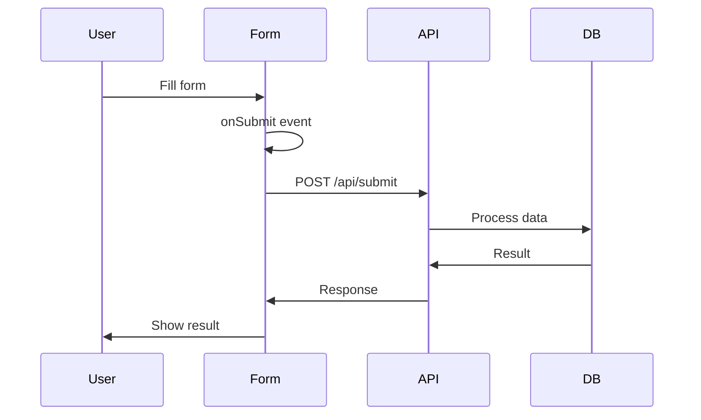

# Forms

<Callout type="info" title="TL;DR">

Manic uses standard HTML forms with React state for managed inputs. Submit to API routes for server-side processing. Use controlled components for complex forms and validation.

</Callout>
## What It Is

Form handling in Manic follows standard React patterns:

| Pattern | Use Case |
|---------|----------|
| **Uncontrolled** | Simple forms with FormData |
| **Controlled** | Complex forms with validation |
| **Server Actions** | Form submission to API |

**Flow:**
1. User fills form
2. Client validates (optional)
3. Submit to API route
4. Server processes
5. Return result/errors

---

## Prerequisites

- [API Routes](/docs/framework/server) - For form submission endpoints
- [State Management](/docs/framework/advanced/state-management) - Form state
- [Error Handling](/docs/framework/advanced/error-handling) - Validation errors

---

## Quick Start

### Simple Form

```tsx
// app/routes/contact.tsx
import React, { useState } from 'react';

export default function ContactPage() {
  const [status, setStatus] = useState<'idle' | 'submitting' | 'success' | 'error'>('idle');

  const handleSubmit = async (e: React.FormEvent<HTMLFormElement>) => {
    e.preventDefault();
    setStatus('submitting');

    const formData = new FormData(e.currentTarget);
    const data = Object.fromEntries(formData);

    const res = await fetch('/api/contact', {
      method: 'POST',
      body: JSON.stringify(data),
      headers: { 'Content-Type': 'application/json' },
    });

    setStatus(res.ok ? 'success' : 'error');
  };

  return (
    <form onSubmit={handleSubmit}>
      <input name="email" type="email" required />
      <textarea name="message" required />
      <button type="submit" disabled={status === 'submitting'}>
        {status === 'submitting' ? 'Sending...' : 'Send'}
      </button>
      {status === 'success' && <p>Message sent!</p>}
    </form>
  );
}
```

---

## How It Works

### Form Submission Flow



---

## Examples

### Example 1: Controlled Form with Validation

```tsx
// app/routes/register.tsx
import React, { useState } from 'react';

interface FormErrors {
  email?: string;
  password?: string;
}

export default function RegisterPage() {
  const [form, setForm] = useState({ email: '', password: '' });
  const [errors, setErrors] = useState<FormErrors>({});
  const [status, setStatus] = useState<'idle' | 'submitting' | 'success' | 'error'>('idle');

  const validate = (): boolean => {
    const newErrors: FormErrors = {};

    if (!form.email.includes('@')) {
      newErrors.email = 'Invalid email address';
    }

    if (form.password.length < 8) {
      newErrors.password = 'Password must be at least 8 characters';
    }

    setErrors(newErrors);
    return Object.keys(newErrors).length === 0;
  };

  const handleSubmit = async (e: React.FormEvent) => {
    e.preventDefault();

    if (!validate()) return;

    setStatus('submitting');

    const res = await fetch('/api/register', {
      method: 'POST',
      headers: { 'Content-Type': 'application/json' },
      body: JSON.stringify(form),
    });

    setStatus(res.ok ? 'success' : 'error');
  };

  const handleChange = (e: React.ChangeEvent<HTMLInputElement>) => {
    setForm({ ...form, [e.target.name]: e.target.value });
  };

  return (
    <form onSubmit={handleSubmit}>
      <div>
        <input
          name="email"
          type="email"
          value={form.email}
          onChange={handleChange}
        />
        {errors.email && <span>{errors.email}</span>}
      </div>

      <div>
        <input
          name="password"
          type="password"
          value={form.password}
          onChange={handleChange}
        />
        {errors.password && <span>{errors.password}</span>}
      </div>

      <button type="submit" disabled={status === 'submitting'}>
        Register
      </button>
    </form>
  );
}
```

### Example 2: Form with Reset

```tsx
// app/routes/search.tsx
import React, { useState } from 'react';

export default function SearchPage() {
  const [query, setQuery] = useState('');

  const handleReset = () => {
    setQuery('');
  };

  return (
    <form method="get" action="/search">
      <input
        name="q"
        value={query}
        onChange={(e) => setQuery(e.target.value)}
      />
      <button type="submit">Search</button>
      <button type="button" onClick={handleReset}>Clear</button>
    </form>
  );
}
```

### Example 3: Multi-Part Form

```tsx
// app/routes/upload.tsx
import React, { useState } from 'react';

export default function UploadPage() {
  const [file, setFile] = useState<File | null>(null);

  const handleSubmit = async (e: React.FormEvent) => {
    e.preventDefault();

    if (!file) return;

    const formData = new FormData();
    formData.append('file', file);

    await fetch('/api/upload', {
      method: 'POST',
      body: formData,
    });
  };

  return (
    <form onSubmit={handleSubmit}>
      <input
        type="file"
        onChange={(e) => setFile(e.target.files?.[0] ?? null)}
      />
      <button type="submit">Upload</button>
    </form>
  );
}
```

### Example 4: Login Form

```tsx
// app/routes/login.tsx
import React, { useState } from 'react';
import { Link, useRouter } from 'manicjs';

export default function LoginPage() {
  const [form, setForm] = useState({ email: '', password: '' });
  const [error, setError] = useState('');
  const [isLoading, setIsLoading] = useState(false);
  const router = useRouter();

  const handleSubmit = async (e: React.FormEvent) => {
    e.preventDefault();
    setIsLoading(true);
    setError('');

    try {
      const res = await fetch('/api/auth/login', {
        method: 'POST',
        headers: { 'Content-Type': 'application/json' },
        body: JSON.stringify(form),
      });

      if (!res.ok) {
        const data = await res.json();
        setError(data.error || 'Login failed');
        return;
      }

      router.navigate('/dashboard');
    } catch (e) {
      setError('An error occurred');
    } finally {
      setIsLoading(false);
    }
  };

  const handleChange = (e: React.ChangeEvent<HTMLInputElement>) => {
    setForm({ ...form, [e.target.name]: e.target.value });
  };

  return (
    <form onSubmit={handleSubmit}>
      {error && <div className="error">{error}</div>}

      <input
        name="email"
        type="email"
        placeholder="Email"
        value={form.email}
        onChange={handleChange}
        required
      />

      <input
        name="password"
        type="password"
        placeholder="Password"
        value={form.password}
        onChange={handleChange}
        required
      />

      <button type="submit" disabled={isLoading}>
        {isLoading ? 'Logging in...' : 'Login'}
      </button>

      <p>
        Don't have an account? <a href="/register">Register</a>
      </p>
    </form>
  );
}
```

### Example 5: Server-Side Validation

```tsx
// app/api/contact/index.ts
export async function POST({ request }: { request: Request }) {
  const data = await request.json();
  const errors: Record<string, string> = {};

  // Validate email
  if (!data.email || !data.email.includes('@')) {
    errors.email = 'Valid email is required';
  }

  // Validate message
  if (!data.message || data.message.length < 10) {
    errors.message = 'Message must be at least 10 characters';
  }

  // Return errors if any
  if (Object.keys(errors).length > 0) {
    return Response.json({ errors }, { status: 400 });
  }

  // Process form
  await saveMessage(data);

  return Response.json({ success: true });
}
```

---

## Advanced Patterns

### Pattern 1: Use React Hook Form

```tsx
// If using react-hook-form
import { useForm } from 'react-hook-form';

export function MyForm() {
  const { register, handleSubmit, formState: { errors } } = useForm();

  const onSubmit = (data: any) => {
    console.log(data);
  };

  return (
    <form onSubmit={handleSubmit(onSubmit)}>
      <input {...register('email', { required: true })} />
      {errors.email && <span>Required</span>}
      <button type="submit">Submit</button>
    </form>
  );
}
```

### Pattern 2: Auto-Save Drafts

```tsx
// Save draft to localStorage
function useAutoSave(form: object, key: string) {
  useEffect(() => {
    localStorage.setItem(key, JSON.stringify(form));
  }, [form, key]);

  useEffect(() => {
    const saved = localStorage.getItem(key);
    if (saved) {
      // Restore saved form
    }
  }, []);
}
```

---

## Common Issues

### Issue 1: Form Not Submitting

**Problem:** Form submits but nothing happens.

**Check:**
1. `e.preventDefault()` is called
2. Form has `onSubmit` handler
3. Button has `type="submit"`

```tsx
// ✗ BAD: Missing preventDefault
const handleSubmit = (e) => {
  // default behavior occurs
};

// ✓ GOOD: Prevent default
const handleSubmit = (e) => {
  e.preventDefault();
  // handle submit
};
```

### Issue 2: Validation Not Working

**Problem:** Server returns errors but they're not displayed.

**Solution:**

```tsx
const handleSubmit = async (e) => {
  e.preventDefault();

  const res = await fetch('/api/submit', { ... });
  const data = await res.json();

  if (!res.ok && data.errors) {
    setErrors(data.errors);  // Display server errors
  }
};
```

---

## Best Practices

<Callout type="info">

**Validate client-side** for better UX, but always validate server-side for security.

</Callout>
<Callout type="warn">
 
Always validate user input server-side, even if client-side validation passes.
 
</Callout>
> **Use type="email"** and other HTML5 validation attributes for basic validation.

<Callout type="info">

**Show loading states** — disable buttons during submission to prevent double-submit.

</Callout>
<Callout type="info">

**Display clear error messages** — tell users what went wrong and how to fix it.

</Callout>
---

## Version History

| Version | Changes |
|---------|---------|
| v0.12.0 | Added form examples |
| v0.11.0 | Initial form support |
| v0.10.0 | Basic form handling |

---

See also:
- [API Routes](/docs/framework/server)
- [State Management](/docs/framework/advanced/state-management)
- [Error Handling](/docs/framework/advanced/error-handling)
