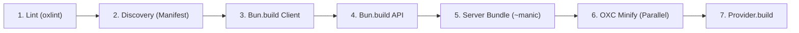

import {
  HiOutlineArrowPath,
  HiOutlineCpuChip,
  HiOutlineMap,
  HiOutlinePuzzlePiece,
} from 'react-icons/hi2';

# Framework

Manic is a **zero-config React SPA framework** built exclusively on Bun with ultra-fast OXC transforms, Hono API routes, and native View Transitions support.

## Quick Start

<Tabs items={['bun', 'npm', 'yarn', 'pnpm']}>
  <Tab value="bun">
    ```bash
    bun create manic my-app
    cd my-app
    bun dev
    ```
  </Tab>
  <Tab value="npm">
    ```bash
    npx create-manic my-app
    cd my-app
    npm install
    npm run dev
    ```
  </Tab>
  <Tab value="yarn">
    ```bash
    yarn create manic my-app
    cd my-app
    yarn dev
    ```
  </Tab>
  <Tab value="pnpm">
    ```bash
    pnpm create manic my-app
    cd my-app
    pnpm dev
    ```
  </Tab>
</Tabs>

Visit `http://localhost:6070` (default dev port; override with `server.port` or `manic dev --port`)

## What You Get

<Callout type="info">

Everything is automatically wired. No webpack, no Vite, no config hell.

</Callout>
- **Client Router** — File-based routing with lazy-loaded code splitting
- **API Routes** — Hono-powered, fully typed OpenAPI  
- **Build Engine** — OXC transforms + Bun bundler (50-100x faster than alternatives)
- **Zero Config** — Just write code, the framework figures out the rest
- **View Transitions** — Native, flicker-free page navigation
- **TypeScript First** — Full type safety across router, API, and config

## Project Structure

<Files>
  <Folder name="app" defaultOpen>
    <Folder name="routes" defaultOpen>
      <File name="index.tsx" />
      <File name="about.tsx" />
      <Folder name="posts">
        <File name="[id].tsx" />
      </Folder>
    </Folder>
    <Folder name="api">
      <Folder name="users">
        <File name="index.ts" />
      </Folder>
      <Folder name="posts">
        <File name="index.ts" />
      </Folder>
    </Folder>
    <File name="index.html" />
  </Folder>
  <File name="manic.config.ts" />
  <File name="~manic.ts" />
  <File name="package.json" />
</Files>

## Next Steps

<Cards>
  <Card 
    href="/docs/framework/routing" 
    icon={<HiOutlineMap aria-hidden />}
    title="Routing Guide"
    description="File-based routing, dynamic segments, catch-all routes"
  />
  <Card 
    href="/docs/framework/server/data-fetching" 
    icon={<HiOutlineArrowPath aria-hidden />}
    title="Data Fetching"
    description="API routes, RPC clients, type-safe queries"
  />
  <Card 
    href="/docs/core/architecture" 
    icon={<HiOutlineCpuChip aria-hidden />}
    title="Architecture"
    description="How Manic's build pipeline and router work"
  />
  <Card 
    href="/docs/framework/plugins" 
    icon={<HiOutlinePuzzlePiece aria-hidden />}
    title="Plugins"
    description="Extend Manic with SEO, sitemap, MCP, and more"
  />
</Cards>

## Key Concepts

### The `~` Convention

Files and folders prefixed with `~` are **excluded from routing**. Use them for components, utilities, and tests:

<Files>
  <Folder name="app/routes" defaultOpen>
    <File name="index.tsx" />
    <File name="~Header.tsx" />
    <Folder name="~hooks">
      <File name="useAuth.ts" />
    </Folder>
  </Folder>
</Files>

### Auto-Generated Routes

Your folder structure **automatically becomes your API and site structure**:

- `app/routes/blog/[slug].tsx` → `/blog/my-post`
- `app/api/users/index.ts` → `GET /api/users`
- `app/api/posts/[id].ts` → `GET /api/posts/123`

### Build Pipeline



<Callout type="info">

Manic builds are **deterministic and extremely fast**. Most projects build in less than `1 second`.

</Callout>
## Deployment

Manic works on **any Bun runtime**. Choose your platform:

**Vercel** (Serverless Functions):
```bash
vercel
```
Automatic deployment on push to `main`.

**Cloudflare** (Edge Runtime):
```bash
wrangler deploy
```
Ultra-low latency via Cloudflare Workers.

**Self-Hosted** (Any Bun server):
```bash
bun start
```
Full Bun HTTP server. Deploy anywhere with `bun run`.

<Callout type="warn">
 
Ensure your deployment environment has **Bun 1.0+** installed.
 
</Callout>

---

Have questions? Check the [troubleshooting](/docs/framework/troubleshooting/index) or [CLI Reference](/docs/cli/index) guide.
