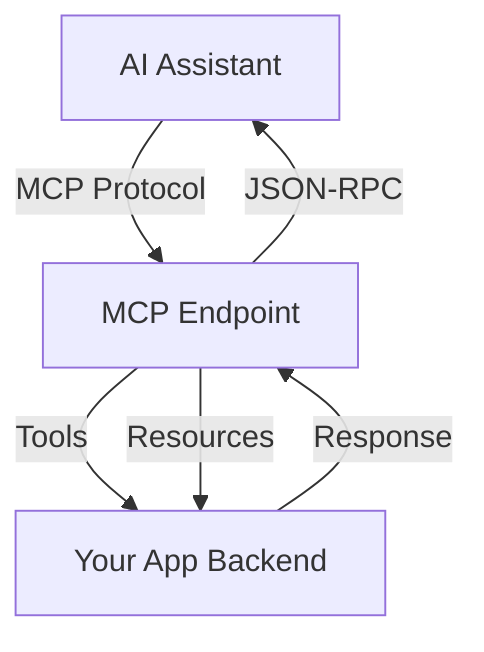

# MCP

Model Context Protocol (MCP) server for integrating your app with AI assistants and agents.

## What is MCP?

MCP (Model Context Protocol) is an open protocol that enables AI assistants like Claude, ChatGPT, and other AI agents to connect to your application for context and actions.

## Installation

```bash
bun add @manicjs/mcp
```

## Quick Start

### 1. Install Plugin

```bash
bun add @manicjs/mcp
```

### 2. Configure

```ts
// manic.config.ts
import { defineConfig } from 'manicjs/config';
import { mcp } from '@manicjs/mcp';

export default defineConfig({
  plugins: [
    mcp({
      // Enable MCP endpoint
      enabled: true,
      // API route for MCP (default: /api/mcp)
      route: '/api/mcp',
    }),
  ],
});
```

### 3. Use with AI Assistant

Your AI assistant can now access your app through the MCP endpoint.

## Options

<TypeTable
  type={{
    enabled: {
      type: 'boolean',
      default: 'true',
      description: 'Enable/disable MCP server',
    },
    route: {
      type: 'string',
      default: '"/api/mcp"',
      description: 'MCP endpoint route',
    },
    tools: {
      type: 'ToolDefinition[]',
      description: 'Custom tools to expose',
    },
    resources: {
      type: 'ResourceDefinition[]',
      description: 'Custom resources to expose',
    },
    prompts: {
      type: 'PromptDefinition[]',
      description: 'Custom prompts to expose',
    },
    auth: {
      type: 'AuthConfig',
      description: 'Authentication settings',
    },
  }}
/>

### ToolDefinition

```ts
interface ToolDefinition {
  name: string;
  description: string;
  inputSchema: object;
  handler: (input: object) => Promise<object>;
}
```

## Exposing Data as Resources

Expose your data as resources that AI can read:

```ts
import { defineConfig } from 'manicjs/config';
import { mcp } from '@manicjs/mcp';

export default defineConfig({
  plugins: [
    mcp({
      resources: [
        {
          uri: 'manic://users',
          name: 'Users List',
          description: 'All registered users',
          mimeType: 'application/json',
          handler: async () => {
            return fetch('/api/users').then(r => r.json());
          },
        },
        {
          uri: 'manic://config',
          name: 'App Config',
          description: 'Current application configuration',
          mimeType: 'application/json',
          handler: async () => {
            return getConfig();
          },
        },
      ],
    }),
  ],
});
```

## Exposing Tools

Expose functions that AI can call:

```ts
import { defineConfig } from 'manicjs/config';
import { mcp } from '@manicjs/mcp';

export default defineConfig({
  plugins: [
    mcp({
      tools: [
        {
          name: 'get_users',
          description: 'Get all users in the system',
          inputSchema: {
            type: 'object',
            properties: {
              limit: { type: 'number', description: 'Max results' },
            },
          },
          handler: async (input) => {
            const users = await fetchUsers(input.limit);
            return { users };
          },
        },
        {
          name: 'send_notification',
          description: 'Send a notification to a user',
          inputSchema: {
            type: 'object',
            properties: {
              userId: { type: 'string' },
              message: { type: 'string' },
            },
            required: ['userId', 'message'],
          },
          handler: async (input) => {
            await sendNotification(input.userId, input.message);
            return { success: true };
          },
        },
      ],
    }),
  ],
});
```

## AI Integration Flow



## Authentication

Protect your MCP endpoint:

```ts
import { defineConfig } from 'manicjs/config';
import { mcp } from '@manicjs/mcp';

export default defineConfig({
  plugins: [
    mcp({
      auth: {
        type: 'bearer',
        token: process.env.MCP_TOKEN,
        allowedOrigins: ['https://anthropic.com', 'https://chat.openai.com'],
      },
    }),
  ],
});
```

## Complete Example

```ts
// manic.config.ts
import { defineConfig } from 'manicjs/config';
import { mcp } from '@manicjs/mcp';

export default defineConfig({
  plugins: [
    mcp({
      enabled: true,
      route: '/api/mcp',
      tools: [
        {
          name: 'query_database',
          description: 'Query the application database',
          inputSchema: {
            type: 'object',
            properties: {
              query: { type: 'string' },
              params: { type: 'array' },
            },
            required: ['query'],
          },
          handler: async ({ query, params }) => {
            const result = await db.query(query, params);
            return { rows: result };
          },
        },
      ],
      resources: [
        {
          uri: 'manic://schema',
          name: 'Database Schema',
          description: 'Current database schema',
          mimeType: 'application/json',
          handler: async () => {
            return db.getSchema();
          },
        },
      ],
    }),
  ],
});
```

## Supported AI Clients

| AI Platform | Support |
|-------------|---------|
| Claude (Anthropic) | ✓ Native |
| ChatGPT Plugins | ✓ Via OpenAPI |
| LangChain | ✓ Via MCP-LangChain |
| Custom | ✓ Standard MCP |

## Security

<Callout type="warn">

**Protect your MCP endpoint** - It exposes your app's data and functionality to AI assistants.

</Callout>

Best practices:
1. Always use authentication
2. Limit exposed tools/resources
3. Log all MCP requests
4. Never expose sensitive data without auth

## See Also

- [MCP Specification](https://modelcontextprotocol.io)
- [Anthropic MCP](https://docs.anthropic.com/en/docs/mcp)
- [SEO](/docs/framework/seo) - Combine with SEO for AI visibility