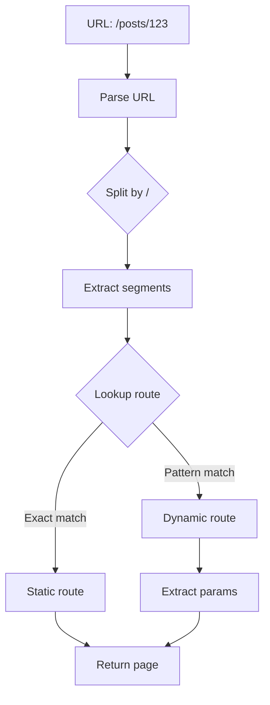
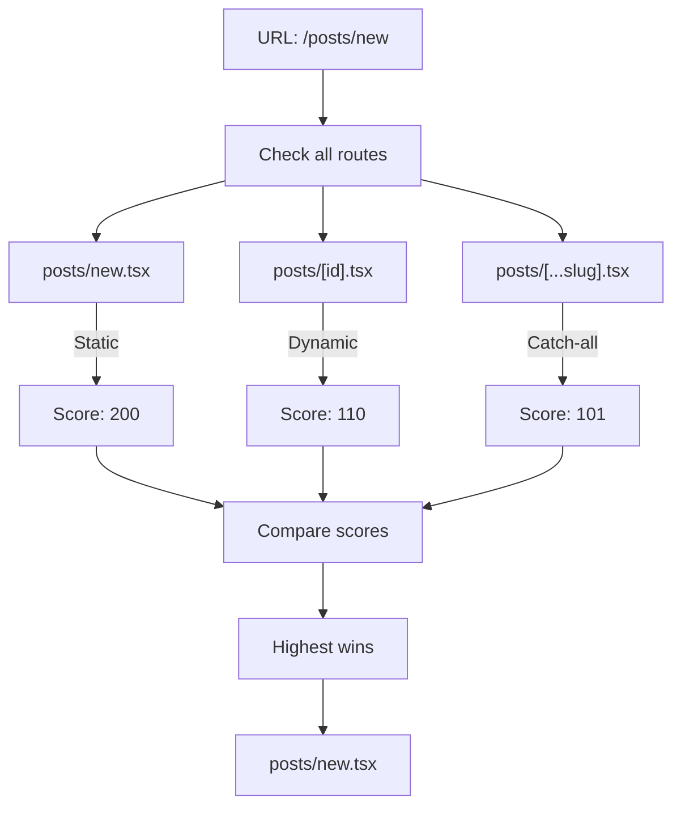

# Dynamic Routes

<Callout type="info" title="TL;DR">

Dynamic routes use `[param]` syntax to capture URL segments at runtime. Manic supports single segments `[id]`, multiple segments `[userId]/[postId]`, catch-all `[...slug]`, and optional catch-all `[[...slug]]` patterns.

</Callout>
## What It Is

Dynamic routes allow your application to handle **variable URL segments** without creating individual files for each possible value:

| Pattern | Syntax | Matches | Captures |
|---------|--------|--------|---------|
| **Single** | `[id]` | `/posts/123` | `{ id: "123" }` |
| **Multiple** | `[userId]/[postId]` | `/users/1/posts/99` | `{ userId: "1", postId: "99" }` |
| **Catch-all** | `[...slug]` | `/docs/a/b/c` | `{ slug: "a/b/c" }` |
| **Optional Catch-all** | `[[...slug]]` | `/docs`, `/docs/a` | `{ slug: "" }` or `{ slug: "a" }` |

---

## Prerequisites

- [Routing Guide](/docs/framework/routing) - Basic routing concepts
- [API Routes](/docs/framework/server) - For REST endpoints

---

## Quick Start

### Create a Dynamic Route

```tsx
// app/routes/posts/[id].tsx
import React from 'react';
import { useRouter } from 'manicjs';

export default function PostPage() {
  const { params } = useRouter();

  return (
    <div>
      <h1>Post #{params.id}</h1>
      <p>Reading post data for ID: {params.id}</p>
    </div>
  );
}
```

**Matches:**
- `/posts/123`
- `/posts/hello-world`
- `/posts/any-value-here`

---

## How Dynamic Routes Work

### Route Matching Flow



### Route Resolution Priority



### Scoring Rules

| Segment Type | Points | Example |
|-------------|--------|---------|
| Static | +100 | `posts/new.tsx` |
| Dynamic | +10 | `posts/[id].tsx` |
| Catch-all | +1 | `posts/[...slug].tsx` |

**Example precedence for `/posts/new`:**
```
posts/new.tsx      [Score: 200] ← WINNER (static)
posts/[id].tsx     [Score: 110]  (dynamic)
posts/[...slug].tsx [Score: 101]  (catch-all)
```

---

## Type Definitions

```ts
// Route parameter types
interface RouteParams {
  // Single param: [id]
  id?: string;

  // Multiple params: [userId]/[postId]
  userId?: string;
  postId?: string;

  // Catch-all: [slug] → "a/b/c"
  slug?: string;

  // Optional catch-all: [[...slug]]
  slug?: string | undefined;
}

// Navigation with params
interface NavigateOptions {
  scroll?: boolean;
  replace?: boolean;
  state?: Record<string, unknown>;
}
```

---

## Pattern Examples

### Pattern 1: Single Dynamic Segment

```tsx
// app/routes/posts/[id].tsx
import React from 'react';
import { useRouter } from 'manicjs';

export default function PostPage() {
  const { params } = useRouter();
  const postId = params.id;

  // Fetch post data
  const post = fetch(`/api/posts/${postId}`).then(r => r.json());

  return (
    <article>
      <h1>Post: {postId}</h1>
      <p>Content loading...</p>
    </article>
  );
}
```

**URLs matched:**
- `/posts/123` → `{ id: "123" }`
- `/posts/abc` → `{ id: "abc" }`
- ❌ `/posts/123/comments` (too many segments)

### Pattern 2: Multiple Dynamic Segments

```tsx
// app/routes/users/[userId]/posts/[postId].tsx
import React from 'react';
import { useRouter } from 'manicjs';

export default function UserPostPage() {
  const { params } = useRouter();
  const { userId, postId } = params;

  return (
    <div>
      <h1>User {userId}'s Post</h1>
      <p>Post ID: {postId}</p>
    </div>
  );
}
```

**URLs matched:**
- `/users/1/posts/99` → `{ userId: "1", postId: "99" }`
- `/users/john/posts/hello` → `{ userId: "john", postId: "hello" }`

### Pattern 3: Catch-All Routes

```tsx
// app/routes/docs/[...slug].tsx
import React from 'react';
import { useRouter } from 'manicjs';

export default function DocsPage() {
  const { params } = useRouter();
  const slug = params.slug;  // "guides/installation"

  // Split into parts
  const parts = slug.split('/');

  return (
    <div>
      <h1>Documentation</h1>
      <p>Path: {slug}</p>
      <ul>
        {parts.map((part, i) => (
          <li key={i}>{part}</li>
        ))}
      </ul>
    </div>
  );
}
```

**URLs matched:**
- `/docs/intro` → `{ slug: "intro" }`
- `/docs/guides/installation` → `{ slug: "guides/installation" }`
- `/docs/api/v2/users/get` → `{ slug: "api/v2/users/get" }`

### Pattern 4: Optional Catch-All (NEW)

```tsx
// app/routes/[[...slug]].tsx
import React from 'react';
import { useRouter } from 'manicjs';

export default function CatchAllPage() {
  const { params } = useRouter();
  const slug = params.slug;  // "" or "a/b"

  // Handle both cases
  const segments = slug ? slug.split('/') : [];

  return (
    <div>
      <h1>Root</h1>
      {segments.length > 0 ? (
        <p>Path: {slug}</p>
      ) : (
        <p>No path specified</p>
      )}
    </div>
  );
}
```

**URLs matched:**
- `/` → `{ slug: "" }` (empty string)
- `/docs` → `{ slug: "docs" }`
- `/docs/api` → `{ slug: "docs/api" }`

---

## Advanced Examples

### Example 1: Nested Dynamic Routes with Layouts

<Files>
  <Folder name="app/routes" defaultOpen>
    <File name="index.tsx" />
    <Folder name="users">
      <File name="index.tsx" />
      <Folder name="[userId]" defaultOpen>
        <File name="index.tsx" />
        <File name="posts.tsx" />
        <File name="settings.tsx" />
        <Folder name="posts">
          <File name="index.tsx" />
          <File name="[postId].tsx" />
        </Folder>
      </Folder>
    </Folder>
  </Folder>
</Files>

```tsx
// app/routes/users/[userId]/index.tsx
import React from 'react';
import { Link, useRouter } from 'manicjs';

export default function UserProfile() {
  const { params } = useRouter();
  const userId = params.userId;

  return (
    <div>
      <h1>User: {userId}</h1>
      <nav>
        <a href={`/users/${userId}/posts`}>Posts</a>
        <a href={`/users/${userId}/settings`}>Settings</a>
      </nav>
    </div>
  );
}
```

### Example 2: Route Guards

```tsx
// app/routes/admin/[...slug].tsx
import React, { useEffect } from 'react';
import { useRouter } from 'manicjs';
import { useAuth } from '../~hooks/useAuth';

export default function AdminRoute() {
  const { params } = useRouter();
  const { user, isLoading } = useAuth();

  useEffect(() => {
    if (!isLoading && (!user || !user.isAdmin)) {
      // Redirect if not admin
      window.location.href = '/login?redirect=/admin';
    }
  }, [user, isLoading]);

  if (isLoading) return <div>Loading...</div>;
  if (!user?.isAdmin) return null;

  return <div>Admin Content: {params.slug}</div>;
}
```

### Example 3: Pagination with Dynamic Routes

```tsx
// app/routes/posts/page/[pageNum].tsx
import React from 'react';
import { Link, useRouter } from 'manicjs';

export default function PostsPage() {
  const { params } = useRouter();
  const pageNum = parseInt(params.pageNum || '1', 10);
  const limit = 10;
  const offset = (pageNum - 1) * limit;

  return (
    <div>
      <h1>Posts - Page {pageNum}</h1>

      <nav>
        {pageNum > 1 && (
          <a href={`/posts/page/${pageNum - 1}`}>
            Previous
          </a>
        )}
        <a href={`/posts/page/${pageNum + 1}`}>
          Next
        </a>
      </nav>
    </div>
  );
}
```

### Example 4: Product Catalog

<Files>
  <Folder name="app/routes" defaultOpen>
    <Folder name="products">
      <File name="index.tsx" />
      <Folder name="[category]" defaultOpen>
        <File name="index.tsx" />
        <File name="[productId].tsx" />
      </Folder>
    </Folder>
  </Folder>
</Files>

```tsx
// app/routes/products/[category]/[productId].tsx
import React from 'react';
import { useRouter } from 'manicjs';

export default function ProductPage() {
  const { params } = useRouter();
  const { category, productId } = params;

  return (
    <div>
      <h1>{category}</h1>
      <p>Product ID: {productId}</p>
    </div>
  );
}
```

---

## Common Issues

### Issue 1: Route Not Matching

**Problem:** Dynamic route not matching.

**Check:**
1. Verify the file is in `app/routes/`
2. Check for typos in the bracket syntax
3. Ensure no conflicting static route exists

**Solution:**

```text
// For /posts/123:
✅ app/routes/posts/[id].tsx   [Score: 110]
❌ app/routes/posts/[id].ts     (wrong extension)
❌ app/routes/post/[id].tsx    (typo in folder)
```

### Issue 2: Params is Undefined

**Problem:** `params.id` is undefined.

**Solution:** Ensure the param name matches exactly:

```tsx
// File: app/routes/posts/[id].tsx
// ✗ BAD: params.postId
const { params } = useRouter();
console.log(params.postId);  // undefined!

// ✓ GOOD: params.id (matches filename)
const { params } = useRouter();
console.log(params.id);  // "123"
```

### Issue 3: Catch-All Not Matching Root

**Problem:** Catch-all route doesn't match `/`.

**Solution:** Use optional catch-all:

```tsx
// ✗ BAD: [...slug]
// File: app/routes/docs/[...slug].tsx
// Matches: /docs/a, /docs/a/b
// Does NOT match: /docs/

// ✓ GOOD: [[...slug]]
// File: app/routes/docs/[[...slug]].tsx
// Matches: /docs, /docs/a, /docs/a/b
```

### Issue 4: TypeScript Errors

**Problem:** TypeScript doesn't know param types.

**Solution:** Extend the router type:

```ts
// app/routes/types/manic.d.ts (if supported)
declare module 'manicjs' {
  interface RouteParams {
    id: string;
    userId: string;
    postId: string;
    slug: string;
  }
}
```

---

## Best Practices

<Callout type="info">

**Use descriptive param names** — `[postId]` is clearer than `[id]` for nested resources.

</Callout>
<Callout type="warn">
 
**Avoid conflicting routes** — static routes always win over dynamic routes. Use unique names like `/admin/users` vs `/users`.
 
</Callout>

<Callout type="info">

**Use catch-all sparingly** — they have lowest priority and can cause unintended matches.

</Callout>
<Callout type="info">

**Validate params early** — check for undefined and invalid values before data fetching.

</Callout>
---

## Version History

| Version | Changes |
|---------|---------|
| v0.12.0 | Added optional catch-all `[[...slug]]` |
| v0.11.0 | Added route scoring |
| v0.10.0 | Added dynamic segments |

---

See also:
- [Routing Guide](/docs/framework/routing)
- [API Routes](/docs/framework/server)
- [404 Handling](/docs/framework/advanced/error-handling)
