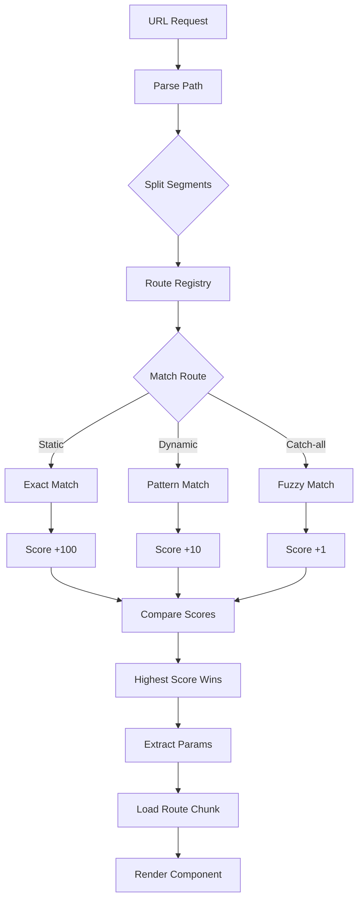

# Routing Guide

Manic features a **file-system-based router** that converts your `app/routes/` directory into an optimized runtime registry with support for dynamic segments, nested layouts, and View Transitions.

## Route Matching Flow



## File System Routing

Every `.tsx` file in `app/routes/` automatically becomes a route.

| File Path | URL Path | Description |
|-----------|----------|-------------|
| `app/routes/index.tsx` | `/` | Home page |
| `app/routes/about.tsx` | `/about` | Static route |
| `app/routes/blog/index.tsx` | `/blog` | Nested static |
| `app/routes/posts/[id].tsx` | `/posts/123` | Dynamic segment |
| `app/routes/docs/[...slug].tsx` | `/docs/a/b/c` | Catch-all route |

### Example Structure

<Files>
  <Folder name="app" defaultOpen>
    <Folder name="routes" defaultOpen>
      <File name="index.tsx" />
      <File name="about.tsx" />
      <Folder name="blog">
        <File name="index.tsx" />
        <File name="[slug].tsx" />
      </Folder>
      <Folder name="posts">
        <File name="index.tsx" />
        <Folder name="[id]">
          <File name="index.tsx" />
          <Folder name="comments">
            <File name="[cId].tsx" />
          </Folder>
        </Folder>
      </Folder>
      <Folder name="docs">
        <File name="[...path].tsx" />
      </Folder>
    </Folder>
  </Folder>
</Files>

---

## Dynamic Segments

### Single Dynamic Segment

Use `[param]` to capture a single URL segment:

```tsx twoslash
// @errors: 2322
// app/routes/posts/[id].tsx
import React from 'react';
import { useRouter } from 'manicjs';

export default function PostPage() {
  const { params } = useRouter();
  
  return <div>Post ID: {params.id}</div>;
}
```

**Matches:**
- `/posts/123` → `{ id: "123" }`
- `/posts/hello-world` → `{ id: "hello-world" }`
- ❌ `/posts/123/comments` (too many segments)

### Multiple Dynamic Segments

Nest folders to capture multiple params:

```tsx twoslash
// @errors: 2322
// app/routes/users/[userId]/posts/[postId].tsx
import React from 'react';
import { useRouter } from 'manicjs';

export default function UserPostPage() {
  const { params } = useRouter();
  
  return <div>User {params.userId}, Post {params.postId}</div>;
}
```

**Matches:**
- `/users/42/posts/99` → `{ userId: "42", postId: "99" }`

### Catch-All Routes

Use `[...param]` to match any number of segments:

```tsx twoslash
// @errors: 2322
// app/routes/docs/[...slug].tsx
import React from 'react';
import { useRouter } from 'manicjs';

export default function DocsPage() {
  const { params } = useRouter();  // slug = "guides/installation"
  
  return <div>Doc: {params.slug}</div>;
}
```

**Matches:**
- `/docs/guides` → `{ slug: "guides" }`
- `/docs/guides/installation` → `{ slug: "guides/installation" }`
- `/docs/api/v2/endpoints/users` → `{ slug: "api/v2/endpoints/users" }`

---

## Route Scoring & Priority

When multiple routes could match a URL, Manic uses a **scoring system** to determine the winner:

### Scoring Rules

- **Static segment**: `+100` points
- **Dynamic segment**: `+10` points
- **Catch-all segment**: `+1` point

### Example Precedence

```text
URL: /posts/new

Route Scores:
├─ app/routes/posts/new.tsx              [Score: 200]  ← WINNER
├─ app/routes/posts/[id].tsx             [Score: 110]
└─ app/routes/posts/[...slug].tsx        [Score: 101]
```

```text
URL: /posts/123

Route Scores:
├─ app/routes/posts/new.tsx              [Score: 200]  ✗ No match
├─ app/routes/posts/[id].tsx             [Score: 110]  ← WINNER
└─ app/routes/posts/[...slug].tsx        [Score: 101]
```

<Callout type="info">

Static routes always win. No need to order files — Manic determines precedence automatically.

</Callout>
---

## Navigation

### Client-Side Links

Use the `<Link>` component for navigation. It prevents full page reloads, prefetches the target chunk on hover/focus, and integrates with view transitions.

```tsx twoslash
// @errors: 2322
import React from 'react';
import { Link } from 'manicjs';

export function Nav() {
  return (
    <nav>
      <Link to="/">Home</Link>
      <Link to="/about">About</Link>
      <Link to="/posts/123">Post #123</Link>
    </nav>
  );
}
```

**Features:**
- ✓ Automatic code-splitting
- ✓ Prefetch on hover/focus
- ✓ View Transitions (smooth animation)
- ✓ No page reload

See [Router API](/docs/api/router#link) for full prop reference.

### Programmatic Navigation

Use `useRouter()` for logic-based navigation:

```tsx twoslash
// @errors: 2322
import React from 'react';
import { useRouter } from 'manicjs';

export function LoginButton() {
  const router = useRouter();
  const email = 'user@example.com';
  const password = 'secret';

  const handleLogin = async () => {
    const response = await fetch('/api/login', {
      method: 'POST',
      body: JSON.stringify({ email, password }),
    });
    
    if (response.ok) {
      router.navigate('/dashboard');
    }
  };

  return <button onClick={handleLogin}>Login</button>;
}
```

See [Router API](/docs/api/router#userouter) for complete hook reference.

---

## The `~` Convention

Files and folders prefixed with `~` are **excluded from routing**. Use this to colocate components, hooks, and utilities without polluting the route namespace:

<Files>
  <Folder name="app" defaultOpen>
    <Folder name="routes" defaultOpen>
      <File name="index.tsx" />
      <File name="~Header.tsx" />
      <Folder name="~hooks">
        <File name="useAuth.ts" />
        <File name="useForm.ts" />
      </Folder>
      <Folder name="posts">
        <File name="[id].tsx" />
        <File name="~PostCard.tsx" />
      </Folder>
    </Folder>
  </Folder>
</Files>

### Why Use `~`?

1. **Keep routes clean** — No accidental routes
2. **Colocate related code** — Components next to pages
3. **Avoid naming conflicts** — Use common names like `Layout`, `Card`

### Examples

```tsx twoslash
// @errors: 2322
// ✓ OK: Route
// app/routes/posts/[id].tsx
function PostCard() {
  return <div>Post Content</div>;
}

export default function PostPage() {
  return <PostCard />;
}

// ✓ OK: Ignored component
// app/routes/posts/~PostCard.tsx
export function PostCardView() {
  return <div>Post Content</div>;
}

// ❌ BAD: Creates unwanted route
// app/routes/posts/PostCard.tsx
// This would create a route at /posts/PostCard
```

---

## Query Parameters

Use `useQueryParams()` to read URL search params:

```tsx twoslash
// @errors: 2322
import React from 'react';
import { useQueryParams } from 'manicjs';
declare const window: any;

export function SearchPage() {
  const searchParams = useQueryParams();
  const searchTerm = searchParams.get('q');

  const handleSearch = (value: string) => {
    const params = new URLSearchParams(searchParams);
    params.set('q', value);
    window.history.replaceState({}, '', `?${params.toString()}`);
  };

  return (
    <>
      <input
        value={searchTerm || ''}
        onChange={(e: any) => handleSearch(e.target.value)}
        placeholder="Search..."
      />
      {searchTerm && <p>Results for: {searchTerm}</p>}
    </>
  );
}
```

**URL Examples:**
- `/search?q=react` → `searchParams.get('q')` = `"react"`
- `/posts?sort=date&page=2` → `searchParams.get('sort')` = `"date"`, `searchParams.get('page')` = `"2"`

See [Router API](/docs/api/router#usequeryparams) for full reference.

---

## Nested Layouts

Create shared layouts by using parent `index.tsx`:

<Files>
  <Folder name="app/routes" defaultOpen>
    <File name="index.tsx" />
    <Folder name="admin">
      <File name="index.tsx" />
      <File name="users.tsx" />
      <File name="settings.tsx" />
    </Folder>
  </Folder>
</Files>

```tsx twoslash
// @errors: 2322
// app/routes/admin/index.tsx (Layout)
import React from 'react';
import { Link } from 'manicjs';

export default function AdminLayout({ children }: { children: React.ReactNode }) {
  return (
    <div className="admin">
      <nav>
        <Link to="/admin/users">Users</Link>
        <Link to="/admin/settings">Settings</Link>
      </nav>
      <main>{children}</main>
    </div>
  );
}
```

<Callout type="info">

This is a convention — layout support depends on your router implementation using `children` prop.

</Callout>
---

## Advanced Patterns

### Protected Routes

```tsx twoslash
// @errors: 2322 2307
import React from 'react';
import { useRouter } from 'manicjs';
import { useAuth } from './~hooks/useAuth';

export default function AdminPage() {
  const router = useRouter();
  const { user } = useAuth();

  React.useEffect(() => {
    if (!user?.isAdmin) {
      router.navigate('/', { replace: true });
    }
  }, [user, router]);

  if (!user?.isAdmin) return null;  // Prevent flash
  
  return <div>Admin Panel</div>;
}
```

### Redirect Logic

```tsx twoslash
// @errors: 2322
// app/routes/old-url.tsx
import React from 'react';
import { useRouter } from 'manicjs';

export default function OldPage() {
  const router = useRouter();

  React.useEffect(() => {
    // Redirect to new location
    router.navigate('/new-location', { replace: true });
  }, [router]);

  return null;
}
```

### Breadcrumbs

```tsx twoslash
// @errors: 2322
import React from 'react';
import { useRouter } from 'manicjs';
import { Link } from 'manicjs';

export function Breadcrumbs() {
  const { path } = useRouter();
  const segments = path.split('/').filter(Boolean);

  return (
    <nav>
      <Link to="/">Home</Link>
      {segments.map((segment, i) => {
        const href = '/' + segments.slice(0, i + 1).join('/');
        return (
          <React.Fragment key={href}>
            <span>/</span>
            <Link to={href}>{segment}</Link>
          </React.Fragment>
        );
      })}
    </nav>
  );
}
```

---

## Best Practices

<Callout type="info">

**Use `<Link>` instead of `<a>`** for client-side navigation. It's faster and provides prefetching.

</Callout>
<Callout type="warn">
 
**Never manually manipulate `window.location`** in Manic. Always use `useRouter().navigate()` or `<Link>`.
 
</Callout>

<Callout type="info">

**Query params are for filters, not state.** Use React state for temporary UI state; use query params for shareable/bookmarkable state.

</Callout>
---

See the [Router API reference](/docs/api/router) for complete hook and component documentation.
