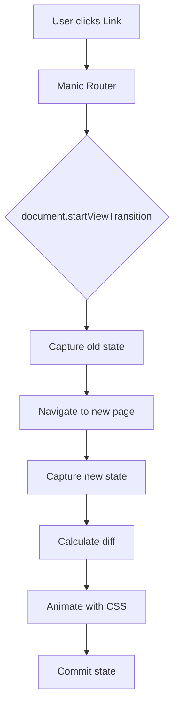
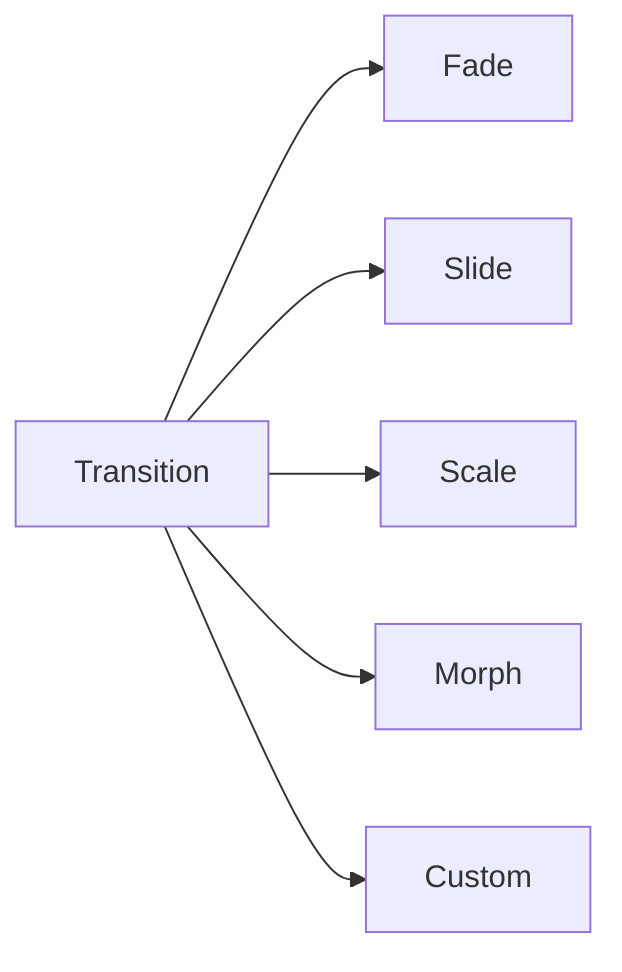

# View Transitions

<Callout type="info" title="TL;DR">

Manic supports the View Transitions API for smooth, animated navigation between pages. Enable via `setViewTransitions()` for cross-document transitions or use the `<ViewTransitions>` component for container-scoped animations.

</Callout>
## What It Is

View Transitions provide **native browser animations** when navigating between pages:

| Feature | Description |
|---------|-------------|
| **Cross-document** | Animate entire page changes |
| **Container-scoped** | Animate specific components |
| **Shared elements** | Morph elements between pages |
| **Custom animations** | CSS-based keyframe animations |

**Browser Support:** Chrome 111+, Safari 17.4+, Edge 111+

---

## Prerequisites

- [Routing Guide](/docs/framework/routing) - Navigation basics
- [Theme & Styling](/docs/framework/theme-dark-mode) - For CSS customization

---

## Quick Start

### Enable View Transitions

```tsx
// app/routes/index.tsx
import React, { useEffect } from 'react';
import { setViewTransitions, useRouter } from 'manicjs';

export default function Root() {
  useEffect(() => {
    setViewTransitions(true);
  }, []);

  return (
    <div>
      <nav>
        <a href="/">Home</a>
        <a href="/about">About</a>
      </nav>
    </div>
  );
}
```

---

## How It Works

### Transition Architecture



### Animation Types



---

## Type Definitions

```ts
// Enable/disable transitions
function setViewTransitions(enabled: boolean): void;

// View transition options
interface ViewTransitionOptions {
  name?: string;  // For shared element transitions
  types?: ViewTransitionType[];
}

type ViewTransitionType =
  | 'default'
  | 'slide-from-right'
  | 'slide-from-left'
  | 'fade'
  | 'custom';
```

---

## API Reference

### setViewTransitions()

Enables the View Transitions API globally:

```tsx
import { setViewTransitions } from 'manicjs';

// Enable
setViewTransitions(true);

// Disable
setViewTransitions(false);
```

### View Transitions with Link

```tsx
import { Link } from 'manicjs';

// Automatic transition on navigation
<a href="/about">About</a>
```

### Custom Transition Types

```tsx
import { useRouter } from 'manicjs';

function Page() {
  const router = useRouter();

  const navigateWithTransition = () => {
    // Custom type
    router.navigate('/page', {
      viewTransition: 'slide-from-right'
    });
  };

  return <button onClick={navigateWithTransition}>Go</button>;
}
```

---

## Examples

### Example 1: Fade Transitions

```tsx
// app/root.tsx
import React, { useEffect } from 'react';
import { setViewTransitions } from 'manicjs';

export default function Root() {
  useEffect(() => {
    setViewTransitions(true);
  }, []);

  return (
    <html>
      <head>
        <style>{`
          ::view-transition-old(root),
          ::view-transition-new(root) {
            animation-duration: 0.3s;
          }

          ::view-transition-old(root) {
            animation: fade-out 0.3s both;
          }

          ::view-transition-new(root) {
            animation: fade-in 0.3s both;
          }

          @keyframes fade-out {
            from { opacity: 1; }
            to { opacity: 0; }
          }

          @keyframes fade-in {
            from { opacity: 0; }
            to { opacity: 1; }
          }
        `}</style>
      </head>
      <body>
        <div id="root"></div>
      </body>
    </html>
  );
}
```

### Example 2: Slide Transitions

```tsx
// CSS for slide transitions
const slideStyles = `
  ::view-transition-old(root) {
    animation: slide-left 0.3s ease-in both;
  }

  ::view-transition-new(root) {
    animation: slide-right 0.3s ease-out both;
    animation-delay: 0.1s;
  }

  @keyframes slide-left {
    from { transform: translateX(0); }
    to { transform: translateX(-100%); }
  }

  @keyframes slide-right {
    from { transform: translateX(100%); }
    to { transform: translateX(0); }
  }
`;
```

### Example 3: Shared Element Transitions

```tsx
// On source page
export function ProductCard({ product }) {
  return (
    <a href={`/products/${product.id}`}>
      <div style={{ viewTransitionName: `product-${product.id}` }}>
        
        <h3>{product.name}</h3>
      </div>
    </a>
  );
}

// On destination page
export function ProductDetail({ product }) {
  return (
    <div style={{ viewTransitionName: `product-${product.id}` }}>
      
      <h3>{product.name}</h3>
    </div>
  );
}
```

<Callout type="info">

Use the same `viewTransitionName` on both pages to create a morphing animation.

</Callout>
### Example 4: Container-Scoped Transitions

```tsx
// ViewTransitions component (if supported)
import { ViewTransitions } from 'manicjs';

export function Layout({ children }) {
  return (
    <ViewTransitions>
      <header>...</header>
      <main>{children}</main>
    </ViewTransitions>
  );
}
```

### Example 5: Custom Animation

```tsx
// Custom keyframes
const customAnimation = `
  ::view-transition-old(root) {
    animation: custom-slide 0.4s ease-out both;
  }

  ::view-transition-new(root) {
    animation: custom-fade 0.4s ease-out both;
  }

  @keyframes custom-slide {
    0% {
      transform: translateX(-20px);
      opacity: 0;
    }
    100% {
      transform: translateX(0);
      opacity: 1;
    }
  }

  @keyframes custom-fade {
    0% {
      opacity: 0;
      transform: scale(0.95);
    }
    100% {
      opacity: 1;
      transform: scale(1);
    }
  }
`;
```

### Example 6: Different Transitions Per Page

```tsx
// Page with custom transition name
import { useRouter } from 'manicjs';

export function AboutPage() {
  const router = useRouter();

  // Different transition for modal pages
  router.navigate('/modal', {
    viewTransition: {
      type: 'fade'
    }
  });
}
```

---

## Advanced Patterns

### Pattern 1: Preserving Scroll Position

```tsx
// Manic handles scroll automatically
// But you can customize behavior:

window.scrollTo = (x, y) => {
  // Custom scroll handling
};

// Or disable scroll animation:
::view-transition-new(root) {
  animation: none;
  /* ... */
}
```

### Pattern 2: Transition Events

```tsx
// Listen for transition events
if (document.startViewTransition) {
  document.startViewTransition(async () => {
    await navigation completed;
  }).updateCallbackDone.then(() => {
    // Transition complete
  });
}
```

### Pattern 3: Fallback for Unsupported Browsers

```tsx
import React, { useEffect, useState } from 'react';

export function AnimatedLink({ to, children }) {
  const [supportsTransitions, setSupportsTransitions] = useState(false);

  useEffect(() => {
    setSupportsTransitions(!!document.startViewTransition);
  }, []);

  return supportsTransitions ? (
    <a href={to} viewTransition>{children}</a>
  ) : (
    <a href={to}>{children}</a>
  );
}
```

### Pattern 4: Multiple Viewport Support

```tsx
// Different animations for mobile vs desktop
const responsiveStyles = `
  @media (max-width: 768px) {
    ::view-transition-old(root) {
      animation: slide-up-mobile 0.3s ease-out both;
    }

    ::view-transition-new(root) {
      animation: fade-in 0.3s ease-out both;
    }
  }

  @media (min-width: 769px) {
    ::view-transition-old(root) {
      animation: slide-left 0.3s ease-out both;
    }

    ::view-transition-new(root) {
      animation: slide-right 0.3s ease-out both;
    }
  }
`;
```

---

## Common Issues

### Issue 1: Transitions Not Working

**Problem:** No animation on navigation.

**Checks:**
1. Browser supports View Transitions (Chrome 111+, Safari 17.4+)
2. `setViewTransitions(true)` called
3. Navigator via `<Link>` or `useRouter()` (not `<a>`)

**Solution:**

```tsx
// ✗ BAD: Direct anchor tag
<a href="/about">About</a>

// ✓ GOOD: Link component
<a href="/about">About</a>
```

### Issue 2: Transitions Choppy

**Problem:** Animation stutters or jank.

**Solution:** Use transform instead of layout properties:

```css
/* ✗ BAD: Layout properties */
::view-transition-old(root) {
  margin-left: 100px;  /* Triggers reflow */
}

/* ✓ GOOD: Transform */
::view-transition-old(root) {
  transform: translateX(100%);
}
```

### Issue 3: Elements Not Morphing

**Problem:** Shared elements not animating between pages.

**Solution:** Match viewTransitionName exactly:

```tsx
// ✗ BAD: Different names
<div style={{ viewTransitionName: `image-${id}` }}>    // Source
<div style={{ viewTransitionName: `img-${id}` }}>   // Dest

// ✓ GOOD: Same name
<div style={{ viewTransitionName: `product-${id}` }}>  // Both pages
```

---

## Best Practices

<Callout type="info">

**Use CSS transforms** for smoother animations. Avoid layout-triggering properties like `margin`, `padding`, `width`, `height`.

</Callout>
<Callout type="warn">
 
**Provide fallback for older browsers** — use feature detection or a simple fade fallback.
 
</Callout>

<Callout type="info">

**Use viewTransitionName** for element morphs — matching names across pages create seamless transitions.

</Callout>
<Callout type="info">

**Keep animations short** — 200-400ms feels natural; longer can feel sluggish.

</Callout>
---

## Browser Support

| Browser | Version | Support |
|---------|---------|----------|
| Chrome | 111+ | ✓ Full |
| Edge | 111+ | ✓ Full |
| Safari | 17.4+ | ✓ Full |
| Firefox | - | ✗ Polyfill needed |
| Opera | - | ✗ Polyfill needed |

---

## Version History

| Version | Changes |
|---------|---------|
| v0.12.0 | Added `setViewTransitions()` |
| v0.11.0 | Added viewTransition types |
| v0.10.0 | Initial view transition support |

---

See also:
- [Routing Guide](/docs/framework/routing)
- [Theme & Styling](/docs/framework/theme-dark-mode)
- [Animation Reference](https://developer.mozilla.org/en-US/docs/Web/API/View_Transitions_API)